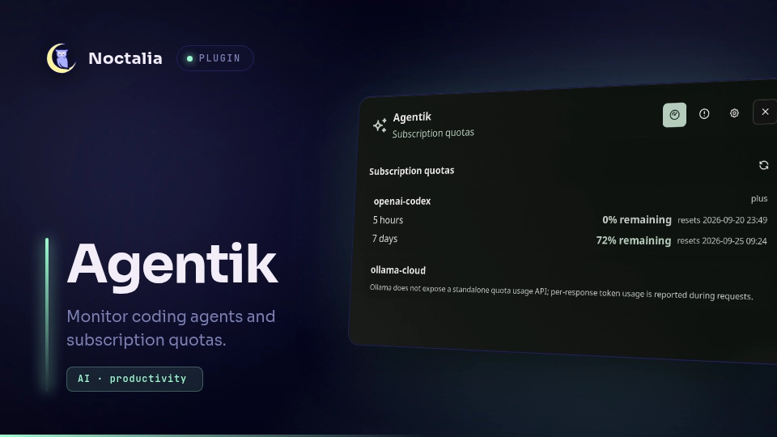

# Agentik

Agentik is a local-first Noctalia control surface for coding agents. It monitors Oh My Pi and optional Hermes Agent sessions, shows their current lifecycle and work state, and opens safe harness-native chat or terminal workflows without taking ownership away from an active terminal.



## Plugin

| Field | Value |
| --- | --- |
| ID | `notfinaldev/agentik` |
| Entries | Bar widget: `agents`; panel: `session-panel`; desktop widget: `desktop-agents`; service: `monitor` |

## Usage

1. Enable Agentik in **Settings → Plugins**.
2. Add the **Agentik Agents** widget to a bar.
3. Click the widget to open the session panel.
4. Optionally add **Agentik Desktop Agents** through the desktop-widget editor.

Open or toggle the panel from a terminal or compositor binding:

```sh
noctalia msg panel-toggle notfinaldev/agentik:session-panel
```

The panel can continue a completed OMP session, fork a session that is active elsewhere, or start a new session with an installed supported harness. **Open in terminal** resumes or forks the selected session in a supported terminal emulator. While another terminal owns an OMP journal, the panel remains read-only.

## Requirements

- Noctalia plugin API 24 or newer.
- `python3` on `PATH`. The monitor and chat bridge are Python programs launched by Noctalia.
- `omp` on `PATH`, or `OMP_BIN` set to its executable. OMP supplies the required session journal and chat workflows.
- Optional: `hermes` on `PATH`, or `HERMES_BIN` set to its executable, to monitor and launch Hermes Agent sessions.
- Optional: `wl-copy` on `PATH` for the **Copy** actions shown beside choices, code, and tool output.
- Optional: `xdg-open` on `PATH` for **Open project directory**.
- Optional terminal handoff uses `sh` plus the first available launcher: `xdg-terminal-exec`, `ghostty`, `kitty`, `foot`, `alacritty`, `gnome-terminal`, `kgx`, or `konsole`. `AGENTIK_TERMINAL` overrides automatic selection.

## Settings

| Setting | Default | Effect |
| --- | --- | --- |
| Show current task | On | Shows the active OMP todo item in session rows |
| Show attention state | On | Shows running, waiting, blocked, completed, failed, or cancelled status |
| Primary label | Project | Selects project, agent session name, or model name |
| Sort order | Running time | Selects running-time or attention-first ordering |
| Needs attention only | Off | Restricts the panel to waiting and blocked sessions |
| Excluded projects | Empty | Comma-separated project names or full paths omitted from monitoring and chat |
| Enable coding session chat | On | Enables session selection, transcript, model, send, cancel, and terminal controls |
| Reduce motion | Off | Uses static orb frames and reveals assistant text immediately |
| Increase contrast | Off | Strengthens session backgrounds and text contrast |
| Show displayed-agent number | On | Shows the current agent ordinal in the bar widget |
| Show intent state | On | Shows the inferred work state in the bar widget |
| Notify on attention needed | Off | Notifies when a known active agent changes to waiting or blocked |
| Notification cooldown | 300 seconds | Limits attention-notification frequency |
| Privacy notifications | Off | Removes project and task names from notification bodies |

Noctalia also supplies the standard placement, position, layer, and open-near-click controls for the panel entry.

## Detection and local access

Agentik does not use a remote service and does not send session journals anywhere.

- **OMP:** reads `~/.omp/agent/sessions/**/*.jsonl` and `~/.omp/agent/terminal-sessions/pts-*`, then inspects the current user's `/proc/<pid>/fd` links to distinguish live sessions from completed, failed, or cancelled sessions. It calls `omp config get modelRoles --json` and `omp models --json` to populate local model choices. Chat and terminal actions run the selected local `omp` command with its normal configuration.
- **Hermes Agent:** detects a live `hermes` process under the current user, reads `~/.hermes/state.db` in SQLite read-only mode, and reads `~/.hermes/provider_models_cache.json` for local model choices. Hermes is ignored when it is not installed or running.
- **Cache:** generates the attributed orb animation pack and writes incremental journal metadata below `${XDG_CACHE_HOME:-~/.cache}/agentik/`.
- **Chat state:** writes selection, lifecycle, locks, and owner-only run logs below `${XDG_STATE_HOME:-~/.local/state}/agentik/chat`.
- **Project access:** monitoring does not read project files. Journal-derived project actions accept only normalized absolute filesystem paths; URL schemes, relative paths, and option-like values are discarded. **Open project directory** calls `xdg-open` with the path as one argv value. A chat or terminal action intentionally starts the chosen harness in the selected project directory; that harness retains its normal filesystem permissions, tools, provider configuration, and network policy.

Environment overrides used for development and controlled deployments are `AGENTIK_STATE_DIR`, `AGENTIK_SESSIONS_DIR`, `AGENTIK_JOURNAL_INDEX`, `AGENTIK_TERMINAL`, `OMP_BIN`, `HERMES_BIN`, and `HERMES_HOME`.

## Notes

- Agent state combines an exact lifecycle (`running`, `waiting`, `blocked`, `completed`, `failed`, or `cancelled`) with an inferred work animation (`working`, `searching`, `verifying`, `awaiting input`, `connecting`, `integrating`, `creating`, `pausing`, or `planning`). The original tool intent remains visible beside the inferred label.
- Agentik preserves a single writer for every OMP journal. It never injects input into a session owned by a terminal.
- Transcript polling is revisioned and bounded. Unchanged polls do not resend transcript content.
- On first run, Agentik generates an attributed 30 FPS SVG animation pack in `${XDG_CACHE_HOME:-~/.cache}/agentik/orbs`; the shell remains usable with a static fallback while generation completes. The generator is `build_orbs.py`, derived from Jakub Antalik's Thinking Orbs under the MIT License; see `THIRD_PARTY_LICENSES`.
- An optional attributed 60 FPS pack can replace it with `python3 build_orbs.py --fps 60`; reload Agentik afterward. The generated pack remains free under the same Thinking Orbs MIT notice.

## License

Agentik is released under the MIT License. See `LICENSE` and `THIRD_PARTY_LICENSES`.
