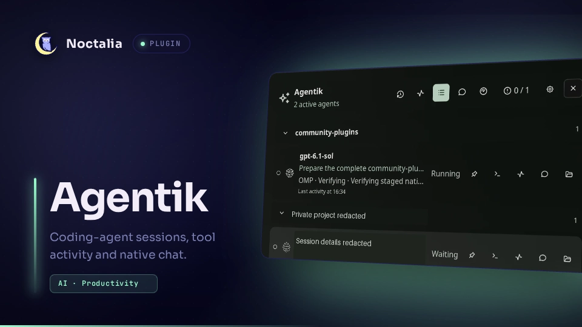

# Agentik

Agentik is a local-first Noctalia control surface for coding agents. It monitors Oh My Pi and optional Hermes Agent sessions, shows their current lifecycle and work state, and opens safe harness-native chat or terminal workflows without taking ownership away from an active terminal.



## Plugin

| Field | Value |
| --- | --- |
| ID | `notfinaldev/agentik` |
| Entries | Bar widget: `agents`; panel: `session-panel`; desktop widget: `desktop-agents`; service: `monitor` |

| Entry | Purpose |
| --- | --- |
| `agents` | Bar pill with rotating or pinned session status, attention counts, and optional notifications |
| `session-panel` | Session and attention lists, tool activity, transcripts, writable managed chat, and subscription quotas |
| `desktop-agents` | Desktop session monitoring and optional writable managed chat |
| `monitor` | Background polling of local OMP journals and Hermes process/session state |

## Usage

1. Enable Agentik in **Settings → Plugins**.
2. Add the **Agentik Agents** widget to a bar.
3. Click the widget to open the session panel.
4. Optionally add **Agentik Desktop Agents** through the desktop-widget editor.

Open or toggle the panel from a terminal or compositor binding:

```sh
noctalia msg panel-toggle notfinaldev/agentik:session-panel
```

The panel can continue a completed OMP session, fork a session that is active elsewhere, or start a new session with an installed supported harness. **Open in terminal** resumes or forks the selected session in a supported terminal emulator. While another terminal owns an OMP journal, the panel remains read-only.

### Pill → attention queue → coding session

- The pill uses native procedural vector orbs and status colors. Between sessions, the outgoing orb and state text fade out together and the incoming orb expands; fallback icons follow the same fade. Selection follows session identity rather than list position.
- A known session changing to waiting or blocked expands the pill for eight seconds with project, task, and **Open Agentik**. It never opens a panel or steals focus automatically. Clicking the expanded pill opens the attention queue with the affected session highlighted and first within its group. Resolving the attention state collapses it immediately.
- Successful completion produces a three-second checkmark pulse. Failed/cancelled sessions and newly discovered completed history do not trigger a success celebration.
- A deterministic, theme-aware identity marker is reused in the pill, session row, attention row, and selected chat header. Colors may repeat; names and status labels remain the authoritative identifiers.
- The **Attention** tab groups blocked sessions before waiting sessions, with longest-idle sessions first within each group. Each row keeps its animated session orb beside the waiting/blocked indicator; presentation speed and reduced-motion settings apply. Times are labelled **Last activity**, not an inferred time spent waiting.
- With coding session chat enabled, **Open session** selects the owning session. **Recent activity** opens its transcript read-only even when coding session chat is disabled. **Copy task** and **Open project** do not send input to a harness. Your chat setting is never enabled automatically.
- Transcript **Back** remains available while loading, after an error, and in the session picker; it restores the originating view. The **Sessions** tab explicitly leaves the attention filter. Hidden or closed transcripts do not keep frame animation running; visible busy/session orbs animate unless **Reduce motion** is enabled.
- **Presentation mode** is explicit and off by default: four-second orb cycles, five-second session holds, longer labels, stronger contrast, and expanded project groups. It adds no auto-collapse. **Reduce motion** takes precedence: static orbs, no automatic session rotation, and immediately revealed text/progress.
- **Pin session to pill** keeps one live session's identity and state visible instead of rotating. Pin controls are available on session/attention rows and the selected transcript header; the panel header can always unpin. A pin clears after a successful snapshot no longer contains the live session. Other sessions' blocked/waiting counts remain visible.
- The pill shows separate blocked and waiting counts. The Attention button shows **blocked / waiting**; its tooltip names both counts.
- Monitoring failures preserve the last successful snapshot and display a warning rather than pretending the data is current. The pill tooltip and panel banner show the last successful refresh and bounded error details. Data becomes stale after 15 seconds without a successful refresh; a successful poll clears the warning.
- Attention expansion/collapse uses a 180 ms reveal; switching between sessions and transcripts uses a 200 ms fade/inset transition. **Reduce motion** disables both.
- Clicking an attention expansion collapses it immediately with **Reduce motion** enabled, without waiting for the next polling tick.
- **Recent outcomes** lists up to eight completed, failed, or cancelled OMP sessions from the last ten minutes, independently of the live-session list. Select an outcome to read its transcript; sending, cancellation, and terminal handoff remain disabled.
- Session and attention rows show **Last activity at HH:MM** in local time. Once the recorded activity is at least 24 hours old, they show **DD/MM/YYYY** instead. Missing timestamps are omitted. Session-start age and transcript-header total session age remain hidden.

Open the attention queue directly:

```sh
noctalia msg panel-open notfinaldev/agentik:session-panel attention
```

### Tool activity, terminal navigation, and context

- **Live tool activity** on session/attention rows opens the latest 12 recorded tool operations without changing the selected chat session. Expand an operation for its bounded result details. Native results determine completion/failure; unfinished historical operations and Hermes results without error metadata stay unknown.
- **Focus owning terminal** focuses an existing Niri or Hyprland window only after proving same-user process ownership and compositor-window ancestry. It never launches a duplicate terminal or matches a window by project directory. Shared terminal hosts, multiplexers, missing ownership, and exited sessions can return an explicit ambiguity/unavailable error.
- Writable chat in the panel and desktop widget supports removable file and screenshot drafts. **Send** is the only action that submits those attachments to the chosen harness. Failed launch retains drafts. Limits: eight files, 16 MiB per file, 32 MiB total; regular local files only. Screenshots are PNG files stored under the private chat-state directory.
- ACP negotiates image and embedded-context support. Other files use native resource links when embedded context is unavailable. Unsupported images fail explicitly; Agentik does not silently discard attachments.

### Approval semantics

Detected choices are response suggestions, not authenticated permission requests. Buttons say **Copy** and explain that nothing is sent or approved; paste the copied response in the owning session to respond. The attention surface never injects terminal input, sends a response, cancels a run, or grants permission.

**Recent activity**, terminal-owned sessions, and the attention surface remain read-only: no native answers or decisions are sent from those views. Writable, Agentik-managed ACP turns show controls only for actual `session/request_permission` or form `elicitation/create` requests. Permission buttons use the harness's exact options; structured questions expose the supplied fields with **Send answer**, **Decline**, and **Cancel request**. Unsupported schemas/URL elicitations are safely declined rather than replaced with fake forms.

Responses are bound to the current run and request ID; invalid and duplicate submissions are rejected. **Response delivered to harness** means the native protocol response was written, not that a tool succeeded or permission was independently granted. No approval is inferred from assistant text, and Agentik never enables an auto-approve mode.

OMP and Hermes managed turns use ACP; journal resume/fork safeguards remain in force. Additional discoverable options are Claude Agent (`claude-agent-acp`), Codex (`codex-acp`), Gemini CLI (`gemini --experimental-acp`), and OpenCode (`opencode acp`). Missing executables stay disabled with installation hints. Authenticate with each harness's normal CLI first; discovery does not claim credentials are valid. Native requests and session-loading support depend on the installed harness.

| Harness | Agentik capabilities |
| --- | --- |
| Oh My Pi | New managed chat, resume, fork, streaming, and terminal handoff; live/history monitoring |
| Hermes Agent | New managed chat, resume, streaming, and terminal handoff; live monitoring; no fork |
| Claude Agent, Codex, Gemini CLI, OpenCode | New managed chat and streaming with the harness's default model only; no monitored-session discovery, resume, fork, or terminal handoff |

ACP features are negotiated at session start: image context, native questions, permission requests, and loading an existing session require support from the installed harness. Executable discovery is not an authentication or feature test.


## Requirements

The manifest lists every built-in external command for disclosure; the optional alternatives below are not all required. Agentik does not install dependencies automatically.

- Noctalia plugin API 24 or newer.
- Linux with readable same-user `/proc` process metadata for monitoring and ownership checks. Verified terminal focus supports only Niri and Hyprland; other compositors can still use the other surfaces but have no owning-window focus support.
- `python3` on `PATH`. The monitor and chat bridge are Python programs launched by Noctalia.
- Optional: `omp` on `PATH`, or `OMP_BIN` set to its executable, for OMP monitoring and ACP chat.
- Optional: `hermes` on `PATH`, or `HERMES_BIN` set to its executable, for Hermes monitoring and ACP chat.
- Optional additional ACP harnesses: `claude-agent-acp`, `codex-acp`, `gemini` (`--experimental-acp`), or `opencode` (`acp`). Chat requires at least one supported installed harness; no OMP installation is required when using another harness.
- Optional: `zenity` or `kdialog` for file selection; `grim` and a compositor supporting its Wayland screenshot protocol for full-screen screenshot attachments. Screenshot capture has no region picker and fails explicitly when unsupported.
- Optional: `niri` or `hyprctl` for verified owning-terminal focus.
- Optional: `wl-copy` on `PATH` for the **Copy** actions shown beside choices, code, and tool output.
- Optional: `xdg-open` on `PATH` for **Open project directory**.
- Optional terminal handoff uses `sh` plus the first available launcher: `xdg-terminal-exec`, `ghostty`, `kitty`, `foot`, `alacritty`, `gnome-terminal`, `kgx`, or `konsole`. `AGENTIK_TERMINAL` overrides automatic selection.

## Settings

| Setting | Default | Effect |
| --- | --- | --- |
| Show current task | On | Shows the active OMP todo item in session rows |
| Show attention state | On | Shows running, waiting, blocked, completed, failed, or cancelled status |
| Primary label | Project | Selects project, agent session name, or model name |
| Sort order | Running time | Selects running-time or attention-first ordering |
| Needs attention only | Off | Restricts the panel to waiting and blocked sessions |
| Excluded projects | Empty | Comma-separated project names or full paths omitted from monitoring and chat |
| Enable coding session chat | On | Enables session selection, transcript, model, send, cancel, and terminal controls |
| Reduce motion | Off | Uses static orbs, stops automatic session rotation, and reveals assistant text/progress immediately |
| Increase contrast | Off | Strengthens session backgrounds and text contrast |
| Presentation mode | Off | Slower orbs/session rotation, longer labels, stronger contrast, and expanded project groups |
| Show displayed-agent number | On | Shows the current agent ordinal in the bar widget |
| Show intent state | On | Shows the inferred work state in the bar widget |
| Notify on attention needed | Off | Notifies when a known active agent changes to waiting or blocked |
| Notification cooldown | 300 seconds | Limits attention-notification frequency |
| Privacy notifications and pill | Off | Removes project and task names from notifications and attention-pill expansions |

Open the **Subscription quotas** tab in the panel to see remaining authenticated-provider allowances and reset times reported by OMP. It requires OMP and does not aggregate quotas from the other harnesses.

Noctalia also supplies the standard placement, position, layer, and open-near-click controls for the panel entry.

## Detection and local access

Agentik has no hosted backend or telemetry and does not independently upload session journals. This is not an offline-only guarantee: selected harnesses can send prompts, attachments, project context, and tool results to their configured providers, and `omp usage --json` can contact authenticated providers for quotas. Provider credentials, network access, tool execution, and filesystem access remain governed by each harness's configuration.

- **OMP:** reads `~/.omp/agent/sessions/**/*.jsonl` and `~/.omp/agent/terminal-sessions/pts-*`, then inspects the current user's `/proc/<pid>/fd` links to distinguish live sessions from completed, failed, or cancelled sessions. It calls `omp config get modelRoles --json` and `omp models --json` to populate local model choices, and `omp usage --json` to read authenticated-provider quota summaries. Chat and terminal actions run the selected local `omp` command with its normal configuration.
- **Hermes:** live monitoring inspects same-user `/proc` command lines and working directories and reads `~/.hermes/state.db` read-only. Chat and tool activity read the Hermes SQLite history and terminal breadcrumbs under `${HERMES_HOME:-~/.hermes}`; model discovery reads `provider_models_cache.json` and calls `hermes config get model`. `HERMES_HOME` changes chat access, but the live monitor currently uses `~/.hermes/state.db`.
- **Quota privacy:** Agentik retains only provider, plan, limit, remaining amount, reset time, and provider notes from OMP usage output. It does not expose account email addresses, account IDs, organization IDs, credentials, or billing details in the panel.
- **Cache:** writes incremental journal metadata below `${XDG_CACHE_HOME:-~/.cache}/agentik/`. Orb animations do not generate or cache image assets.
- **Chat state:** writes selection, lifecycle, locks, harness/model catalog and sanitized quota caches, attachment screenshots, native-request handoffs, and owner-only run logs below `${XDG_STATE_HOME:-~/.local/state}/agentik/chat`. Drafts are not submitted until **Send**; saved screenshots and run logs are local files, not a claim that the selected harness stores no additional state.
- **Project access:** monitoring does not read project files. Journal-derived project actions accept only normalized absolute filesystem paths; URL schemes, relative paths, and option-like values are discarded. **Open project directory** calls `xdg-open` with the path as one argv value. A chat or terminal action intentionally starts the chosen harness in the selected project directory; that harness retains its normal filesystem permissions, tools, provider configuration, and network policy.

Environment overrides used for development and controlled deployments are `AGENTIK_STATE_DIR`, `AGENTIK_SESSIONS_DIR`, `AGENTIK_JOURNAL_INDEX`, `AGENTIK_USAGE_JSON`, `AGENTIK_TERMINAL`, `OMP_BIN`, `HERMES_BIN`, `HERMES_HOME`, `CLAUDE_ACP_BIN`, `CODEX_ACP_BIN`, `GEMINI_BIN`, and `OPENCODE_BIN`.

## Notes

- Agent state combines an exact lifecycle (`running`, `waiting`, `blocked`, `completed`, `failed`, or `cancelled`) with an inferred work animation (`working`, `searching`, `verifying`, `awaiting input`, `connecting`, `integrating`, `creating`, `pausing`, or `planning`). The original tool intent remains visible beside the inferred label.
- Agentik preserves a single writer for every OMP journal. It never injects input into a session owned by a terminal.
- Transcript polling is revisioned and bounded. Unchanged polls do not resend transcript content.
- Bar, panel, and desktop orbs use the shared `orb.luau` renderer: native antialiased dots and lines evaluated from continuous time, targeting 60 Hz without SVG frame packs, image decoding, or first-run generation. Version 0.2.0 replaces generated animation packs with this renderer. Geometry is derived from Jakub Antalik's Thinking Orbs under the MIT License; see `THIRD_PARTY_LICENSES`.
- **Reduce motion** freezes orb geometry and disables animation ticks. **Presentation mode** slows the motion without lowering its redraw cadence. Visible chat orbs continue animating when the harness is idle; closing the panel stops its frame ticks.

## License

Agentik is released under the MIT License. See `LICENSE` and `THIRD_PARTY_LICENSES`.
