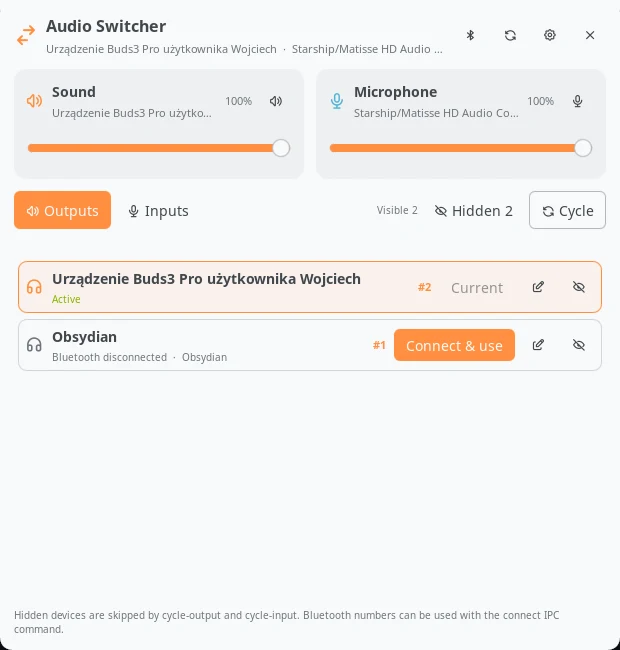

# Audio Switcher

Audio Switcher puts PipeWire inputs, outputs, volume controls, and Bluetooth
audio handoff in one compact Noctalia panel. Devices can be renamed or hidden,
and compositor keybinds can cycle devices or connect a specific Bluetooth
device by its persistent number.



Add the **Audio Switcher** widget from Noctalia's bar editor. Left click opens
the panel, right click cycles through visible outputs, and middle click cycles
through visible inputs. Scrolling over it changes the output volume.

## Plugin

| Field | Value |
| --- | --- |
| ID | `blackbartblues/audio-switcher` |
| Entries | Widget: `widget`; panel: `audio-switcher`; service: `service` |

## Requirements

Install `pactl`, `bluetoothctl`, and `sleep` on `PATH`. On Arch Linux they are
provided by the `libpulse`, `bluez-utils`, and `coreutils` packages respectively.
PipeWire's PulseAudio compatibility service and BlueZ must be running.

## Usage

Open the panel from a configured bar widget or run:

```sh
noctalia msg panel-toggle blackbartblues/audio-switcher:audio-switcher
```

The top sliders control the default output and input volume. Select **Outputs**
or **Inputs**, then choose **Use**. For a disconnected Bluetooth output the same
button connects it, waits for its PipeWire endpoint, makes it the default, and
moves current playback streams to it.

Use the pencil button to set a local display name, choose the device icon, and
change a Bluetooth keybind number. The number is assigned automatically after a
device connects successfully for the first time and can then be changed. Hidden
devices remain available in the panel but are skipped by cycling commands.

Use the settings button in the panel header to open Noctalia's plugin settings.

## Settings

| Entry | Setting | Type | Default | Description |
| --- | --- | --- | --- | --- |
| Plugin | `show_percentage` | `bool` | `true` | Show the output volume beside the bar icon; disable it for an icon-only widget. |
| Plugin | `scroll_step` | `int` | `5` | Volume points changed by each wheel step over the bar widget (1–25). |

## IPC and keybinds

The background service exposes commands that can be used by any compositor:

```sh
# Next non-hidden output. Disconnected Bluetooth outputs are connected as needed.
noctalia msg plugin blackbartblues/audio-switcher:service all cycle-output

# Next non-hidden, currently available input.
noctalia msg plugin blackbartblues/audio-switcher:service all cycle-input

# Connect the Bluetooth device assigned to number 2 and use its output.
noctalia msg plugin blackbartblues/audio-switcher:service all connect 2

# Refresh device state.
noctalia msg plugin blackbartblues/audio-switcher:service all refresh
```

For example, Niri bindings can spawn the commands directly:

```kdl
Mod+F9  { spawn "noctalia" "msg" "plugin" "blackbartblues/audio-switcher:service" "all" "cycle-output"; }
Mod+F10 { spawn "noctalia" "msg" "plugin" "blackbartblues/audio-switcher:service" "all" "cycle-input"; }
Mod+1   { spawn "noctalia" "msg" "plugin" "blackbartblues/audio-switcher:service" "all" "connect" "1"; }
```

Equivalent Hyprland bindings:

```ini
bind = SUPER, F9, exec, noctalia msg plugin blackbartblues/audio-switcher:service all cycle-output
bind = SUPER, F10, exec, noctalia msg plugin blackbartblues/audio-switcher:service all cycle-input
bind = SUPER, 1, exec, noctalia msg plugin blackbartblues/audio-switcher:service all connect 1
```

## Notes

Preferences are written to `preferences.json` in Noctalia's data directory for
this plugin. They contain only aliases, hidden flags, remembered Bluetooth input
capabilities, MAC addresses, keybind numbers, and per-device icon choices.

Before connecting a requested Bluetooth audio device, Audio Switcher disconnects
other Bluetooth audio devices connected to this computer. It cannot disconnect
the target from another computer or phone; that device must release the target
first unless it supports multipoint connections.

The plugin does not access the network. Its service spawns only the declared
`pactl`, `bluetoothctl`, and `sleep` commands. The short sleep is used while
waiting for a newly connected Bluetooth endpoint to appear. The panel may also
invoke the local Noctalia executable to open the plugin settings page.
