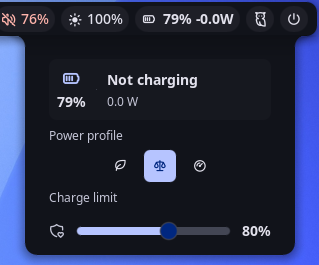

# Battery & Power Management

A battery status widget and control panel for **Noctalia v5**. The bar widget
shows charge percentage, live power draw in watts, and the active power profile.
Clicking it opens a panel to switch the system power profile and set the battery
charge-stop threshold — no root needed at runtime.

> Ported from the Noctalia v4 (Quickshell/QML) plugin of the same name to the v5
> Luau plugin runtime.



## Plugin

Manifest id `piero-93/battery-power-management`. It ships three entries that
share one state snapshot (no Lua memory is shared between them):

- `service` — the headless entry: polls the battery, power profile, and charge
  threshold, and performs every system read/write.
- `widget` — the bar widget: battery glyph, `NN% ±W.W`, and an optional profile
  glyph. Click it to open the panel.
- `panel` — the control surface: power-profile switch and charge-limit slider.
  Toggle it from a keybind with:

  ```sh
  noctalia msg panel-toggle piero-93/battery-power-management:panel
  ```

## Features

- **Live bar widget** — battery glyph, `NN% ±W.W`, and an optional profile glyph
  (leaf / scale / gauge), tinted by charge and profile state.
- **Power profiles** — one-tap switch between Power-saver / Balanced / Performance
  via `powerprofilesctl`.
- **Charge threshold** — a slider to cap charging (50–100%) on hardware that
  exposes `charge_control_end_threshold` (ThinkPad, ASUS, and others).
- **Time remaining** — time-to-empty / time-to-full via `upower`.

## Requirements

| Tool | Used for | If missing |
|------|----------|------------|
| `powerprofilesctl` | read/set power profile | profile controls are hidden |
| `upower` | time-to-empty/full | time remaining is hidden (watts shown instead) |

`powerprofilesctl` ships with
[power-profiles-daemon](https://gitlab.freedesktop.org/upower/power-profiles-daemon);
`upower` is packaged as `upower` on every major distro.

The service reads sysfs and runs the two tools above through a shell, so `sh`
and `cat` must be on `PATH` — both ship with every distro (coreutils and the
system shell), so there is nothing to install. The bundled setup script
additionally uses `sudo`, `bash`, `dirname`, `getent`, `groupadd`, `usermod`,
`chgrp`, `chmod`, and `udevadm`, all part of coreutils, shadow-utils, and
systemd/udev.

The charge-threshold slider additionally needs the sysfs attribute
`charge_control_end_threshold` to be present **and writable by your user** — see
Setup.

## Usage

Install the plugin from Noctalia's plugin manager, then add the **Battery &
Power Management** widget from the bar's Add-widget picker.

**Contributors only** — to run it from a checkout instead, register that
checkout as a development source:

```sh
noctalia msg plugins source add dev path /path/to/community-plugins
noctalia msg plugins enable piero-93/battery-power-management
```

`.luau` edits hot-reload; `plugin.toml` changes apply on the next config reload.

## Setup (optional — charge threshold only)

Writing the charge limit needs write access to a root-owned sysfs file. The
included script sets that up once, without giving the plugin root at runtime:

```sh
cd ~/.local/share/noctalia/plugins/battery-power-management/scripts
sudo ./setup-threshold-permissions.sh        # or: sudo ./setup-threshold-permissions.sh BAT1
```

Without an argument the rule matches `BAT*`, covering every battery in the
machine; pass a device name to scope it to one. The script is idempotent, and it
makes these changes to your system:

| Change | Detail |
|--------|--------|
| Creates a group | `battery_ctl`, and adds you to it with `usermod -aG` |
| Installs a udev rule | `/etc/udev/rules.d/99-noctalia-battery-power-management.rules` — `chgrp battery_ctl` + `chmod 0664` on `charge_control_end_threshold` |

The group is shared with the separate `battery-threshold` plugin on purpose (same
capability, same semantics), but the rule filename is plugin-specific so the two
never overwrite each other.

Then **log out and back in**. If you skip this setup, everything else still
works; only the threshold slider is affected (it shows a notification on write
failure).

### NixOS

`/etc/udev/rules.d` is generated from system config on NixOS, so the script exits
instead of writing to it. Add the equivalent declaratively:

```nix
users.groups.battery_ctl = { };
users.users.<you>.extraGroups = [ "battery_ctl" ];
services.udev.extraRules = ''
  ACTION=="add|change", SUBSYSTEM=="power_supply", KERNEL=="BAT*", RUN+="${pkgs.coreutils}/bin/chgrp battery_ctl /sys$devpath/charge_control_end_threshold", RUN+="${pkgs.coreutils}/bin/chmod 0664 /sys$devpath/charge_control_end_threshold"
'';
```

## Settings

| Setting | Type | Default | Description |
|---------|------|---------|-------------|
| Colorize by profile | bool | `true` | Tint the widget by active profile |
| Power-saver color | color | `secondary` | Accent for the Power-saver profile |
| Performance color | color | `error` | Accent for the Performance profile |
| Show profile icon | bool | `true` | Show the profile glyph in the widget |
| Show balanced icon | bool | `false` | Also show the glyph on Balanced |
| Battery device | string | `BAT0` | sysfs battery name (`BAT0`, `BAT1`, …) |

## What it does to your system

For review transparency (this plugin is trusted, unsandboxed Luau):

- **Reads** `/sys/class/power_supply/<device>/uevent` and
  `/sys/class/power_supply/<device>/charge_control_end_threshold` every 5 s.
- **Runs** `powerprofilesctl get` and
  `upower -i /org/freedesktop/UPower/devices/battery_<device>` on every third
  poll (~15 s), each guarded by `commandExists`, plus
  `powerprofilesctl set <profile>` when you pick a profile.
- **Writes** the threshold to
  `/sys/class/power_supply/<device>/charge_control_end_threshold` only when you
  move the slider.
- All of the above go through `noctalia.runAsync`, which executes via
  `/bin/sh -c`, so each poll spawns a shell (and a `cat` for the sysfs read).
  The configurable device name is reduced to a single path segment and
  shell-quoted before use; the threshold is clamped to 50–100.
- **No network access.**
- The **setup script** is never invoked by the plugin; you run it yourself with
  `sudo`. Its system changes are listed in Setup above.

## License

GPL-3.0
