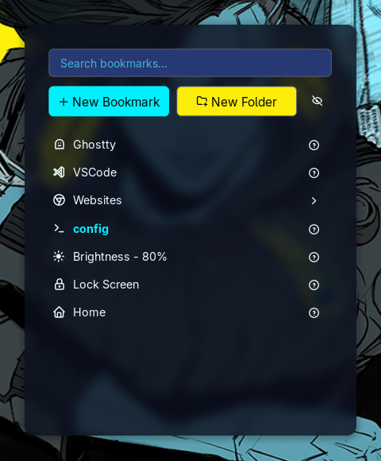
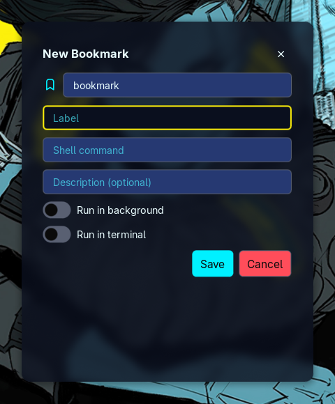
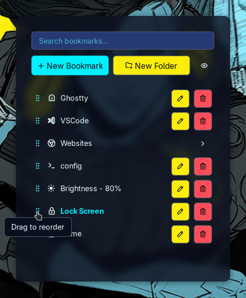
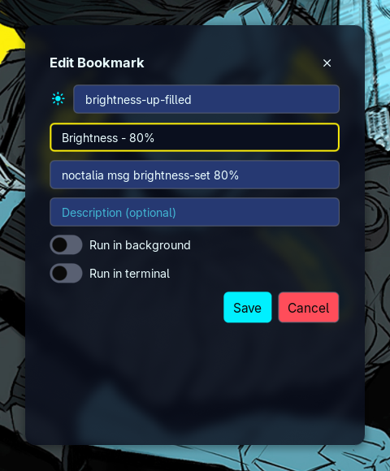

# Bookmarks

A bookmarks/shortcuts plugin for Noctalia. You can add folders and commands to a list of bookmarks.
Reorder bookmarks, categorize them with folders, set glyphs and labels, and simply left click to
execute. All of it is user defined, stored in a JSON file you can backup.

## Plugin

| Field   | Value                              |
| ------- | ---------------------------------- |
| ID      | `dunarand/bookmarks`               |
| Entries | Bar widget: `bar`; panel: `panel`; |

Bar widget `bar` is not required. Instead, you can assign a keybind to directly open the `panel`,
which is shown in the Usage section.

## Requirements

- Noctalia v5.0.0 or higher
- `nohup` (Optional): For "Run in background" wrapper toggle

## Usage

You can add the widget to your bar or assign the following command to your compositor keybinds. For
example, in Hyprland v0.55+

```
hl.bind(
    "SUPER + SHIFT + B",
    hl.dsp.exec_cmd("noctalia msg panel-toggle dunarand/bookmarks:panel")
)
```

You can interact with the bookmarks list via keybinds:

| Keybind                  | Purpose                                                          |
| ------------------------ | ---------------------------------------------------------------- |
| `CTRL + N` or Down Arrow | Select the next (below) item                                     |
| `CTRL + P` or Up Arrow   | Select the previous (above) item                                 |
| `CTRL + S`               | Search bookmarks                                                 |
| `Enter` / `Return`       | Execute the selected bookmark's command / Navigate into a folder |

- Bookmarks and folders are listed in the main panel.

  

- "?" button shows tooltips: bookmark command and its description.

  

- You can create or edit bookmarks by assigning them a glyph, a label, a command, and an
  optional description.

  

  - "Run in background" toggle wraps the command you defined in the following way:

    `nohup <bookmark-command> >/dev/null 2>&1 &`

    For example, instead of typing the whole command

    `nohup xdg-open "$HOME" >/dev/null 2>&1 &`

    each time, you can instead define the command as `xdg-open "$HOME"` and toggle "Run in
    background" switch.

  - "Run in terminal" switch executes the command with the default terminal. These switches are
    mutually exclusive so you can only choose one. Toggling on a switch will result the other to
    turn off.

- You can create folders and nest other bookmarks within folders.

  

  Folders cannot nest other folders. This is by design and it'll not change unless I find a
  genuine usecase. You can edit folders by clicking on the "pen" icon next to its name.

- You can press the "eye" icon to enter edit mode where you can edit, delete, and reorder bookmarks.

  

- Each bookmark can be edited anytime.

  

The saved bookmarks are written to `$NOCTALIA_STATE_HOME/plugins/data/dunarand/bookmarks/data.json`.
By default, `$NOCTALIA_STATE_HOME` should point to `~/.local/state/noctalia`. You can point to a
different location for saving and backing up your bookmarks. This setting is configurable via
**plugin settings** under Settings -> Plugins. Only JSON format is accepted.

## Settings

The bar widget has the following settings:

| Setting   | Type     | Default     | Description                      |
| --------- | -------- | ----------- | -------------------------------- |
| `glyph`   | `glyph`  | `bookmark`  | Glyph displayed on the bar       |
| `tooltip` | `string` | `Bookmarks` | Tooltip displayed on the bar     |
| `text`    | `string` | `Bookmarks` | Widget text displayed on the bar |

The plugin itself has the following settings:

| Setting            | Type   | Default | Description                                                                           |
| ------------------ | ------ | ------- | ------------------------------------------------------------------------------------- |
| `data_path`        | `file` |         | data.json file to store the saved bookmarks. Leave empty to use the default location. |
| `show_info_button` | `bool` | `true`  | Shows the "?" tooltip button on the bookmark entries.                                 |

## IPC

1. Open the bookmarks panel:

   ```sh
   noctalia msg panel-toggle dunarand/bookmarks:panel
   ```

2. Open the bookmarks panel in search mode (immediately puts you into search mode) so that you can
   use your bookmarks panel as a launcher:

   ```sh
   noctalia msg panel-toggle dunarand/bookmarks:panel search
   ```
