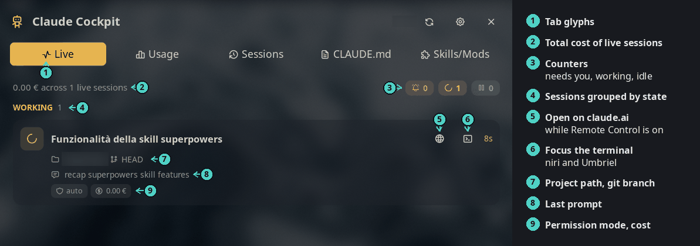
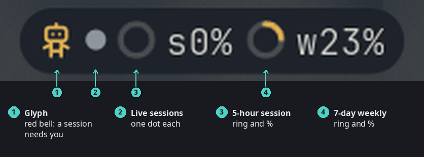
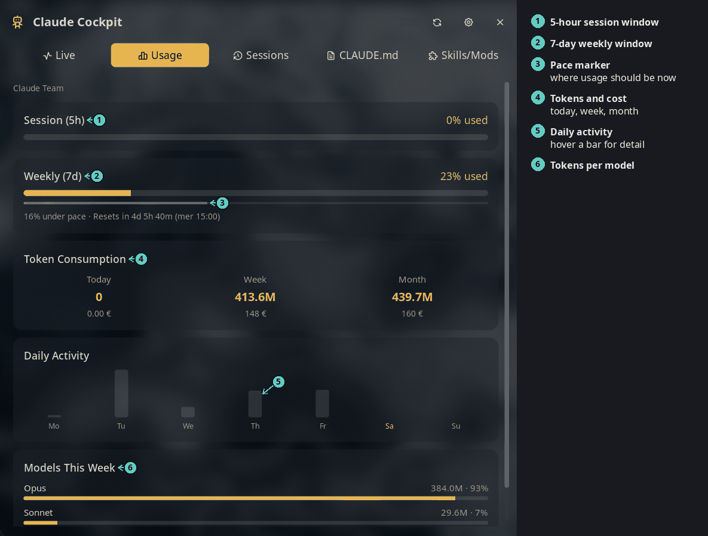
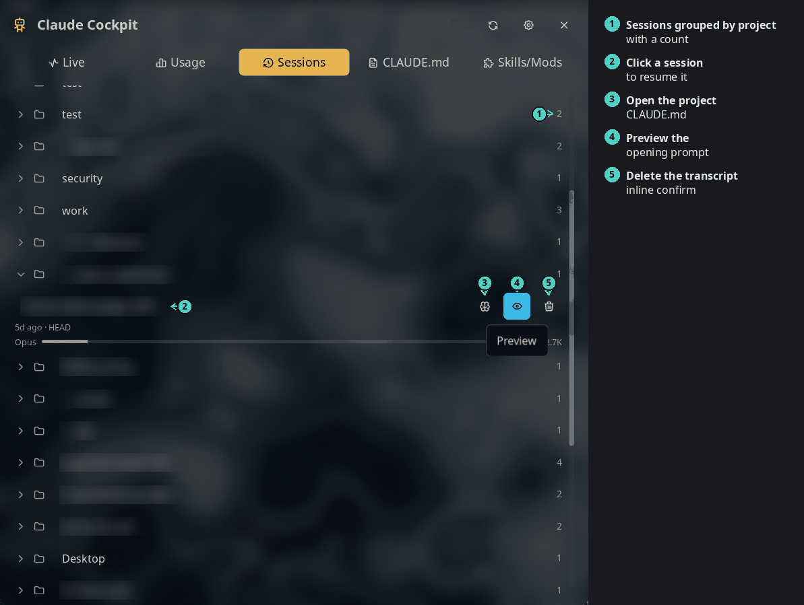
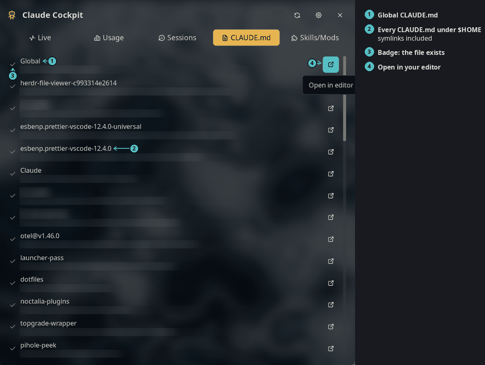
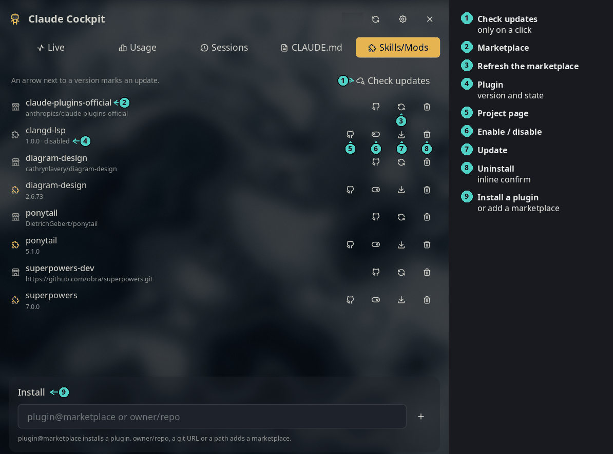

# Claude Cockpit

Watch your Claude Code sessions and plan limits from the bar. One panel
shows the running sessions, usage and cost, every past session, your
CLAUDE.md files, and the installed skills and mods.



*The Live tab: every running session, grouped by what it needs from you.*

## Plugin

| Field | Value |
| --- | --- |
| ID | `nightwatch75/claude-cockpit` |
| Entries | Bar widget: `widget`; panel: `panel`; service: `service` |

The headless `service` fetches usage and polls the live sessions. The
widget and the Live and Usage tabs only show what it publishes.

## Requirements

- `bash`, `jq` and `curl`.
- The base tools the scripts call: `find`, `stat`, `grep`, `tac`, `awk`,
  `head`, `tail`, `rm`, `mkdir`, `mv`. Every distribution ships them.
- `claude` on `PATH` for the Skills/Mods tab, and a logged-in Claude Code
  (`~/.claude/.credentials.json`) for the Usage tab.
- `xdg-open` to open a project page.
- Optional: `niri` or `umbriel` to focus a session's terminal from the
  Live tab.
- Optional: `code` or `zed` to open a CLAUDE.md, or set `editor_command`.

## Usage

Add **Claude Cockpit** to a bar from the Add-widget picker. Click it to
open the panel, or:

```sh
noctalia msg panel-toggle nightwatch75/claude-cockpit:panel
```

### Bar widget



*Activity mode, the default. The tooltip lists the live sessions and the
usage figures.*

- The glyph turns into a red bell when a session waits for you.
- One dot per running session: red needs you, accent is working, grey is
  idle. After 8 dots it shows `+N`.
- Rings and percentages show the 5-hour session and the 7-day weekly
  window. They turn amber or red when usage runs ahead of the clock.

Set `display_mode` to `classic` for the glyph and percentages only.

### Live

See the screenshot at the top. Sessions are grouped into *Needs you*,
*Working* and *Idle*. Each card shows the title, the time in its state, the
path and git branch, what it waits for, the last prompt, the model, the
context size and the cost. Click a card to focus its terminal (niri and
Umbriel). The globe opens the session on claude.ai while Remote Control is
on.

### Usage



*Plan limits, token use and cost, daily activity and models.*

Cost is an estimate from token counts and public prices, in the currency
you choose.

### Sessions



*Every past session, grouped by project. Work project names are blurred in
this screenshot.*

Click a session to resume it (`claude --resume <id>`) in a terminal, in its
project directory. The search box filters by title, prompt or path.

### CLAUDE.md



*Every CLAUDE.md in your home directory. Paths are blurred in this
screenshot.*

The list also has a row for each session project without a CLAUDE.md, so
you can create one. Network mounts and noise folders (`.git`,
`node_modules`, `.cache`, `.venv`) are skipped.

### Skills/Mods



*Installed plugins grouped by marketplace, with the install box at the
bottom.*

- Skills and mods are Claude Code plugins, so this tab drives
  `claude plugin`. Bare skill folders in `~/.claude/skills` are listed too.
  You can only remove them.
- **Check updates** fetches every marketplace and marks a plugin with a
  newer version as `old → new`. It installs nothing.
- Removing a marketplace also uninstalls its plugins.
- The install box takes `plugin@marketplace` to install a plugin, or
  `owner/repo`, a git URL or a path to add a marketplace.
- Restart Claude Code to apply plugin changes.

## Settings

| Setting | Type | Default | Description |
| --- | --- | --- | --- |
| `usage_refresh_interval` | `int` | `2` | Minutes between usage fetches (2–15). |
| `currency` | `select` | `auto` | Cost currency: `auto` follows the locale, or one of `usd`, `eur`, `gbp`, `jpy`, `cny`, `chf`, `aud`, `cad`, `inr`. |
| `currency_api_url` | `string` | `https://api.frankfurter.dev/v1/latest` | Exchange-rate API for non-USD currencies. |
| `terminal` | `string` | `""` | Terminal to resume a session in. Empty uses `$TERMINAL`, then the usual emulators. |
| `editor_command` | `string` | `""` | Command to open a CLAUDE.md. Empty tries `code`, then `zed`. |
| `display_mode` | `select` | `activity` | Widget mode: `activity` (dots, rings, percentages) or `classic` (glyph and percentages). |
| `glyph` | `glyph` | `robot` | Widget glyph. |
| `usage_percent_display` | `select` | `both` | Windows the widget shows, in both modes: `session` (`sNN%`), `weekly` (`wNN%`), `both`, or `none`. |

## Notes

What the plugin touches:

- **Reads** `~/.claude/sessions/*.json` and the transcripts of running
  sessions, every 2 seconds, only while the widget is in activity mode or
  the Live tab is open. A transcript is parsed again only when it changes.
  The Usage and Sessions tabs read the other transcripts in small slices.
- **Reads** `~/.claude/.credentials.json` for the token of the usage query.
- **Writes** two caches you can delete: `~/.claude/pricing-cache.json` and
  `~/.claude/usage-cache.json`. In the plugin data dir: `live/` (session
  stats) and `rings/` (widget ring images).
- **Network**: the Anthropic usage API, the LiteLLM price table and the
  exchange-rate API, all over HTTPS. The Sessions and CLAUDE.md tabs make
  no network calls.
- **Spawns** the plugin's own scripts through `bash`, `claude plugin` on a
  click in the Skills/Mods tab, your terminal, your editor, `xdg-open`, and
  `niri msg` or `umbriel msg` to focus a window (window ids and pids only,
  never titles).
- **Deletes**, always after an inline confirm: a session transcript (trash
  glyph), a plugin or marketplace (through `claude plugin`), a local skill
  folder (a symlink loses the link only).
- No rename: Claude Code cannot rename a session after it starts.

The Usage engine, `get-claude-usage`, is copied (MIT) from
[jrohland/claudecode](https://github.com/jrohland/noctalia-v5-claudecode),
reading only the default `~/.claude` account. See its header comment and
`LICENSE`.

Localized in English. Translations are welcome through
[Noctalia Translate](https://i18n.noctalia.dev).

## License

[MIT](LICENSE)
