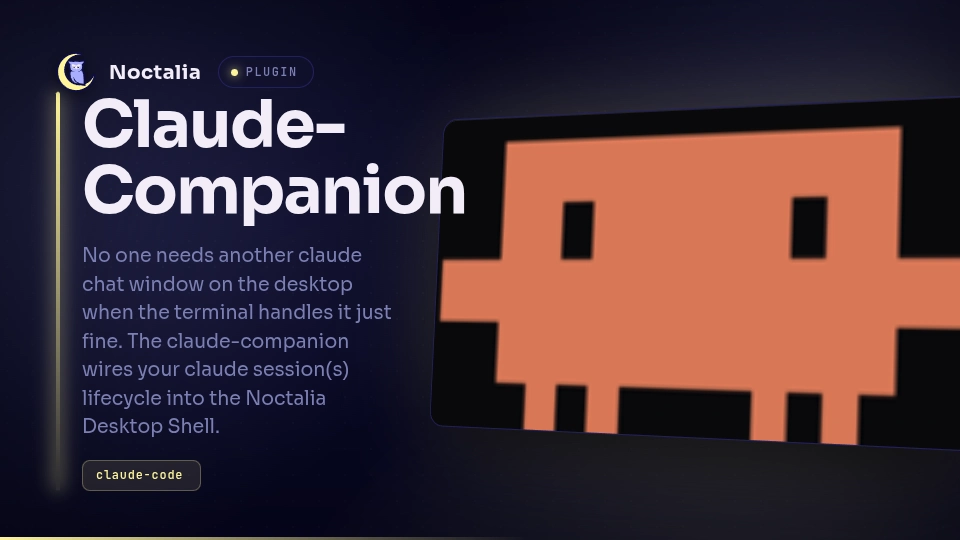
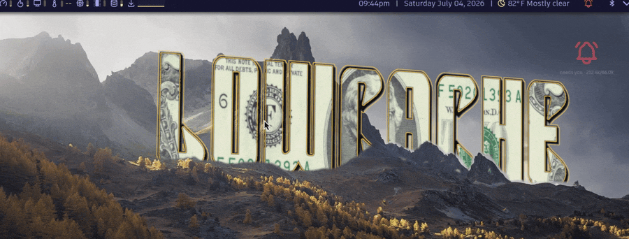

# Claude Companion



[Claude Code](https://claude.com/claude-code)'s live status on your Noctalia desktop. A **pulse** on the bar tracks every running session and turns red when one needs you. An **orb** on the desktop breathes with the work. Ask quick questions from the bar and read the full answer in a panel. The terminal still does the real work; this plugin makes it visible.

It works with other agents too: Gemini CLI, Codex, opencode and aider. See [Other agents](#other-agents).




## Plugin

| Field | Value |
| --- | --- |
| ID | `lowcache/claude-companion` |
| Entries | Bar widget: `pulse`; desktop widget: `orb`; panels: `answer`, `sessions`, `consent`, `ask`; services: `pulse-svc`, `claude-ask`; launcher provider: `claude` |
| Launcher Prefix | `/claude` |

## Requirements

Noctalia 5 on **niri**, **Hyprland** or **Sway**; you only need the CLI for the compositor you run (`niri`, `hyprctl` or `swaymsg`).

- `claude` — [Claude Code](https://claude.com/claude-code), the agent this visualizes. Optional if you drive the pulse from another agent.
- `python3` — the hooks and the MCP shim. Standard library only.
- `playerctl`, `nmcli`, `notify-send`, `ps` — used by the desktop tools Claude gets, each optional: without one, that tool reports nothing.
- `tr`, `timeout` — used by `hooks/pulse-emit`, the emitter for other agents; it also needs `grep`, `sed` and `head` for its `-` mode.

## Install

1. In Noctalia, open **Settings → Plugins → Browse Plugins**, find **Claude Companion** and click **Add to Noctalia**.
2. Put the `pulse` widget on a bar (**Settings → Bar**) and, if you like, the `orb` on your desktop. Neither is required: sessions are tracked either way.
3. Connect Claude Code's hooks:

   ```sh
   python3 ~/.local/state/noctalia/plugins/materialized/community/claude-companion/hooks/install.py
   ```

   This backs up `~/.claude/settings.json`, adds the plugin's hooks and leaves your other hooks alone. It's safe to run again; it only fixes what's missing or out of date. Restart any running Claude sessions afterwards.

Your sessions show up even without step 3, as working, needs you or idle. Hooks add tool-level detail, token counts, instant updates and the approval gate. If the hooks ever break, the sessions panel shows a warning with a **Repair** button.

Check that it works:

```sh
noctalia msg plugin lowcache/claude-companion:pulse-svc all needs_attention   # pulse turns red
noctalia msg plugin lowcache/claude-companion:pulse-svc all idle              # back to normal
```

Working on the plugin itself? See [DEVELOPMENT.md](https://github.com/lowcache/noctalia-claude-plugin/blob/main/DEVELOPMENT.md) for installing from a clone.

## Usage

| Do this | Get this |
| --- | --- |
| `/claude <task>` in the launcher | Claude Code in your terminal, with tools to see and control the desktop |
| `/claude` | Your most recent conversation, continued |
| `/claude ? <question>` | A quick read-only answer in the answer panel |
| Left-click the pulse | The ask panel: type a question, press Enter |
| Right-click the pulse | The sessions panel: each session's state and token use |
| Hover the pulse | The same, as a tooltip |

The answer panel opens by itself when an answer arrives. To see it again, use **Show last answer** under `/claude`.

Sessions clean themselves up. When Claude exits, even if it was killed or crashed, its session disappears within a few seconds. The **Retire** button in the sessions panel is for the rare one that sticks.

Every panel can be opened from a keybind:

```sh
noctalia msg panel-toggle lowcache/claude-companion:ask    # or: answer, sessions, consent
```

## Settings

| Setting | Key | Type | Default | What it does |
| --- | --- | --- | --- | --- |
| Breath speed | `breath_speed` | double, 0.25–3.0 | 1.0 | How fast the pulse and orb breathe |
| Bar dot glow floor | `pulse_glow_floor` | double, 0.0–0.9 | 0.45 | How dim the pulse gets between breaths |
| Orb swell | `orb_swell` | double, 0.0–3.0 | 1.0 | How much the orb grows as it breathes |
| Tool consent gate | `consent_mode` | off / learn / enforce | `off` | Approve Claude's tool calls from the desktop; see below |
| Detect sessions without hooks | `detect_sessions` | bool | on | Show sessions from Claude Code's own session files |

Colors follow your Noctalia theme.

## Approving tools from the desktop

The consent gate lets you approve Claude's shell commands and file edits (Bash, Write, Edit, NotebookEdit) from a desktop panel instead of the terminal. It's off by default.

1. Set **Tool consent gate** to **Learn** and work normally for a few days. Nothing is blocked; the plugin records what Claude runs.
2. Open the consent panel (`noctalia msg panel-toggle lowcache/claude-companion:consent`) and click **Promote observations**. Everything it recorded is now allowed without asking.
3. Set the gate to **Enforce**. Anything not allowed yet opens the panel: **Allow once**, **Always allow** or **Deny**.

Good to know:

- The gate can only add a prompt, never remove one. Claude Code's own permission rules still apply to everything.
- **Always allow** matches a Bash command exactly, character for character. For Write and Edit it covers that file path, whatever gets written to it later.
- If anything goes wrong, such as Noctalia not running or no answer within 110 seconds, Claude asks in the terminal as usual.
- The allowlist is `~/.local/state/noctalia/claude-companion/allow.jsonl` (under `$XDG_STATE_HOME` if you set it). If your system wipes that folder at boot, add it to what you persist.

## IPC

Panels — `answer`, `sessions`, `consent`, `ask`:

```sh
noctalia msg panel-toggle lowcache/claude-companion:answer
noctalia msg panel-toggle lowcache/claude-companion:sessions
noctalia msg panel-toggle lowcache/claude-companion:consent
noctalia msg panel-toggle lowcache/claude-companion:ask
```

The `pulse-svc` service takes the lifecycle events that drive the pulse. Eight lifecycle events and three control events, with a single space-free CSV payload; the full contract is in [PROTOCOL.md](PROTOCOL.md):

```sh
noctalia msg plugin lowcache/claude-companion:pulse-svc all <event> [payload]
noctalia msg plugin lowcache/claude-companion:pulse-svc all needs_attention
noctalia msg plugin lowcache/claude-companion:pulse-svc all idle
```

The `claude-ask` service takes one bare poke, used by the ask panel. The question goes to `$XDG_RUNTIME_DIR/claude-companion/ask` first, because a payload can't contain spaces:

```sh
noctalia msg plugin lowcache/claude-companion:claude-ask all ask
```

The `pulse` bar widget and the `orb` desktop widget only subscribe to shared state and take no IPC.

## Other agents

The pulse understands a simple event format, so any agent that can run a command on its own events can drive it. `hooks/pulse-emit` sends those events:

```sh
pulse-emit turn_start mysession
pulse-emit turn_end mysession
pulse-emit session_end mysession
```

Copy-paste setups for **Gemini CLI**, **Codex CLI**, **opencode** and **aider** are in [PROTOCOL.md](PROTOCOL.md#ready-made-adapters), along with the full event format.

## Notes

### What it touches

- **Files it writes:** temporary files under `$XDG_RUNTIME_DIR` (`/tmp` if that's unset), the consent allowlist and learn log in `~/.local/state/noctalia/claude-companion/`, and hook entries in `~/.claude/settings.json`, only when you run the installer.
- **Files it reads:** Claude Code's session files in `~/.claude/sessions/`, and each session's transcript for token counts.
- **What Claude can do through it:** sessions started with `/claude` can read your windows, workspaces, media, network, battery and running processes, and can focus or move windows, switch workspaces, send notifications and change the theme or wallpaper.
- **Network:** none of its own. Quick questions run `claude -p`, which talks to Anthropic just like Claude Code in a terminal.

### Known limits

- A notification or dropdown terminal can cover the plugin's panels. Dismiss it and the panel is still there.
- Quick questions can't refresh an expired Claude login. If yours has expired, open Claude Code in a terminal once; the plugin tells you when this is the problem.
- Detection without hooks reads Claude Code's internal session files. If a future Claude Code changes them, detection stops and hooks keep working.
- Built-in and wallpaper-generated color schemes fall back to fixed accent colors. Custom and community schemes are followed live.

## Support

If this plugin is useful to you, you can [sponsor the work](https://github.com/sponsors/lowcache) or [buy me a coffee](https://buymeacoffee.com/lowcache). Bug reports and upstream fixes are worth just as much.

## License

MIT; see [LICENSE](https://github.com/lowcache/noctalia-claude-plugin/blob/main/LICENSE).
