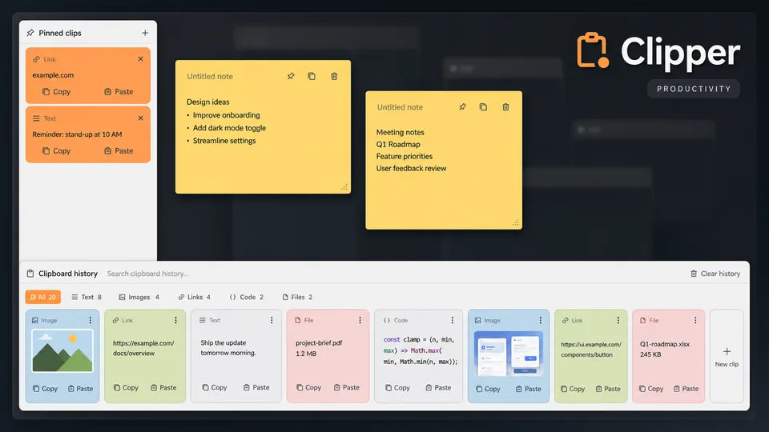
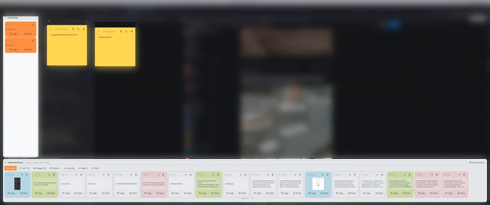

# Clipper

Clipper combines searchable clipboard history, persistent pinned clips, image previews, and freely arranged notecards in one fullscreen Noctalia workspace.

## Preview



### Panel



The desktop behind the transparent workspace is blurred in the screenshot; the Clipper surfaces remain unchanged.

## Plugin

| Field | Value |
| --- | --- |
| ID | `blackbartblues/clipper` |
| Entries | Bar widget: `widget`; panel: `panel`; service: `service`; shortcut: `shortcut` |

## Requirements

Clipper runs on Wayland and uses the following commands:

- `cliphist` stores, lists, decodes, deletes, and clears clipboard history.
- `wl-copy` and `wl-paste` are provided by `wl-clipboard`; they copy entries and, in private mode, watch text and image clipboard changes.
- `wtype` sends the paste shortcut after Clipper restores the previously focused window.
- `hyprctl`, `niri`, and `nc` provide focus capture and restoration on Hyprland, niri, and MangoWC respectively. Only the command for the active compositor is used; `nc` is the MangoWC client.

The history and notecard workspace works without compositor-specific focus restoration. The **Paste** action requires the relevant compositor command and `wtype`; **Copy** does not.

## Usage

Add the `widget` entry to a bar to open Clipper with a click. You can also add the `shortcut` entry under **Settings → Control Center shortcuts** and bind it in your compositor. For example, the panel can be assigned to `Super`+`V`.

Open, close, or toggle the panel directly:

```sh
noctalia msg panel-open blackbartblues/clipper:panel
noctalia msg panel-close blackbartblues/clipper:panel
noctalia msg panel-toggle blackbartblues/clipper:panel
```

The panel has three working areas:

- **Pinned clips** keeps selected text and images outside normal history retention. Copy or paste a pin, or remove it when it is no longer needed.
- **Notecards** provides editable sticky notes. Notes save automatically, can overlap, move freely, change color, and export as text files.
- **Clipboard history** searches and filters text, images, colors, links, code, and file paths. Use **Copy** to place an entry on the clipboard or **Paste** to restore the window focused before Clipper opened and paste there.

In the history area, drag a card by its top bar into the pinned column. Notecards are moved by their top bar so their title and body remain directly editable.

## Settings

| Setting | Type | Default | Description |
| --- | --- | --- | --- |
| `database_mode` | `select` | `private` | Uses Clipper's isolated cliphist database or the default global cliphist database. Delete and clear affect the shared database in global mode. |
| `manage_watchers` | `bool` | `true` | Starts Clipper-owned text and image watchers in private mode. Hidden and ignored in global mode. |
| `history_limit` | `int` | `200` | Maximum entries loaded by the service. In private mode it also sets Clipper's cliphist retention limit. |
| `enable_notecards` | `bool` | `true` | Shows or hides the notecard canvas. Existing notes remain stored when hidden. |
| `max_pinned` | `int` | `20` | Maximum number of persistent pinned entries. |
| `auto_paste_delay` | `int` | `300` | Delay in milliseconds before restoring the previous window and sending `Ctrl`+`Shift`+`V`. |
| `history_cards` | `int` | `30` | Maximum cards per history page; the panel reduces the count when the available width is smaller. |
| `panel_margin_percent` | `int` | `0` | Margin around the fullscreen workspace as a percentage of the active display. |
| `show_panel_background` | `bool` | `false` | Draws a background behind the complete workspace. Pinned clips and history keep their own opaque surfaces. |
| `card_color` | `color` | `surface_variant` | Base theme role or custom color for text history cards; recognized content types retain distinct accents. |
| `pinned_color` | `color` | `primary` | Theme role or custom color for pinned cards. |
| `notes_color` | `color` | `#FFD54F` | Initial paper color for new notecards. Each note can cycle through the built-in paper palette. |
| `show_close_button` | `bool` | `true` | Shows the close action in the panel header. |

## IPC

Panel-level IPC controls the current panel view. The panel entry must be open for these events to have an active instance:

```sh
noctalia msg plugin blackbartblues/clipper:panel all refresh
noctalia msg plugin blackbartblues/clipper:panel all search 'query text'
noctalia msg plugin blackbartblues/clipper:panel all filter image
noctalia msg plugin blackbartblues/clipper:panel all new-note
```

`filter` accepts `all`, `text`, `image`, `color`, `link`, `code`, or `file`.

The singleton service exposes every data operation. Clipboard history IDs are the numeric IDs shown by `cliphist list`; pin and note IDs are available in the shared snapshot described below.

```sh
# History
noctalia msg plugin blackbartblues/clipper:service all refresh
noctalia msg plugin blackbartblues/clipper:service all copy 42
noctalia msg plugin blackbartblues/clipper:service all paste 42
noctalia msg plugin blackbartblues/clipper:service all pin 42
noctalia msg plugin blackbartblues/clipper:service all delete 42
noctalia msg plugin blackbartblues/clipper:service all clear

# Pinned clips
noctalia msg plugin blackbartblues/clipper:service all copy-pinned pin-1700000000-1
noctalia msg plugin blackbartblues/clipper:service all paste-pinned pin-1700000000-1
noctalia msg plugin blackbartblues/clipper:service all unpin pin-1700000000-1

# Notecards
noctalia msg plugin blackbartblues/clipper:service all create-note
noctalia msg plugin blackbartblues/clipper:service all update-note '{"id":"note-1700000000-1","title":"Title","content":"Body"}'
noctalia msg plugin blackbartblues/clipper:service all move-note '{"id":"note-1700000000-1","x":160,"y":240}'
noctalia msg plugin blackbartblues/clipper:service all reorder-note '{"id":"note-1700000000-1","target_index":1}'
noctalia msg plugin blackbartblues/clipper:service all cycle-note-color note-1700000000-1
noctalia msg plugin blackbartblues/clipper:service all export-note note-1700000000-1
noctalia msg plugin blackbartblues/clipper:service all delete-note note-1700000000-1
```

Automations can also send the same request shape used internally by the panel:

```sh
noctalia msg plugin blackbartblues/clipper:service all request \
  '{"operation":"activate","id":"42","paste":false}'
```

Supported `operation` values are `refresh`, `activate`, `pin`, `delete`, `wipe`, `unpin`, `copy_pinned`, `create_note`, `update_note`, `move_note`, `reorder_note`, `cycle_note_color`, `export_note`, and `delete_note`. IPC is asynchronous: the CLI confirms dispatch, while the result is published to Noctalia state as `clipper_result`.

The service publishes these state keys for integrations:

- `clipper_snapshot`: revision, status, error, current history metadata, pins, notecards, watcher ownership, and total item count.
- `clipper_result`: the most recent request ID, operation, success flag, error code, and operation-specific fields.
- `clipper_panel_open`: whether the Clipper panel is open.

## Internationalization

English is the source language and runtime fallback in `translations/en.json`. All visible panel labels, actions, statuses, notifications, widget text, shortcut text, setting labels, and setting descriptions use translation keys. Additional locales are supplied through Noctalia Translate rather than committed as machine translations.

## Notes

- Private history, pinned payloads, notecard metadata, and decoded image thumbnails are stored in Noctalia's plugin data directory. Notecard exports are written to `~/Documents/Clipper`.
- Global database mode follows cliphist's normal database resolution, including `XDG_CACHE_HOME`. Clipper does not start duplicate watchers in this mode; an external cliphist watcher must already populate the database.
- **Delete** and **Clear history** permanently modify the selected database. In global mode this also affects other clipboard frontends using that database.
- Clipboard bytes are streamed between `cliphist`, files, and `wl-copy`; history payloads are not decoded into Luau. Preview metadata and cached image thumbnails are bounded.
- The plugin makes no network requests. It spawns only the commands listed under **Requirements**, plus standard shell utilities used to supervise watchers and bounded subprocesses.
- Automatic paste currently restores focus on Hyprland, niri, and MangoWC. Unsupported compositors can still use **Copy** and paste manually.
