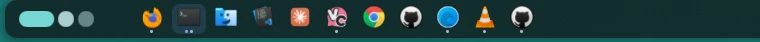

# Flex Taskbar

Flex Taskbar is a configurable Niri taskbar for the Noctalia bar. It groups windows by application, shows one dot per window and a focused-app underline, and provides clickable window thumbnails on hover.

## Plugin

| Field | Value |
| --- | --- |
| ID | `sudiptacmd/flex-taskbar` |
| Entries | Bar widget: `taskbar`; panel: `previews` |

## Screenshot



## Requirements

- `niri` supplies the window list, focus actions, output information, and window screenshots.
- `gtk-launch` launches pinned desktop applications that do not have a custom command. It is normally provided by GTK.
- `wl-copy` and `wl-paste` preserve and restore the clipboard while Niri captures preview thumbnails. Both are provided by `wl-clipboard` on most distributions.
- `head` selects the first clipboard MIME type and `rm` removes the temporary clipboard backup. Both are normally provided by GNU coreutils.

All six commands must be available on `PATH`. This plugin is designed for Niri and does not support other compositors.

## Usage

Add the `taskbar` widget to a bar in Noctalia Settings. Right-click the widget to open its settings, then edit **Pinned applications** using desktop-file IDs without the `.desktop` suffix, for example `firefox`, `kitty`, or `org.gnome.Nautilus`.

- Left-click a stopped pin to launch it with `gtk-launch` or its configured custom command.
- Left-click a running app to focus it; repeated clicks cycle through that app's windows.
- Scroll over the widget to move focus through running application groups.
- Hover a running app to open its window previews, then click a preview to focus that window.
- Disable **Window previews on hover** in plugin settings if previews are not wanted.

If Niri's `app_id` differs from the desktop-file ID, add a **Window app aliases** mapping from the Niri ID to the pinned ID. Inspect current IDs with:

```sh
niri msg -j windows
```

The preview panel normally opens automatically from the bar widget. It can also be toggled directly, although it will be empty until the widget has populated preview state:

```sh
noctalia msg panel-toggle sudiptacmd/flex-taskbar:previews
```

Flex Taskbar's own hover background is transparent by default. If Noctalia still draws a capsule around the whole widget, disable the bar's global **Hover highlight** option.

## Settings

Plugin-wide preview settings:

| Setting | Type | Default | Description |
| --- | --- | --- | --- |
| `preview_enabled` | `bool` | `true` | Enables window previews when a running app is hovered. |
| `preview_hover_delay` | `int` | `220` | Delay in milliseconds before opening previews. |
| `preview_hide_delay` | `int` | `450` | Grace period in milliseconds for moving into the preview panel. |
| `preview_max_windows` | `int` | `3` | Maximum preview cards shown for one app, from 1 to 3. |
| `preview_width` | `int` | `190` | Thumbnail width in pixels. |
| `preview_height` | `int` | `115` | Thumbnail height in pixels. |
| `preview_gap` | `int` | `10` | Gap between preview cards in pixels. |
| `preview_radius` | `int` | `8` | Thumbnail corner radius in pixels. |
| `preview_show_titles` | `bool` | `true` | Shows the window title below each thumbnail. |
| `preview_title_size` | `int` | `11` | Window-title font size in pixels. |
| `preview_refresh_seconds` | `int` | `12` | Seconds before a cached thumbnail is captured again. |
| `preview_card_color` | `color` | `#ffffff12` | Preview-card background color. |
| `preview_border_color` | `color` | `#ffffff20` | Border color for previews that are not focused. |
| `preview_border_width` | `double` | `1.0` | Preview-card border width in pixels. |

Per-widget taskbar settings:

| Setting | Type | Default | Description |
| --- | --- | --- | --- |
| `pinned_apps` | `string_list` | common desktop apps | Ordered desktop-file IDs to keep as launchers. |
| `show_unpinned_running` | `bool` | `true` | Adds running applications that are not pinned. |
| `hide_stopped_pins` | `bool` | `false` | Hides a pin when it has no windows. |
| `app_aliases` | `string_map` | common aliases | Maps Niri `app_id` values to pinned desktop-file IDs. |
| `launch_commands` | `string_map` | empty | Maps an app ID to a shell launch command instead of `gtk-launch`. |
| `icon_overrides` | `string_map` | empty | Maps an app ID to an icon name or local image path. |
| `label_overrides` | `string_map` | empty | Maps an app ID to a custom visible label. |
| `current_output_only` | `bool` | `false` | Shows only windows on the monitor containing this bar; pins remain visible. |
| `order` | `select` | `pinned_first` | Orders groups pinned-first, running-first, or alphabetically. |
| `icon_size` | `int` | `24` | App icon size in pixels. |
| `icon_radius` | `int` | `5` | App icon corner radius in pixels. |
| `item_width` | `int` | `34` | Minimum width of each app item in pixels. |
| `item_gap` | `int` | `3` | Gap between app items in pixels. |
| `item_padding` | `int` | `3` | Horizontal padding inside an app item in pixels. |
| `item_radius` | `int` | `8` | App-item corner radius in pixels. |
| `item_border_width` | `double` | `0.0` | App-item border width in pixels. |
| `item_border_color` | `color` | transparent | App-item border color. |
| `background_style` | `select` | `active` | Draws item backgrounds for none, running, focused, or all apps. |
| `running_background_color` | `color` | `#ffffff12` | Background color for running app items. |
| `active_background_color` | `color` | `#7aa2f726` | Background color for the focused app item. |
| `hover_background_color` | `color` | transparent | Background color while hovering an app; transparent by default. |
| `active_opacity` | `double` | `1.0` | Focused icon and label opacity. |
| `inactive_opacity` | `double` | `1.0` | Running, unfocused icon and label opacity. |
| `stopped_opacity` | `double` | `1.0` | Stopped launcher icon and label opacity. |
| `show_labels` | `bool` | `false` | Shows application labels beside icons. |
| `label_size` | `int` | `12` | App-label font size in pixels. |
| `label_max_width` | `int` | `90` | Maximum app-label width in pixels. |
| `show_window_dots` | `bool` | `true` | Shows one indicator dot per window. |
| `dot_size` | `int` | `3` | Window-dot diameter in pixels. |
| `dot_gap` | `int` | `2` | Gap between window dots in pixels. |
| `max_dots` | `int` | `8` | Maximum dots drawn per app; all windows remain available for cycling. |
| `dot_color` | `color` | `#a9b1d6` | Unfocused window-dot color. |
| `focused_dot_color` | `color` | `#7aa2f7` | Focused window-dot color. |
| `show_active_underline` | `bool` | `true` | Shows an underline beneath the focused application. |
| `underline_width` | `int` | `18` | Focused underline width in pixels. |
| `underline_thickness` | `int` | `2` | Focused underline thickness in pixels. |
| `underline_radius` | `int` | `2` | Focused underline corner radius in pixels. |
| `underline_color` | `color` | `#7aa2f7` | Focused underline color. |
| `indicator_gap` | `int` | `1` | Vertical gap between the icon, dots, and underline in pixels. |
| `fallback_glyph` | `glyph` | `app-window` | Glyph used when no app icon can be resolved. |
| `poll_interval` | `int` | `350` | Milliseconds between Niri window queries. Lower values are more responsive and use more resources. |

## IPC

Refresh the taskbar immediately:

```sh
noctalia msg plugin sudiptacmd/flex-taskbar:taskbar all refresh
```

Open plugin settings, close previews, or request previews for an app ID:

```sh
noctalia msg plugin sudiptacmd/flex-taskbar:taskbar all settings
noctalia msg plugin sudiptacmd/flex-taskbar:taskbar all close-previews
noctalia msg plugin sudiptacmd/flex-taskbar:taskbar all preview firefox
```

## Notes

- The plugin asynchronously runs `niri msg -j windows` at the configured polling interval and `niri msg -j workspaces` when output filtering is enabled. It also runs Niri focus and screenshot actions, `gtk-launch`, and user-provided custom launch commands.
- Preview PNGs and a temporary clipboard backup are written under `noctalia.pluginDataDir()`, in the plugin's Noctalia state-data directory. No network requests are made.
- Niri's window screenshot action writes the image to the clipboard. The plugin preserves and restores the first available clipboard MIME type with `wl-paste` and `wl-copy`, but clipboard-history tools may still briefly observe the screenshot.
- Niri windows configured with `block-out-from "screen-capture"` may produce hidden or black previews.
- Custom launch commands are executed as the current user. Only configure commands you trust.

## License

MIT
