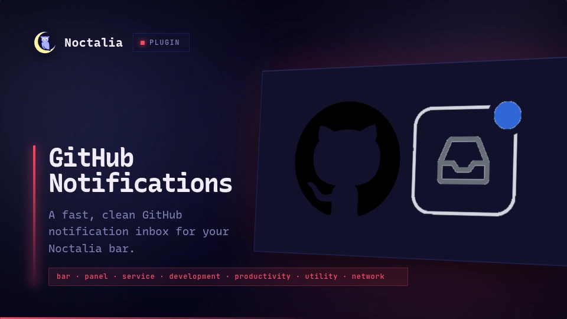

# GitHub Notifications

A fast, clean GitHub notification inbox for Noctalia. Shows your unread notification count
directly in the bar and opens an interactive, theme-aware inbox panel on click.



## Plugin

| Field | Value |
| :--- | :--- |
| Plugin ID | `hy4ri/github-notifications` |
| Entries | Bar widget: `inbox`; panel: `panel`; service: `sync` |
| Minimum Noctalia plugin API | `24` (Noctalia v5.0.0-beta.9+) |

## Requirements

- [GitHub CLI](https://cli.github.com/) (`gh`), authenticated with your GitHub account.
- `xdg-open` (`xdg-utils`) to open notifications in your default browser.

Authenticate once before using the plugin:

```bash
gh auth login
```

Verify your authentication status anytime with:

```bash
gh auth status
```

The plugin never asks for, handles, or stores your personal access token. All authentication
relies completely on your local `gh` session.

## Features

- **Bar Widget**: Shows the GitHub icon and unread notification counter. Left-click to open the inbox; right-click to trigger an immediate refresh.
- **Notification Cards**: Displays PRs, issues, discussions, releases, check suites, and mentions with clear icons, repository paths, reason badges, and compact relative timestamps (`3m`, `2h`, `1d`).
- **Open in Browser**: Clicking a notification opens its target page directly in your browser and optimistically marks it as read.
- **Quick Mark as Read**: A dedicated check button on each notification allows dismissing it without opening a browser tab.
- **Mark All as Read**: One-click action in the header to mark all current notifications as read on GitHub.
- **Manual & Background Sync**: Automatically polls GitHub in the background (default: every 2 minutes) with manual refresh buttons in both the widget and panel.
- **Safe Execution**: Uses Noctalia's direct argument-array process execution (`runAsync`) to completely prevent shell injection risks.

## Usage

1. Enable **GitHub Notifications** in Noctalia's plugin manager.
2. Add the `inbox` widget to your bar from the widget picker.
3. Click the widget to toggle your notifications panel.
4. Right-click the widget or click the panel refresh button to fetch updates immediately.

## Settings

| Setting | Options | Default |
| :--- | :--- | :--- |
| Automatic refresh interval | Every 1, 2, 5, or 10 minutes | Every 2 minutes |
| Notification limit | 25 or 50 notifications | 50 notifications |
| Widget display mode | Icon and count, or icon only | Icon and count |
| Hide count when zero | On or off | Off (shows 0) |

## IPC Commands

Toggle the panel via IPC:

```bash
noctalia msg panel-toggle hy4ri/github-notifications:panel
```

Request a manual refresh from CLI or scripts:

```bash
noctalia msg plugin hy4ri/github-notifications:sync all refresh
```

Mark all notifications as read via IPC:

```bash
noctalia msg plugin hy4ri/github-notifications:sync all mark_all_read
```

## Data and Privacy

The plugin queries GitHub's official REST notifications API via `gh api "notifications?all=false&per_page=..."`.
All subprocess invocations use direct argument vectors without passing through a shell interpreter.
The plugin never stores tokens or credentials. A normalized snapshot of recent unread notifications is cached
in Noctalia's secure per-plugin data directory (`$XDG_STATE_HOME/noctalia/`) to avoid flickering on launch.

## Limitations

This plugin is intentionally focused on being a fast, lightweight notification inbox. It does not attempt to be a full GitHub client (no issue editing, PR merging, or code review workflows).

## Troubleshooting

- **"GitHub CLI Not Found"**: Install `github-cli` from your package manager and ensure `gh` is on your `$PATH`.
- **"Authentication Required"**: Run `gh auth login` in your terminal to sign in, then click "Try again" in the panel.
- **Notifications not opening in browser**: Ensure `xdg-utils` is installed so `xdg-open` is available.
