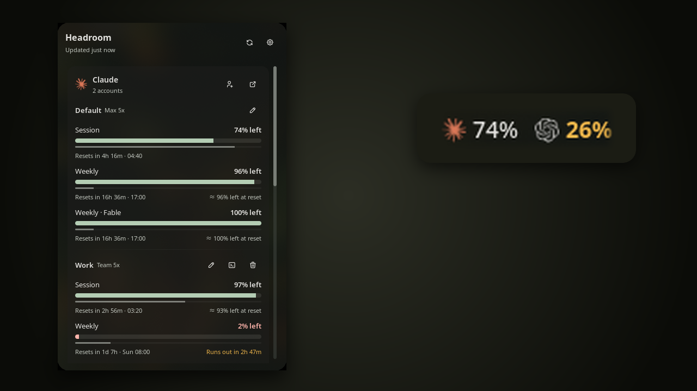
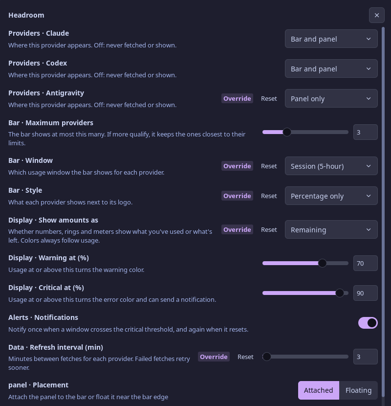

# Headroom

Headroom shows how much of your Claude, Codex and Antigravity plan limits you have left, right in the Noctalia bar.
Click it for every usage window, when each one resets, and where you'll be by then at your current rate.

It reads the sign-ins your CLIs have already saved, so there are no API keys to set up. If you have more than one
Claude or Codex account, it shows each one's usage, and you can add more from the panel.



## Plugin

| Field | Value |
| --- | --- |
| ID | `ayagmar/headroom` |
| Entries | Bar widget: `usage`; panel: `panel`; service: `poller` |

## Requirements

Sign in to at least one of these. Headroom picks up each one on its own; there is nothing to configure.

- **Claude**: [Claude Code](https://claude.com/claude-code) on a Pro, Max, Team or Enterprise plan. Headroom reads
  `~/.claude/.credentials.json` (or `$CLAUDE_CONFIG_DIR/.credentials.json`).
- **Codex**: the [Codex CLI](https://github.com/openai/codex), signed in with ChatGPT (`codex login`). Headroom reads
  `~/.codex/auth.json` (or `$CODEX_HOME/auth.json`). API-key-only setups have no plan limits to show.
- **Antigravity**: the `agy` CLI or an Antigravity app, signed in with Google. Headroom reads the session Antigravity
  keeps in your keyring (through `secret-tool`) or in `~/.gemini/antigravity-cli/antigravity-oauth-token`. Plans
  without Antigravity quota show *No quota on this plan*.

Optional tools, all declared in `dependencies`. Each one only powers the feature below, and when it's missing that
feature is skipped:

- `xdg-open` opens a provider's usage page from the panel. Without it, those buttons are hidden.
- `secret-tool` (from libsecret) reads Antigravity's keyring session. Without it, only the token file is read.
- `claude` (Claude Code) renews an expired Claude session and signs in Claude accounts from the panel. Without it,
  the card asks you to sign in again and accounts can't be added.
- `codex` (the Codex CLI) signs in Codex accounts from the panel. Without it, Codex accounts can't be added.
- `agy` (the Antigravity CLI) renews an expired Antigravity session, run through `env` to turn off its auto-updater
  for that run. Without them, the card asks you to sign in again.
- `env` also points `claude` at an added account's folder when renewing that account's session.
- `rm` deletes the folder of an account you remove.

Signing in from the panel opens a terminal. Noctalia picks it: `$TERMINAL` if set, otherwise the first emulator it
finds.

## Usage

Add the **Headroom** widget to your bar from Settings → Bar.

### Bar

Each signed-in provider shows its logo and how much of one window it has used (or has left, if you prefer).

- Amber means usage passed the warning threshold, or that you're on course to be locked out for a good while before
  the window resets. Red means it passed the critical threshold.
- A maxed-out window shows the time until it comes back, such as `1h 15m`, instead of `100%`.
- Tiny amounts read `<1%` or `>99% left` instead of being rounded away.

| Action | What it does |
| --- | --- |
| Left click | Opens the panel. Data older than 2 minutes is fetched again while it opens. |
| Right click | Refreshes now (`plugin ayagmar/headroom:poller all refresh`; rebind it in the widget's settings). |
| Middle click | Opens Headroom's settings. |
| Hover | Shows each window's usage, reset time and forecast. |

### Panel

One card per provider, with a meter for every window (Session, Weekly, Weekly · Opus and so on).

- **Time track.** The thin line under each meter is time, on the same scale: time elapsed under a "used" meter, time
  left under a "left" one. When the meter runs ahead of the line, you're using the window faster than it allows.
- **Reset time.** A countdown plus the clock time, in your shell's time format: `Resets in 3h 27m · 20:19`, or
  `Sat 07:59` for weekly windows.
- **Forecast.** Your usage so far, extrapolated to the reset: `≈ 59% by reset` if the window will last,
  `Runs out in 26m` if it won't. It waits until 15% of the window has passed, so one busy morning doesn't predict the
  whole week.
- **Usage page.** The link button on each card opens the provider's own usage page.
- **Extras.** Extra usage and credits appear under the windows when your plan has them.
- **Problems.** An expired session, a rejected sign-in or a network failure is explained on the card, with what to
  do about it. The last numbers stay visible, marked as cached.

In the panel, `R` refreshes and `Esc` closes.

### Accounts

Claude Code and Codex keep each sign-in in a config folder (`~/.claude`, `~/.codex`), and you can point them at
another one with `CLAUDE_CONFIG_DIR` or `CODEX_HOME`. Headroom shows one account per folder:

- **Default**: the folder the CLI uses when you don't pick one.
- **Found**: other folders next to it that hold a sign-in, such as `~/.claude-work` or `~/.codex-personal`. They show
  up on their own, named after the folder.
- **Added**: accounts you add from the panel.

With more than one account, the card gives each its own section with its meters. Hover a name to see its email and
folder.

- **Add an account.** Click the person button on a Claude or Codex card, give the account a name, and click
  **Sign in**. A terminal opens with the CLI's own sign-in (`claude auth login`, `codex login`) for a new folder that
  Headroom keeps for that account. If your browser is already signed in to another account, open the sign-in link in a
  private window. The account appears as soon as the sign-in finishes.
- **Use an account.** The terminal button copies the command that starts the CLI as that account, such as
  `CLAUDE_CONFIG_DIR='…' claude`.
- **Sign in again.** An account whose sign-in expired or was rejected has a **Sign in** button that reopens the CLI's
  sign-in for its folder. A provider that isn't signed in at all has one too.
- **Remove an account.** Click the trash button, then **Remove?** to confirm. Headroom deletes the folder it made for
  that account. A found account is hidden instead (eye button, then **Hide?**); its folder stays as it is. The
  default account can't be removed.

Switching which account the CLI uses by default isn't supported yet. Antigravity keeps one sign-in in your keyring, so
it has one account.

```sh
noctalia msg panel-toggle ayagmar/headroom:panel
```

## Settings

Everything is on one page: Settings → Plugins → Headroom, or middle-click the bar widget. Labels start with their group:
**Providers**, **Bar**, **Display**, **Alerts** and **Data**.



| Setting | Type | Default | Description |
| --- | --- | --- | --- |
| `provider_claude`, `provider_codex`, `provider_antigravity` | `select` | `bar` | Where each provider appears: `bar` (bar and panel), `panel` (panel only) or `off` (never fetched or shown). |
| `max_providers` | `int` | `3` | The most items the bar shows (1–8). If more qualify, it keeps the ones closest to their limits, forecast included. |
| `bar_accounts` | `select` | `default` | When a provider has several accounts, whether the bar shows only the `default` one or `all` of them. The panel always shows them all. |
| `window` | `select` | `tightest` | The window the bar shows: `tightest` (closest to its limit), the 5-hour `session`, or `weekly`. |
| `bar_style` | `select` | `full` | Next to the logo: `full` (ring and percentage), `value` (percentage only) or `ring` (ring only). |
| `display` | `select` | `used` | Whether numbers, rings and meters show what you've `used` or what's `remaining`. Colors always follow usage. |
| `warn_percent` | `int` | `70` | Usage at or above this turns amber. So does a window you'd be locked out of for at least a tenth of its length. |
| `critical_percent` | `int` | `90` | Usage at or above this turns red and can send a notification. |
| `notify` | `bool` | `true` | Notifies once when a window crosses `critical_percent`, and again when it resets. |
| `refresh_minutes` | `int` | `5` | Minutes between fetches for each provider (1–120). Failed fetches retry sooner; throttled ones wait longer. |

Healthy meters use your theme's primary color, so amber and red always stand out. Logos keep their brand colors.

## Adding a provider

Each provider is an adapter: one folder under `providers/` with a Luau module and a logo. The adapter only knows its
vendor (where the sign-in lives, which endpoint to call, how to read the response) and returns usage in a shared
format. Everything else works for it without changes: the bar, the panel, forecasts, notifications, caching, retries
and session renewal. The three adapters here are about 200 lines each.

Wiring one in takes a line in `providers/registry.luau`, a setting in `plugin.toml` and two strings in
`translations/en.json`; the tests fail if any of them is missing. The
[contributing guide](https://github.com/ayagmar/headroom/blob/main/CONTRIBUTING.md) walks through it. Providers ship
with the plugin, so to get one added (Copilot, Cursor, OpenRouter, …), open an issue or a pull request.

## IPC

```sh
# Refresh every provider now
noctalia msg plugin ayagmar/headroom:poller all refresh
```

## Notes

- **Network.** Only the `poller` service makes requests: one per signed-in account every `refresh_minutes`.
  - Claude: `GET https://api.anthropic.com/api/oauth/usage`
  - Codex: `GET https://chatgpt.com/backend-api/wham/usage`
  - Antigravity: `POST https://cloudcode-pa.googleapis.com/v1internal:retrieveUserQuotaSummary`, and
    `:loadCodeAssist` for the plan name at most every 6 hours

  These are the endpoints each vendor's own tools use. Headroom sends `headroom-noctalia/<version>` as its User-Agent,
  except to Antigravity, whose endpoint only answers `antigravity`. Offline mode (`shell.offline_mode`) is respected.
- **Credentials are read-only.** Headroom never refreshes, rewrites or copies a token. Refresh tokens rotate, so using
  one here could sign your CLI out. When a session expires, Headroom asks the vendor's CLI to renew it instead
  (`claude`, `agy`; see *Processes*). If that CLI isn't installed or the renewal fails, the card asks you to sign in
  again, and Headroom notices the new session within a minute. Codex sessions last about ten days and aren't renewed
  by Headroom; if one expires, run `codex` once. Found accounts aren't renewed either: their sessions belong to
  whoever runs the CLI in that folder. When you add an account, the CLI writes its sign-in, not Headroom.
- **Files written.** All in `~/.local/state/noctalia/plugins/data/ayagmar/headroom/`:
  - `cache.json`: the last usage numbers, so the bar has data right after login. No credentials.
  - `accounts.json`: the names of accounts you added and the found folders you hid. No credentials.
  - `accounts/<provider>/<name>/`: one empty folder per added account, which the CLI then signs in to.
  - `icons/` and `rings/`: small SVGs tinted for your theme.
- **Processes.** Each runs from an argument list, never through a shell, except the sign-in noted below:
  - `xdg-open <usage page URL>`, when you click a card's link button.
  - `claude -p /status --no-session-persistence`, when the Claude session has expired, at most every 10 minutes per
    account. Claude Code renews its own session. No model call is made, no quota is used and no transcript is kept.
    For an added account it runs as `env CLAUDE_CONFIG_DIR=<its folder> claude …`.
  - `claude auth login` or `codex login`, in a terminal, when you click **Sign in**. For any account other than the
    default, `CLAUDE_CONFIG_DIR` or `CODEX_HOME` points it at that account's folder. This is the one command run
    through a shell, because a terminal runs it; the folder is quoted.
  - `rm -rf -- <folder>`, when you remove an added account. Only folders under `accounts/` in Headroom's data folder
    are ever deleted.
  - `secret-tool lookup service gemini username antigravity`, to read Antigravity's session. After a failed lookup,
    such as a locked keyring, Headroom waits 30 minutes before asking again, so it can't keep raising unlock prompts.
  - `env AGY_CLI_DISABLE_AUTO_UPDATE=true agy models`, when the Antigravity session has expired, at most every 10
    minutes. agy renews its own session.
- **The endpoints are undocumented** and can change without notice. If a card says *Unexpected response*, please
  [open an issue](https://github.com/ayagmar/headroom/issues).
- **Source and issues** live at [github.com/ayagmar/headroom](https://github.com/ayagmar/headroom), along with the
  tests and a guide to adding a provider.
- **Trademarks.** Claude and Anthropic are trademarks of Anthropic; OpenAI and Codex of OpenAI; Google and
  Antigravity of Google. The Claude and OpenAI logos come from [Simple Icons](https://simpleicons.org) (CC0) and the
  Antigravity mark from [ai-usagebar](https://github.com/akitaonrails/ai-usagebar) (MIT). They only identify each
  provider and imply no endorsement.
