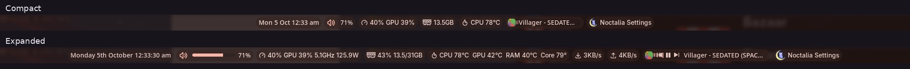

# Hover Widgets

Nine compact Noctalia bar widgets that expand on hover. Add only the entries you want; each instance has its own settings. The defaults use a slim volume track, a background media visualiser, hover playback controls and text-based CPU/RAM readings.

## Plugin

| Field | Value |
| --- | --- |
| ID | `pulser/hover-widgets` |
| Entries | Bar widgets: `clock`, `volume`, `cpu`, `ram`, `temp`, `net-down`, `net-up`, `media`, `active-window` |

## Requirements

Noctalia 5.2.0 or later, plugin API 32, on Linux. Install these commands on `PATH`:

- `noctalia`: native Control Center actions.
- `wpctl`: read, set and mute the default PipeWire output volume.
- `playerctl` and `sh`: choose an MPRIS player, read metadata and control playback.
- `wlrctl`: read the focused window. Requires `wlr-foreign-toplevel-management-v1` support from the compositor.
- `nvidia-smi`: NVIDIA temperature when Show GPU temperature is enabled. Optional on systems without an NVIDIA GPU; disable that setting if unavailable.

Dependencies are declared for the whole plugin, so the host may report a missing command even if you do not use the associated widget. ImageMagick is not required. The media visualiser uses Noctalia's shared PipeWire spectrum service; seeking requires an MPRIS player that supports it.

## Usage

Enable **Hover Widgets** in Settings → Plugins. In Settings → Bar → Widgets, add any of these entries. Installing the plugin does not automatically replace existing widgets or add all nine.

| Entry | Widget type | Behaviour |
| --- | --- | --- |
| `clock` | `pulser/hover-widgets:clock` | Time/date expand to the full weekday, ordinal day and month, with seconds on hover. Click opens Calendar. |
| `volume` | `pulser/hover-widgets:volume` | Speaker click toggles mute; percentage/padding opens Audio. Hover reveals the track; click or drag it to change volume. Wheel adjusts by 2 percentage points per step by default. |
| `cpu` | `pulser/hover-widgets:cpu` | CPU and GPU usage; hover adds CPU frequency and package power where available. Click opens System. |
| `ram` | `pulser/hover-widgets:ram` | Used memory with a theme-tinted RAM icon; hover adds total memory and percentage. Click opens System. |
| `temp` | `pulser/hover-widgets:temp` | CPU temperature; hover adds enabled GPU, DIMM, hottest-core and NVMe readings where available. Click opens System. |
| `net-down` | `pulser/hover-widgets:net-down` | Receive speed, hidden below the configured threshold. Hover expands the units. Click opens System. |
| `net-up` | `pulser/hover-widgets:net-up` | Transmit speed, hidden below the configured threshold. Hover expands the units. Click opens System. |
| `media` | `pulser/hover-widgets:media` | Cover art, title, playback progress and audio visualiser. Hover reveals previous/play-pause/next and expands the title up to its configured limit. |
| `active-window` | `pulser/hover-widgets:active-window` | Focused window title and app icon expand on hover; long titles cycle. Hidden when no window is available. |

### Volume

Dragging is enabled by default. The 100px-wide, 7px-thick track has a flat point and no handle; colour, width, thickness and handle visibility are adjustable. The widget keeps its width stable during a drag. With dragging enabled, it waits 1.2 seconds after leaving before folding, or 500ms after releasing outside. Queued slider layout changes do not count as new drags.

### Media

The default background pill is 164px wide, expands up to 280px, and is 16px thick. It fits shorter titles rather than always using the maximum; longer titles cycle while hovered. Its 44-band visualiser uses the Progress mask, with configurable colour and darkening. Change Progress placement to Inline for a separate progress track.

Left-click the cover or the play/pause button to toggle playback. Previous/next operate the selected player. Click the title/background to seek. With Right-click controls to seek enabled, right-click over a playback control seeks at that horizontal position; left-click still operates the button. The upper/lower control slivers also seek on left-click without highlighting the button. Keep the media widget's native right-click action set to `none` (the default) so this routing works; right-click elsewhere opens Media. Wheel seeking moves 10 seconds per step by default, or select track skipping instead.

If migrating from the separate development plugins, replace each widget with the corresponding `pulser/hover-widgets:<entry>` type. Existing per-instance overrides are retained only if you carry them over; reset plugin settings to use these defaults. Native bar placement, capsule styling, font and widget scale remain Noctalia appearance settings. To match the development bar exactly, set volume's native Scale to 0.85 and media's Font family to Adwaita Sans.

## Settings

Each table applies to its named entry. The clock has no plugin-specific settings. Dependent appearance settings are hidden when their parent selection is inactive.

### `volume`

| Setting | Type | Default | Description |
| --- | --- | --- | --- |
| `icon_click` | `select` | `mute` | Click the speaker to toggle mute, or open Audio. Click the expanded track to set volume. Percentage/padding and right-click open Audio. Options: `mute`, `panel`. |
| `show_percent` | `bool` | `true` | Show volume percentage or muted. Click this label to open Audio. |
| `scroll_step` | `int` | `2` | How much one scroll notch changes the volume. |
| `invert_scroll` | `bool` | `false` | By default scroll up raises the volume. Turn this on if it feels backwards. |
| `drag_enabled` | `bool` | `true` | Drag the classic volume track. It folds when idle and stays open during an active drag. |
| `slider_width` | `int` | `100` | Expanded track width in pixels, independent of thickness and speaker size. |
| `slider_thickness` | `int` | `7` | Track thickness, independent of its width. The circular knob is 1.5 times this size. |
| `bar_color` | `select` | `primary` | Theme colour role used for the classic filled track and circular knob. Options: `primary`, `onsurface`, `secondary`, `tertiary`, `hover`, `error`. |
| `point_style` | `select` | `flat` | Rounded or flat moving progress edge. Flat also uses a slim rectangular volume handle. Options: `rounded`, `flat`. |
| `show_knob` | `bool` | `false` | Show the circle or flat handle at the current volume. Turn off for a plain bar. |
| `knob_color` | `select` | `primary` | Independent knob colour. On-primary matches the knob used by native Settings sliders. Options: `on_primary`, `on_surface`, `primary`, `secondary`, `tertiary`, `error`. |

### `cpu`

| Setting | Type | Default | Description |
| --- | --- | --- | --- |
| `show_gpu` | `bool` | `true` | Show GPU utilisation beside CPU usage using Noctalia system monitoring. A dash means the sensor is unavailable or still loading. |
| `gauge` | `bool` | `false` | Compact display: gauge bar (on) or plain percentage (off) |

### `ram`

| Setting | Type | Default | Description |
| --- | --- | --- | --- |
| `gauge` | `bool` | `false` | Compact display: gauge bar (on) or plain percentage (off) |
| `amount_first` | `bool` | `true` | On: shows used GB by default, revealing the percentage and total on hover. Off: shows the percentage by default, revealing used/total GB on hover. |

### `temp`

| Setting | Type | Default | Description |
| --- | --- | --- | --- |
| `show_gpu` | `bool` | `true` | Show GPU temp on hover |
| `show_nvme` | `bool` | `false` | Show hottest NVMe temp on hover |
| `show_ram` | `bool` | `true` | Show RAM (DIMM) temp on hover |
| `show_hottest_core` | `bool` | `true` | Show hottest CPU core on hover |

### `net-down`

| Setting | Type | Default | Description |
| --- | --- | --- | --- |
| `threshold_kbps` | `int` | `1024` | Hide entirely below this; hovering always shows it. 1024 = 1 MB/s |
| `compact_units` | `bool` | `true` | 34K/1.2M instead of 34KB/s/1.2MB/s while not hovering |
| `hide_completely` | `bool` | `true` | On: vanishes below the idle threshold. Off: icon stays, only the number hides |

### `net-up`

| Setting | Type | Default | Description |
| --- | --- | --- | --- |
| `threshold_kbps` | `int` | `1152` | Hide entirely below this; hovering always shows it. 1024 = 1 MB/s |
| `compact_units` | `bool` | `true` | 34K/1.2M instead of 34KB/s/1.2MB/s while not hovering |
| `hide_completely` | `bool` | `true` | On: vanishes below the idle threshold. Off: icon stays, only the number hides |

### `media`

| Setting | Type | Default | Description |
| --- | --- | --- | --- |
| `show_cover_art` | `bool` | `true` | Replace the play/pause icon with the track's (rounded) cover art when available. |
| `corner_rounding` | `int` | `75` | 0 = square corners, 100 = fully circular. |
| `cover_size` | `int` | `18` | Size of the cover art icon in place of the play/pause glyph. |
| `show_controls` | `bool` | `true` | Show previous, play/pause and next buttons. |
| `controls_on_hover` | `bool` | `true` | When Playback controls is enabled, animate those buttons in and out on hover. |
| `scroll_action` | `select` | `seek` | Skip tracks or seek through the current song with the mouse wheel. Options: `tracks`, `seek`. |
| `scroll_seek_step` | `int` | `10` | Seconds per wheel step. Scroll up goes forward; down goes back. |
| `audio_spectrum` | `bool` | `true` | Show live audio bars behind background progress, or beside the controls for inline progress. Uses the shell’s shared audio spectrum; rests when paused or silent. |
| `audio_spectrum_bands` | `int` | `44` | Number of live frequency bands, from 8 to 128. Bars and gaps adapt to fit the widget. |
| `visualiser_mode` | `select` | `progress` | Background layout: overlay, show only on played progress, dark on progress/light on background, or use the audio bars as the progress fill. Inline visualisers keep the overlay style. Options: `overlay`, `played_only`, `inverted`, `progress`. |
| `visualiser_color` | `color` | `on_tertiary` | Theme/custom audio-bar colour. In inverted mode this is the lighter background colour; progress mode uses Progress colour. |
| `visualiser_opacity` | `int` | `83` | Opacity of the audio visualiser, independent of progress colour and darkening. |
| `visualiser_height` | `int` | `18` | Maximum height of the centred audio bars. |
| `visualiser_width` | `int` | `50` | Width when progress is inline; background mode uses the media widget’s full width. |
| `show_progress_bar` | `bool` | `true` | Show a playback-position bar next to the icon. It's a rendered image (not text), so it never affects the widget's Font setting -- when cover art is on, the bar sits beside the art; when off, it replaces the play/pause glyph. |
| `point_style` | `select` | `flat` | Rounded or flat moving progress edge. Applies to classic and background progress; the native slider keeps its own style. Options: `rounded`, `flat`. |
| `progress_layout` | `select` | `background` | Inline seekable bar or progress behind the media content. Click the background title/progress area to seek; artwork and buttons retain playback actions. Options: `inline`, `background`. |
| `progress_darkening` | `int` | `20` | Darken the played progress fill itself, from 0% (original colour) to 80%. Applies to background and classic progress. |
| `background_progress_color` | `color` | `primary` | Pick a theme colour or a custom colour for the background progress fill. |
| `background_darkening` | `int` | `10` | Darken the unplayed background around the progress. Zero matches the widget background; the progress colour stays at full strength. |
| `background_width` | `int` | `164` | Compact background pill width, in pixels; it grows to Expanded background width on hover. |
| `background_expand_width` | `int` | `280` | Maximum hovered background width. Expansion stops earlier when the whole title fits; longer titles cycle within this limit. |
| `background_height` | `int` | `16` | Thickness of the background progress pill, in pixels. |
| `background_seek_strip` | `bool` | `true` | Right-click a playback button to seek at its position on the background progress. Left-click operates the button; right-click elsewhere opens Media controls. |
| `progress_style` | `select` | `classic_drag` | Classic supports clicks. Classic with dragging keeps the same pill, uses expanded width, previews while dragging and seeks on release. Interactive uses the native slider appearance. Options: `classic`, `classic_drag`, `interactive`. |
| `progress_width` | `int` | `86` | Width of the seek slider in this state. Expanded width is at least the compact width. Set both equal for a fixed length. |
| `progress_expand_width` | `int` | `35` | Width of the seek slider in this state. Expanded width is at least the compact width. Set both equal for a fixed length. |
| `progress_thickness` | `int` | `8` | Progress bar thickness, independent of cover size and width. Rounded ends stay circular. |
| `bar_color` | `color` | `on_surface` | Pick a theme colour or a custom colour for classic progress. |
| `compact_width` | `int` | `20` | Text width when not hovering. The text only actually shrinks to this if it's longer -- a short title just stays put. |
| `expand_width` | `int` | `40` | Maximum title characters on hover. Shorter titles use only the space they need; longer titles cycle within the limit. |

### `active-window`

| Setting | Type | Default | Description |
| --- | --- | --- | --- |
| `compact_width` | `int` | `26` | Text width when not hovering. The title only actually shrinks to this if it's longer -- a short title just stays put. |
| `expand_width` | `int` | `45` | Text width while hovering. If the title is still longer than this, it scrolls as a marquee instead of growing further. |
| `icon_size` | `int` | `20` | Per-app icon size when compact (not hovering). Only affects the real app icon -- the generic fallback glyph (shown when no icon can be resolved) is a fixed size, since the plugin API doesn't expose glyph sizing. |
| `icon_size_hover` | `int` | `24` | Per-app icon size while hovering; animates between this and the compact size along with the text width. |

## Notes

- **Processes:** volume runs `wpctl`; media runs the shipped `pick-player.sh` through `sh` and calls `playerctl`; active-window runs `wlrctl`; GPU temperature optionally runs `nvidia-smi`. Native panel callbacks can invoke `noctalia msg panel-toggle control-center` with the relevant page. No remote code is downloaded or executed.
- **Artwork/network:** media downloads HTTP(S) artwork from the URL supplied by the selected player using Noctalia's downloader. YouTube metadata without artwork may use `i.ytimg.com`. The artwork host receives the request and your IP address. Local `file://` artwork is read directly. Downloads are cached under `cache/media-mini` in the plugin data directory, with a user-cache fallback.
- **RAM icon:** `assets/memory.svg` is a custom vector RAM outline. Theme-tinted copies are written to `cache/ram-icons` in the plugin data directory, with a user-cache fallback. The icon ships under this plugin's MIT license.
- **System reads:** CPU, memory and network widgets read `/proc`; temperature and CPU frequency/power read `/sys`. GPU usage comes from Noctalia's system monitor and may be unavailable. CPU frequency is CPU0, not an all-core average. Package power requires readable Intel RAPL counters. CPU temperature targets Intel `coretemp`; NVMe sensors use the composite reading and DIMM sensors use `spd5118`. Missing readings are omitted, or shown as a dash.
- **Units:** memory GB values are binary GiB; network KB/s and MB/s are binary KiB/s and MiB/s. Network thresholds are KiB/s. Non-loopback interface totals can double-count traffic across bridges, VPNs and physical interfaces.
- **Text:** expansion uses UTF-8-safe character slicing and cached approximate glyph widths. Smooth partial-glyph animation depends on future native API support.
- **Privacy/compositors:** focused-window titles and media metadata may contain private information. Tested on Noctalia 5.2.1 with DriftWM; other compositors and hardware have not been verified.

## License

MIT, copyright 2026 pulser. See [LICENSE](LICENSE).
