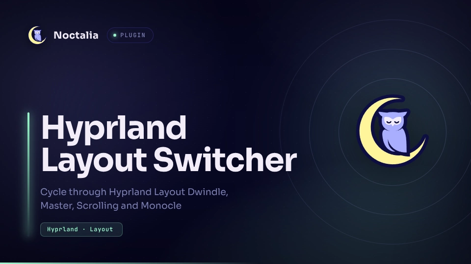

# Hyprland Layout Switcher



**Hyprland Layout Switcher** is a bar widget for [Noctalia](https://docs.noctalia.dev) that shows the tiled layout of the currently active Hyprland workspace and cycles to the next layout on click or via a keybinding. Switching is scoped to the current workspace with a workspace rule, so each workspace keeps its own layout instead of changing the global default.

## Plugin

| Field | Value |
| --- | --- |
| ID | `maddingo/hypr-layout-switcher` |
| Entries | Bar widget: `toggle`; service: `poller` |

## Requirements

Hyprland, with `hyprctl` on `PATH` — the plugin declares `hyprland` as a dependency. It reads `hyprctl activeworkspace -j` and applies layouts through `hyprctl eval`, so it does nothing on other compositors (Sway, river, Niri, X11 WMs, …).

The `monocle` and `scrolling` layouts come from Hyprland layout plugins. If you do not have them installed, cycling onto them is a no-op on Hyprland's side.

## Usage

Enable the plugin, then add the widget to a bar section:

```sh
noctalia msg plugins enable maddingo/hypr-layout-switcher
```

In Settings → Bar, add **Hyprland Layout Switcher → toggle** to the section you want. The widget shows an icon plus the layout name (`Dwindle`, `Master`, `Monocle`, `Scrolling`).

The `poller` service runs `hyprctl activeworkspace -j` once per second and publishes the layout, so the widget stays in sync when you switch workspaces or change the layout from elsewhere.

Clicking the widget cycles to the next layout in `dwindle → master → monocle → scrolling → dwindle`. Special workspaces (scratchpads) are handled too, matched by name instead of id.

## IPC

The `poller` service accepts a `cycle` event, which does the same thing as clicking the widget:

```sh
noctalia msg plugin maddingo/hypr-layout-switcher:poller all cycle
```

The signature is `plugin <author/plugin:entry> <target[:bar-name]> <event>`. `poller` is a service entry with no visible output, so the target must be `all`.

Bind it in `~/.config/hypr/hyprland.lua`:

```lua
-- Cycle the active workspace's tiled layout
bind("SUPER, Tab, exec, "
  .. "noctalia msg plugin maddingo/hypr-layout-switcher:poller all cycle")
```

Reload with `hyprctl reload`. The widget updates immediately, whether you cycle via the keybinding or by clicking.

To jump straight to a specific layout instead of cycling, bind `hyprctl` directly — the widget picks the change up on its next poll:

```lua
bind("SUPER, D, exec, hyprctl keyword general:layout dwindle")
bind("SUPER, M, exec, hyprctl keyword general:layout master")
```

Note that `general:layout` changes the global default, whereas the plugin's `cycle` only affects the active workspace.

## Notes

- **Commands spawned:** `hyprctl activeworkspace -j` every second while the plugin is enabled, and `hyprctl eval '…'` on each cycle. No network access, no files written.
- **No settings.** To change behaviour, fork the repo and add your fork as the plugin source. The layout list lives at the top of `service.luau`:

  ```lua
  local layouts = { "dwindle", "master", "monocle", "scrolling" }
  ```

  Trim it to the layouts you actually have installed, and keep the `glyphs` table at the top of `widget.luau` in sync. Reload the plugin afterwards.
- The plugin only sets the layout; per-layout options stay in your Hyprland config, for example:

  ```lua
  -- See https://wiki.hypr.land/Configuring/Layouts/Dwindle-Layout/ for more
  hl.config({ dwindle = { preserve_split = true } })

  -- See https://wiki.hypr.land/Configuring/Layouts/Master-Layout/ for more
  hl.config({ master = { new_status = "master" } })

  -- See https://wiki.hypr.land/Configuring/Layouts/Scrolling-Layout/ for more
  hl.config({ scrolling = { fullscreen_on_one_column = true } })
  ```
