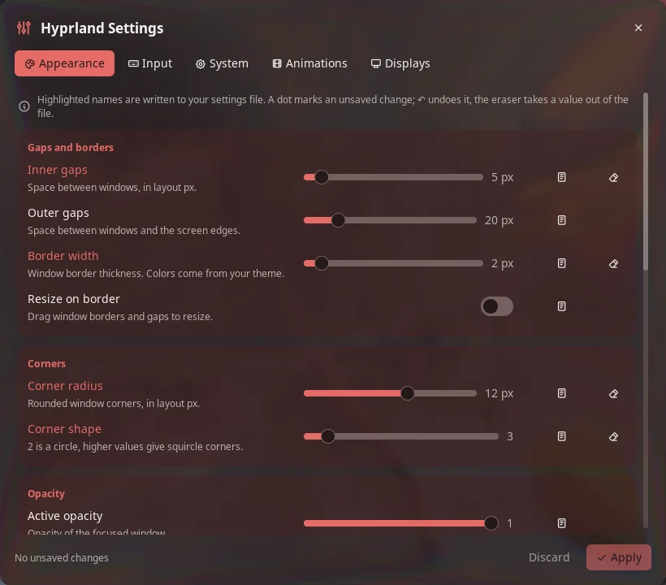

# Hyprland Settings

A settings panel for Hyprland's Lua config. Change displays, input, appearance,
animations and a few system options in Noctalia. Every change goes into one Lua file
with a reason above each value, and it reverts by itself after 15 seconds unless you
keep it.

It covers the settings you change day to day. To edit your whole config, including
keybinds and window rules, have a look at
[hyprconf](https://github.com/muschneider/hyprlandconf-gui), a standalone editor.



## Plugin

| Field | Value |
| --- | --- |
| ID | `michael-retunzew/hyprland-settings` |
| Entries | Bar widget: `button`; panel: `panel`; service: `service`; launcher provider: `open` |
| Launcher Prefix | `/hyprland` |

## Requirements

- `hyprland` 0.56 or newer with a Lua config (`hyprland.lua`). The old `.conf` format
  is not supported.
- `lua`: `lua` and `luac` from the same Lua version Hyprland is built against (5.5
  for 0.56). `luac -p` checks every file before it is written.
- `util-linux`: `flock` serializes saving and reverting.
- `systemd`: a user session. `systemd-run --user` arms a timer that reverts a change
  even if Noctalia crashes during the countdown.

## Usage

1. Install and enable the plugin.
2. Open it: type `hyprland` in the launcher (or `/hyprland`), add the bar widget
   `button` (an "adjustments" icon), or run:

   ```sh
   noctalia msg panel-toggle michael-retunzew/hyprland-settings:panel
   ```

3. On first open the panel asks to connect itself to Hyprland. **Set up** creates
   `~/.config/hypr/hyprland-settings.lua` and adds one line to the end of
   `~/.config/hypr/hyprland.lua`, keeping a backup:

   ```lua
   require("hyprland-settings")
   ```

   Choose **No, I'll do it myself** and the panel shows the same two steps to do by
   hand, with a **Check again** button. Until Hyprland loads the file, **Apply** stays
   off. If a block in your `hyprland.lua` must win over the panel (a power-saving
   block, for example), move the line above it.
4. Change values and press **Apply**. The plugin writes the file, Hyprland reloads it,
   and the plugin checks that Hyprland really loaded it. Then a banner asks
   **Keep these changes?** with a 15 second countdown. **Keep** saves. **Revert**, or
   doing nothing, puts the previous file back.

What each control does:

- A **highlighted name** means the value is written to the file. Values you never
  touch are left to Hyprland's defaults or the rest of your config.
- A **dot** marks an unsaved change. **↶** undoes it.
- The **note** button adds a reason. It is written as `-- why: …` above the value.
- The **eraser** takes a value out of the file again.
- A **warning** sign means a saved value is not in effect, usually because a file
  loaded later overrides it.

Pages:

- **Appearance**: gaps, border width, corners, opacity, dimming, blur, shadow and
  layout. Colors are never touched; they belong to your theme.
- **Input**: keyboard layout, variant and options, key repeat, mouse sensitivity and
  acceleration, focus follows mouse, and touchpad scrolling, tapping and clicking.
- **System**: variable refresh rate, focus behavior, cursor hiding, waking screens,
  the Hyprland logo and XWayland.
- **Animations**: animations on or off, and the preset *Futurista*.
- **Displays**: one card per connected screen with resolution and refresh rate, scale
  and rotation. Only modes the screen reports and scales that give whole pixels are
  offered. Arrows change the order, and a sketch shows the row to scale. Rules for
  screens that are not plugged in are kept and can be removed.


### Taking over an existing file

The plugin only replaces a file it wrote itself. If the file was written by hand, or
edited since the last save, Apply stops and the banner offers **Take over the file**.
The original is kept for good in the plugin's data directory as `original-<id>.lua`.

## Settings

| Setting | Type | Default | Description |
| --- | --- | --- | --- |
| `config_path` | `file` | `~/.config/hypr/hyprland-settings.lua` | The file the plugin writes and `hyprland.lua` loads. A symlink is followed: the file it points to is replaced, the link stays. |

## IPC

The service takes the same operations as the panel:

```sh
noctalia msg plugin michael-retunzew/hyprland-settings:service all refresh
noctalia msg plugin michael-retunzew/hyprland-settings:service all apply '<json>'
noctalia msg plugin michael-retunzew/hyprland-settings:service all adopt '<json>'
noctalia msg plugin michael-retunzew/hyprland-settings:service all keep
noctalia msg plugin michael-retunzew/hyprland-settings:service all revert
```

`apply` and `adopt` take the settings as JSON in the shape of the saved state:
`{"options": {"general.gaps_in": {"value": 5, "why": "…"}}, "preset": {"name": "futurista"}, "monitors": [{"output": "desc:…", "mode": "1920x1080@144", "position": "1600x0", "scale": 1}]}`.
`adopt` also takes over a hand-written file. `setup`, `setup_decline` and
`setup_check` do what the first-run card's buttons do. The panel can switch pages for
screenshots:

```sh
noctalia msg plugin michael-retunzew/hyprland-settings:panel all page displays
```

## Notes

- **Files written.**
  - The config file: written to a temporary file next to it, then renamed, so Hyprland
    never reads half a file.
  - The data directory `~/.local/state/noctalia/plugins/data/michael-retunzew/hyprland-settings/`:
    the saved state (`state.json`), the transaction journal (`txn`), the backup of the
    previous file and the copies used to recognize the plugin's own file.
- **First-run setup** runs only when you press **Set up**. `setup.lua` creates the
  empty settings file and appends the `require` line to `hyprland.lua` with a
  temporary file and a rename. A symlinked `hyprland.lua` stays a symlink, and
  `luac -p` checks the result first. The original goes to `backups/` in the data
  directory. If the line is already there, nothing changes. To undo, delete the line
  and the file.
- **Processes.**
  - `hyprctl`: `--batch` with `getoption`, `monitors all`, `configerrors`, and
    `repl` to read `HYPRLAND_SETTINGS_REVISION` and whether the settings file is
    loaded (`package.loaded`).
  - `flock` with `lua txn.lua` for saving and reverting, and with `lua setup.lua`
    for the first-run setup.
  - `luac -p` and `readlink -f`.
  - `systemd-run --user` and `systemctl --user stop` for the revert timer.
  - No network access.
- **How a reload is proven.** The generated file sets the global
  `HYPRLAND_SETTINGS_REVISION`. **Keep** only becomes available after `hyprctl repl`
  returns the new revision. If it does not within 5 seconds, or Hyprland reports a new
  config error, the change is reverted. This also happens when `hyprland.lua` does not
  load the file at all.
- **Restarts.** If Noctalia restarts during a countdown, the open change is reverted
  instead of resumed. A reboot counts as expired.
- **Layout limit.** Displays are arranged as one row, left to right, with the tops
  aligned. Vertical offsets and mirroring stay as they are until you reorder.
- **Not in v1:** keybinds, window rules, gestures, a page with every option, more
  animation presets and live previews.
- **Tests:** `tests/run.sh` needs `luau`, `lua` and `luac`. It runs the module and
  service tests against a fake Noctalia host and the transaction tests in a temporary
  directory.

## Credits

The *Futurista* animation preset comes from
[Hyprland Visual Editor](https://github.com/XimoCP/hyprland-visual-editor) by XimoCP
(MIT, Copyright (c) 2026 XimoCP), as ported to Noctalia v5 by Hermy and linux-fertxo.
Its license notice is kept in `lib/presets/futurista.luau`.
