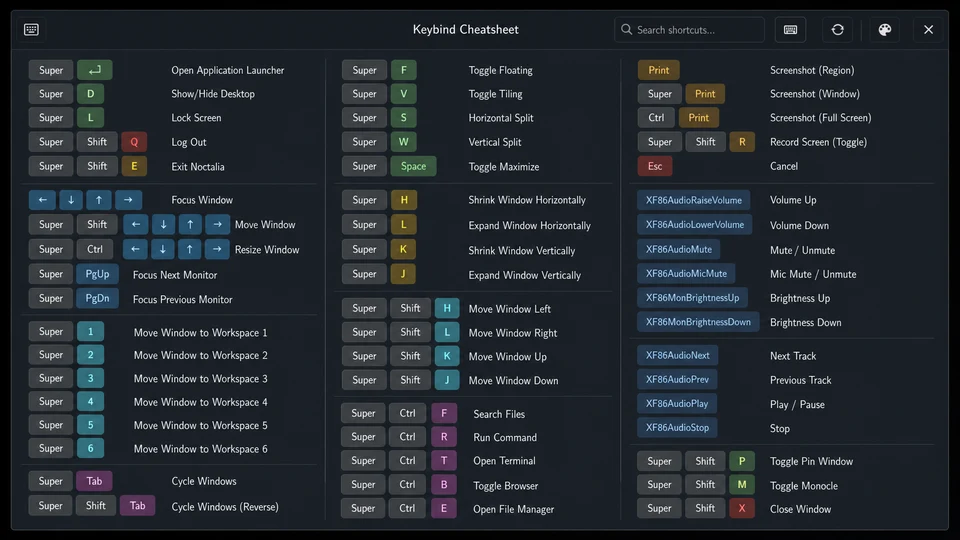

# Keybind Cheatsheet

Keybind Cheatsheet opens a searchable Noctalia panel containing the active
Mango, Hyprland, or Niri shortcuts. It follows split configuration files,
formats common hardware keys, and keeps custom descriptions and hidden rows.



## Plugin

| Field | Value |
| --- | --- |
| ID | `kenn/keybind-cheatsheet` |
| Entries | Bar widget: `keybinds`; panel: `cheatsheet` |

## Requirements

Install `hyprctl` on `PATH` when using a Hyprland Lua configuration. Mango,
Niri, and classic Hyprland configurations do not spawn external commands.

No clipboard command is required. Color paste uses Noctalia's native clipboard
API.

## Usage

Enable the plugin, then add the `keybinds` widget from Noctalia's bar widget
picker. Clicking its keyboard glyph toggles the cheatsheet.

Open or close the panel without a bar widget:

```sh
noctalia msg panel-toggle kenn/keybind-cheatsheet:cheatsheet
```

Bind that command in the active compositor.

Mango:

```ini
bind=SUPER,F1,spawn,noctalia msg panel-toggle kenn/keybind-cheatsheet:cheatsheet
```

Hyprland classic configuration:

```ini
bind = SUPER, F1, exec, noctalia msg panel-toggle kenn/keybind-cheatsheet:cheatsheet
```

Niri:

```kdl
Mod+F1 { spawn "noctalia" "msg" "panel-toggle" "kenn/keybind-cheatsheet:cheatsheet"; }
```

Type in the search field to filter by key, description, action, or category.
Use the header pencil to enter edit mode. Edit mode keeps hidden bindings
visible with muted content while descriptions and visibility are changed with
the row's pencil and eye buttons; leaving edit mode applies those visibility
choices to the main keymap. The palette button opens key-color controls with
native color picking, clipboard paste, and reset actions.

## Supported configuration

| Compositor | Default | Parsing |
| --- | --- | --- |
| Mango | `~/.config/mango/config.conf` | `bind`, `axisbind`, `mousebind`, `gesturebind`, `switchbind`, `source`, and `source-optional` |
| Hyprland classic | `~/.config/hypr/hyprland.conf` | `bind*` directives, variables, and recursive `source` paths |
| Hyprland Lua | `~/.config/hypr/hyprland.lua` | Live `hyprctl binds -j` data plus category and description scanning through `require()` files |
| Niri | `~/.config/niri/config.kdl` | KDL `binds` blocks, action categorization, and recursive `include` paths |

Includes support `*`, `?`, and bracket glob components. Traversal is limited to
32 levels and 256 files, and repeated paths are visited once to stop cycles.

Category comments use the same forms as the earlier Noctalia plugin:

```ini
# Applications
bind=SUPER,T,spawn,foot #"Terminal"
```

```ini
# 1. Applications
bind = SUPER, T, exec, foot #"Terminal"
```

```kdl
// #"Applications"
Mod+T hotkey-overlay-title="Terminal" { spawn "foot"; }
```

Hyprland Lua category scanning recognizes `-- 1. Applications` headings and
literal `description` or `desc` fields. Concatenated descriptions such as
`"Workspace " .. i` are treated as prefixes.

## Settings

| Setting | Type | Default | Description |
| --- | --- | --- | --- |
| `compositor` | `select` | `auto` | Detect Mango, Hyprland, or Niri, or force one parser. |
| `mango_config` | `file` | `~/.config/mango/config.conf` | Main Mango configuration. |
| `hyprland_config` | `file` | `~/.config/hypr/hyprland.conf` | Main classic Hyprland configuration. |
| `hyprland_lua_config` | `file` | `~/.config/hypr/hyprland.lua` | Lua file scanned for categories. |
| `hyprland_parser` | `select` | `auto` | Select live Lua or classic parsing. |
| `niri_config` | `file` | `~/.config/niri/config.kdl` | Main Niri configuration. |
| `columns` | `int` | `3` | Maximum balanced columns, from 1 to 4. |
| `show_undescribed` | `bool` | `true` | Show bindings that have no description. |
| `show_actions` | `bool` | `false` | Show the compositor action under descriptions. |
| `glyph` | `glyph` | `keyboard` | Bar widget icon. |

Noctalia v5 owns panel dimensions and does not expose runtime auto-height.
This plugin uses a wide 1500 x 760 panel, scrolling, and a responsive cap on
the requested column count.

## IPC

Refresh an open panel after editing compositor configuration:

```sh
noctalia msg plugin kenn/keybind-cheatsheet:cheatsheet all refresh
```

The panel reparses on every open, so refreshing it while closed is unnecessary.
The bar entry also accepts `toggle` and `refresh` when a widget instance exists:

```sh
noctalia msg plugin kenn/keybind-cheatsheet:keybinds focused toggle
noctalia msg plugin kenn/keybind-cheatsheet:keybinds focused refresh
```

For parser development, run the fixture suite inside Noctalia:

```sh
noctalia msg plugin kenn/keybind-cheatsheet:cheatsheet all self-test
```

The report is logged and written to the plugin's persistent data directory as
`selftest.json`.

## Notes

The plugin has no service, timer, file watcher, network request, or long-lived
process. It reads configuration only on panel open or refresh. Hyprland Lua mode
runs the fixed command `hyprctl binds -j` asynchronously.

Custom descriptions, hidden binding identities, and color overrides are stored
in Noctalia's per-plugin state directory as `preferences.json`. The file
contains no command output or configuration contents.
