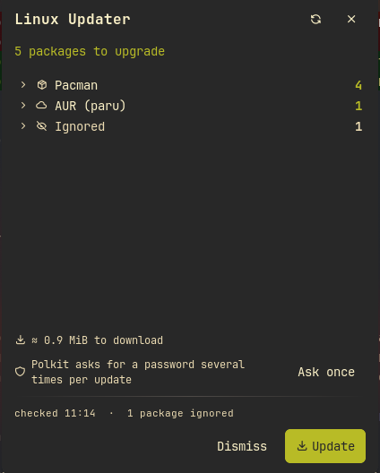
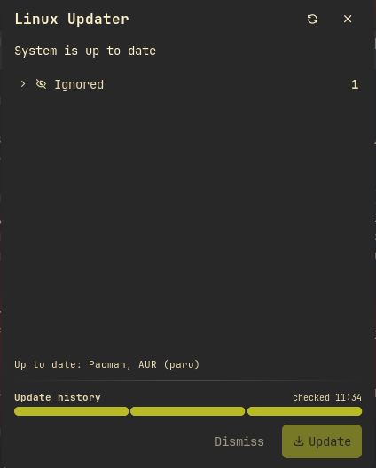

# Linux Updater

Check and install system updates from the bar on any major Linux
distribution. One click runs the whole upgrade in the background: polkit
asks for your password, the panel shows a live log tail and a progress bar,
finished runs land on a history strip — with rollback where the
distribution supports it. The right package-manager backend is picked
automatically from `/etc/os-release`.




## Features

- **Background or terminal updates.** By default the run is spawned
  detached (it survives a shell restart), fully non-interactive, logged to
  a file the panel tails live with a progress bar; the bar widget shows a
  percentage. On success: notification and an automatic re-check. A failed
  run keeps its log on screen and offers an interactive **Retry in
  terminal** fallback. The `update_mode` setting can instead open every
  update in a terminal window, where prompts work as usual — the log, the
  progress bar and the history keep working (the terminal output is tee'd
  into the same log, and the history entry is verified against the
  installed versions, so declined packages are not recorded).
- **Update history with rollback.** Every finished run becomes a segment on
  the history strip (hover for date and size, click for the package list).
  Rollback takes whatever road the distribution offers: on Arch and
  Debian/Ubuntu single packages or whole runs come back from the package
  cache (dependencies from the same run travel along, and the package
  manager refuses anything that would break other packages), on Fedora a
  whole run is undone with `dnf history undo` and single packages with
  `dnf downgrade` while the old version is still in a repo. Buttons grey
  out with the reason when the cached file or repo version is gone. A
  second click confirms every rollback.
- **Ignore management.** Every package row has an ignore button; ignored
  packages live in an expandable section with restore buttons. The system's
  own mechanisms (`IgnorePkg`, `apt-mark hold`) are detected and shown with
  a tag explaining where they are managed. The plugin list is honored
  during updates (`--ignore`/`--exclude`/hold/lock per backend).
- **One polkit password per run.** pkexec normally re-authenticates every
  package-manager call; the panel offers to install a narrow
  keep-authorization rule (one confirmed click) so a single password covers
  the whole run.
- **Self-fixing setup.** When something the plugin relies on is missing or
  off (the polkit rule, apt's list-refresh timers), the panel says so and
  offers a one-click, one-confirmation fix. Nothing is ever changed
  silently.
- **Extra sources (opt-in).** Beyond the system manager: global npm
  packages, cargo-installed binaries (via cargo-update), RubyGems, Snap
  and Homebrew can each be checked and updated in the same run, and pip
  can be checked (check-only by design: distribution Pythons are
  externally managed, PEP 668). Each is its own off-by-default toggle and
  is silently skipped when its tool is absent. They work with any
  backend, like Flatpak — and most of them roll back too, each through
  its manager's own mechanism: npm/gem/cargo reinstall the recorded old
  version, snap reverts to the locally kept previous revision, and
  Flatpak apps pin the previous commit recorded at check time.
- **Extras.** Download-size estimate and Arch news (pacman backend), AUR
  via paru/yay, Flatpak on every backend, reboot recommendation with the
  best available method per distribution, desktop notifications, launcher
  quick actions (`/up`), full log in a terminal pager, an opt-in activity
  graph of pending-update counts across recent checks.

## Plugin

| Field | Value |
| --- | --- |
| ID | `umedbazarov/linux-updater` |
| Entries | Bar widget: `widget`; panel: `panel`; service: `service`; launcher: `launcher` |
| Launcher Prefix | `/up` |

## Backends and capabilities

| | pacman (Arch, Manjaro, …) | dnf (Fedora) | apt (Debian, Ubuntu, Mint, …) | zypper (openSUSE) | xbps (Void) | PackageKit (fallback) |
| --- | --- | --- | --- | --- | --- | --- |
| Check without root | ✓ | ✓ | ✓ (via apt timers) | ✓ (via autorefresh) | ✓ | ✓ |
| Background update | ✓ | ✓ | ✓ | ✓ | ✓ | ✓ |
| Old→new versions in the list | ✓ | ✓ | ✓ | ✓ | new only | new only |
| Download size estimate | ✓ | — | — | — | — | — |
| Rollback | per package / per run, from the package cache | whole run (`dnf history undo`) + per package (`dnf downgrade`, while the old version is in a repo) | per package / per run, from the apt archive cache (kept on Debian, routinely cleaned on Ubuntu; gone entries are greyed out) | — (use snapper) | — | — |
| System ignore shown | `IgnorePkg` | — | `apt-mark hold` | — | — | — |
| Plugin ignore honored on update | `--ignore` | `--exclude` | hold for the run | lock for the run | hold for the run | explicit pending-minus-ignored list |
| Distribution news | Arch news feed | — | — | — | — | — |
| AUR layer | ✓ (paru/yay) | — | — | — | — | — |
| Reboot detection | kernel modules | `needs-restarting` | `/var/run/reboot-required` | `zypper needs-rebooting` | kernel modules | kernel modules |

Flatpak checking and updating works on every backend, and so do the
opt-in extra sources (npm, Cargo, pip [check-only], RubyGems, Snap,
Homebrew) — they ride along with the update run, honor the plugin ignore
list, and offer per-item rollback where their manager has a mechanism
for it: `npm -g install <old>`, `gem install -v <old>`,
`cargo install --version <old>`, `snap revert`, and
`flatpak update --commit=<recorded>` for Flatpak apps. pip and Homebrew
have none. A secondary source that cannot be checked (an unreachable AUR
mirror, a registry that is down) fails only itself: the remaining sources
are still checked, and the panel reports the failed one instead of
counting it as up to date. Only a failure of the system package manager's
own check stops the run. NixOS is not
supported by design (see
[nix-monitor](https://noctalia.dev/plugins/avivbintangaringga/nix-monitor)
instead); Gentoo has no backend yet — the backend interface in
`backends/` is open for contributions.

## Requirements

The `dependencies` list in `plugin.toml` names every external command the
plugin can spawn across all backends; only the subset below matters on any
one system.

- The distribution's own package-manager tooling, on `PATH` — one family
  is enough, and the panel says what is missing:
  - Arch family: `pacman`, `checkupdates` + `pactree` (both from
    `pacman-contrib`);
  - Fedora family: `dnf`, `rpm`;
  - Debian family: `apt`, `apt-get`, `apt-mark`, `dpkg-query`, and
    `systemctl` for the apt-timers self-check;
  - openSUSE: `zypper`, `rpm`;
  - Void: `xbps-install`, `xbps-pkgdb`;
  - anything else: `pkcon` (PackageKit).
- `pkexec` (polkit) with an authentication agent — Noctalia's built-in
  agent works out of the box. Not needed for the PackageKit backend, which
  uses its own polkit policies.
- POSIX base tools, present on any install: `sh`, `awk`, `date`, `grep`,
  `head`, `install`, `rm`, `sed`, `tail`, `tee`, `test`, `uname`, `wc`.
- Optional: `paru`/`yay` (AUR, Arch family), `flatpak`, `xdg-open` (open
  package pages), `less` (full-log pager), `sudo` + a terminal emulator
  for terminal-mode updates and the **Retry in terminal** fallback.
- Optional, only when the matching extra source is enabled: `npm`,
  `cargo-install-update` (from cargo-update), `pip`, `gem`, `snap`,
  `brew`.

## Usage

Add the `widget` bar widget from Noctalia's widget picker. Left click opens
the panel, right click checks for updates now. You can also open the panel
directly:

```sh
noctalia msg panel-toggle umedbazarov/linux-updater:panel
```

The panel lists pending packages by source (system manager, AUR, Flatpak).
Each package row has an ignore button, a copy button and an open button.
**Update** starts the run per the `update_mode` setting — in the
background (default: pkexec raises the polkit dialog, everything else is
non-interactive, the run survives a shell restart) or in a terminal window
where prompts work as usual. Either way the package list gives way to a
live log tail with a progress bar and the bar widget shows a percentage.
When it ends you get a notification and an automatic re-check; a failed
background run keeps its log on screen and offers **Retry in terminal**.

The strip at the bottom is the update history: one segment per run, hover
for the date, click for the run's package list. Where the backend supports
rollback (see the matrix), packages or whole runs can be rolled back from
there — a second click confirms, and the package manager refuses any
transaction that would break dependencies.

If the system needs a one-time setup step (polkit keep-authorization rule
so one password covers a run; apt timers for fresh package lists), the
panel says so and offers to fix it with one confirmed click. Nothing is
ever changed silently.

Type `/up` in the launcher for quick actions or `/up <text>` to
fuzzy-search pending packages.

## Settings

| Setting | Type | Default | Description |
| --- | --- | --- | --- |
| `backend` | `select` | `auto` | Package-manager backend; auto-detected from `/etc/os-release`. |
| `aur_helper` | `select` | `auto` | AUR helper (Arch family only): auto/yay/paru/custom/off. |
| `aur_check_cmd` | `string` | *(empty)* | Custom AUR check command when `aur_helper` is `custom`. |
| `flatpak_enabled` | `bool` | `true` | Also check and update Flatpak. |
| `npm_enabled` | `bool` | `false` | Also check and update global npm packages. |
| `cargo_enabled` | `bool` | `false` | Also check and update cargo-installed binaries (needs cargo-update). |
| `pip_enabled` | `bool` | `false` | Also check outdated pip packages (check-only, PEP 668). |
| `gem_enabled` | `bool` | `false` | Also check and update RubyGems. |
| `snap_enabled` | `bool` | `false` | Also check and update snaps (snapd's own polkit). |
| `brew_enabled` | `bool` | `false` | Also check and update Homebrew packages. |
| `ignore_packages` | `string_list` | *(empty)* | Packages excluded from the count and skipped on update (see matrix for the mechanism per backend). |
| `auto_check_hours` | `int` | `0` | Check automatically every N hours; 0 never. |
| `notify_on_updates` | `bool` | `true` | Desktop notification when updates are found. |
| `show_download_size` | `bool` | `true` | Show the download estimate where the backend supports it. |
| `check_arch_news` | `bool` | `true` | Arch news feed (pacman backend only). |
| `check_reboot_needed` | `bool` | `true` | Flag when a reboot is recommended. |
| `show_activity_graph` | `bool` | `false` | Record and graph pending-update counts across recent checks. |
| `activity_history_length` | `int` | `10` | Checks kept for the activity graph (3–30). |
| `update_mode` | `select` | `background` | How Update runs: non-interactive background run or a terminal window. |
| `rollback_auto_ignore` | `bool` | `false` | After a rollback, add the rolled-back packages to the plugin ignore list. |
| `hide_setup_hints` | `bool` | `false` | Hide the one-time setup suggestions. |
| `hide_polkit_hint` | `bool` | `false` | Hide the polkit keep-authorization rule suggestion. |
| `log_lines` | `int` | `14` | Log lines shown during a run (6–30). |
| `terminal` | `string` | *(empty)* | Terminal for terminal-mode updates and the fallback; empty uses Noctalia's detection. |
| `update_cmd` | `string` | *(empty)* | Full override for the background update command. |

Settings that change what a check would count (backend, AUR helper, the
Flatpak and extra-source toggles, the ignore list) invalidate the last
result: the panel returns to "Not checked yet" instead of showing numbers
the new settings would not produce. Cosmetic settings leave it alone.

## IPC

```sh
noctalia msg plugin umedbazarov/linux-updater:service all check
noctalia msg plugin umedbazarov/linux-updater:service all update
noctalia msg plugin umedbazarov/linux-updater:service all update_background
noctalia msg plugin umedbazarov/linux-updater:service all update_terminal
noctalia msg plugin umedbazarov/linux-updater:service all dismiss
noctalia msg plugin umedbazarov/linux-updater:service all ignore:NAME
noctalia msg plugin umedbazarov/linux-updater:service all unignore:NAME
```

## Notes

- **Commands spawned.** Per backend, listed in `backends/*.luau` (each file
  documents its own commands): the distribution's check command
  unprivileged; the update through `pkexec <manager>` (or PackageKit's own
  polkit path, or `sudo` in terminal mode), detached, logged to
  `<data>/update.log` and followed with `tail`;
  `flatpak list/remote-ls/update`; `pactree`/`rpm`/`dpkg-query`/`apt-mark`/
  `zypper locks`/`xbps-pkgdb` where the matrix says so; and, per enabled
  extra source, its own read-only listing (`npm -g outdated`,
  `cargo install-update --list`, `pip list --outdated`, `gem outdated`,
  `snap refresh --list`, `brew outdated`) plus its update command in the
  run. The full command list is declared in `dependencies` in
  `plugin.toml`.
- **Privileges.** Escalation only through polkit, only for package-manager
  binaries; the optional keep-authorization rules (shipped in `polkit/`,
  installable from the panel with one confirmed click) are scoped to those
  binaries for active local sessions. `pacman.conf`, apt or zypper
  configuration files are never edited.
- **Files written.** Only in the plugin data directory: `update.log`,
  `runs.json` (history), `ignore.json`, `news_state.json`, `run_meta.json`,
  `activity_state.json` (only when the activity graph is on),
  a staged polkit rule and its install marker — plus
  `/etc/polkit-1/rules.d/49-linux-updater-<pm>.rules` when you explicitly
  click the install button.
- **Network.** Whatever the corresponding manual check/upgrade would
  contact, plus the Arch news feed (pacman backend, every 6 h).
## Testing status

Honest coverage, so expectations are set right:

- **Arch (pacman backend): fully exercised on a real system** — background
  updates including AUR builds, per-package rollback and roll-forward from
  the cache, ignore management, the polkit rule install, history, resume
  after a shell restart.
- **dnf / apt / zypper / xbps / PackageKit: command layers verified in
  containers** on real package managers — including the full
  `upgrade → dnf history undo` cycle on Fedora and apt's hold semantics —
  and every parser runs against recorded real-output fixtures: the
  fixtures live in `fixtures/`, the test harness is `tests/run.sh` (needs
  the `luau` CLI; not wired into this repository's CI, which validates
  manifests only).
- **Rollback and ignore paths verified in containers:** the apt cache
  rollback (Ubuntu 24.04: a curl+libcurl4t64 pair downgraded in one
  transaction from `/var/cache/apt/archives`, epoch-encoded filenames),
  the dnf per-package downgrade (Fedora 41: exact-version downgrade
  succeeds while the version is in a repo; the repoquery probe answers
  ok/miss so the panel can grey the button with the reason), and
  PackageKit's explicit-list update (Fedora 41 with a hand-started
  dbus/polkitd: `pkcon update curl` upgraded curl and left the
  "ignored" package untouched).
- **Extra sources: verified in containers** — full update → rollback
  cycles for npm (node:22), RubyGems (ruby:3.3) and Cargo (rust:1) with
  the plugin's exact commands; pip's outdated listing (python:3.12); and
  the whole Flatpak commit story on Ubuntu 24.04 (downgrade by full
  commit works, a 12-char prefix is rejected by the server — which is why
  the check records the full active commit). The fixtures under
  `fixtures/extras/` are these containers' real outputs. **Snap and
  Homebrew parsers are written from documented formats only** (snapd
  needs systemd, brew a full bootstrap — neither fits a container run).
- **Not yet verified by anyone:** live polkit dialogs and the full UI on
  non-Arch distributions (containers cannot reproduce a polkit session),
  the dnf4 output branch (fixtures cover dnf5), Debian-specific deviations
  from Ubuntu, snap/brew against live tools. Treat non-Arch backends as
  **beta** — the capability matrix above is enforced in code, so the
  worst case is a missing feature, not a broken system.

**I would be genuinely glad to see this tested on other package managers
and distributions — Fedora, Ubuntu/Debian/Mint, openSUSE, Void, anything
with PackageKit. Feedback and bug reports on GitHub are very welcome:
please open an issue in
[community-plugins](https://github.com/noctalia-dev/community-plugins/issues)
with `[linux-updater]` in the title, and mention your distribution and the
backend the panel shows.**

## Credits

Grown out of [arch-updater](https://github.com/noctalia-dev/community-plugins/tree/main/arch-updater)
(yuuto, MIT), generalized to a backend architecture.

## License

MIT.
