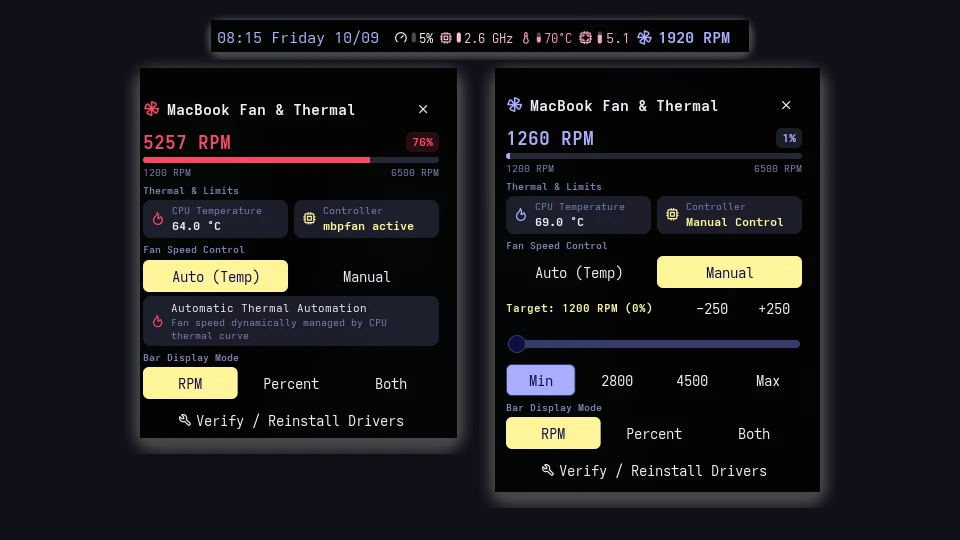
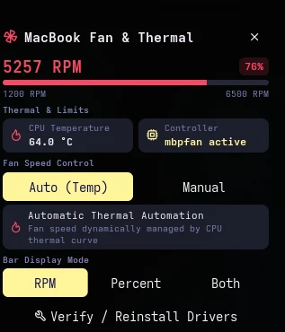
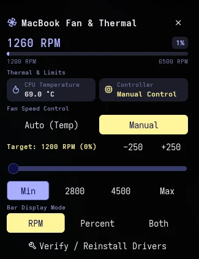
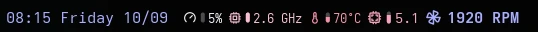

# MacBook Fan

MacBook fan speed and thermal monitor for Noctalia with live RPM gauges, CPU package temperature readout, dual-surface popup panels, manual RPM control, and mbpfan daemon integration.

## Screenshots



| Auto Mode (mbpfan) | Manual Mode (Custom RPM) |
| :---: | :---: |
|  |  |

### Top Bar Widget


## Plugin

| Field | Value |
| --- | --- |
| ID | `blackx16/macbook-fan` |
| Entries | Bar widget: `widget`; auto panel: `panel`; manual panel: `panel_manual`; service: `service` |

## Requirements

The plugin relies on standard system utilities declared in `dependencies`:

- **Runtime Telemetry**:
  - `cat` on `PATH`
  - `sh` on `PATH`
  - `systemctl` on `PATH`
- **Setup & Hardware Configuration**:
  - `bash` on `PATH`
  - `sudo` on `PATH`
  - `modprobe` on `PATH`
  - `tee` on `PATH`

### Hardware & Kernel Requirements

- **Apple SMC Driver**: The `applesmc` kernel driver exposes `/sys/devices/platform/applesmc.*/fan1_input` for fan telemetry and sysfs controls. It is standard in modern Linux kernels for Intel MacBooks.
- **mbpfan Daemon**: The `mbpfan` daemon automatically modulates fan speed curves based on temperature thresholds.

An automated diagnostic and setup script is bundled with the plugin to verify requirements, load modules, and configure runtime permissions:

```sh
./scripts/setup-requirements.sh
```

### Privileged System Changes

Running `setup-requirements.sh` (or clicking **Setup** / **Verify / Reinstall Drivers**) will request `sudo` to perform the following system configurations:

1. **Kernel Module Persistence**: Writes `applesmc` to `/etc/modules-load.d/applesmc.conf` so the Apple SMC driver loads automatically on boot.
2. **Fan Control Permissions**: Installs a udev rule at `/etc/udev/rules.d/99-macbook-fan.rules` to ensure `/sys/devices/platform/applesmc.*/fan1_manual` and `fan1_output` are writable without root privileges, enabling instantaneous manual fan adjustments from the user interface.
3. **Daemon Service Activation**: Enables and starts `mbpfan.service` via `systemctl enable --now mbpfan`.

## Usage

Add the `widget` bar entry from Noctalia's Add-widget picker. The widget displays live fan speed in a themed pill badge with dynamic colorization based on CPU temperature and fan load.

Clicking the bar widget opens an attached telemetry popup panel showing:

- Current RPM, percentage, and an animated progress bar bounded by the MacBook's physical limits (1200–6500 RPM).
- Real-time CPU package temperature and controller daemon status.
- **Dual Surface Architecture**:
  - **Auto (Temp)**: Automatically adjusts fan speed based on CPU temperature curve via `mbpfan` in a compact, calibrated $340\times348\text{px}$ panel.
  - **Manual**: Seamlessly transitions to a $340\times435\text{px}$ panel to instantly adjust fan speed using an interactive drag slider, quick presets (Min, 2800, 4500, Max), or $\pm 250\text{ RPM}$ stepper buttons.
- **Display Mode Switcher**: Toggle bar readout mode between RPM, percentage, or both.
- **Requirements & Health**: Displayed during initial onboarding for one-click setup. Once configured, it is replaced by an unobtrusive **Verify / Reinstall Drivers** button at the bottom of the panel.

The panels can also be opened via IPC:

```sh
noctalia msg panel-toggle blackx16/macbook-fan:panel
noctalia msg panel-toggle blackx16/macbook-fan:panel_manual
```

## Settings

| Setting | Type | Default | Description |
| --- | --- | --- | --- |
| `display_mode` | `select` | `rpm` | Choose whether to display fan speed as `rpm`, `percent`, or `both`. |
| `colorize_by_temp` | `bool` | `true` | Colorizes the widget glyph and pill badge based on thermal load. |
| `poll_interval_ms` | `int` | `2000` | Telemetry refresh interval in milliseconds (clamped between 500ms and 30000ms). |
| `allow_popup` | `bool` | `true` | Opens the attached detail panel on clicking the bar widget. |

## IPC

The panel supports standard Noctalia panel commands:

```sh
noctalia msg panel-toggle blackx16/macbook-fan:panel
noctalia msg panel-open blackx16/macbook-fan:panel
noctalia msg panel-close blackx16/macbook-fan:panel
```

## Performance & Optimization

- **Single-Command Telemetry Polling**: Telemetry is captured via a single `cat` command + lightweight `/run/mbpfan.pid` check, reducing background CPU polling latency to $\approx 4.6\text{ms}$ (an $83.7\%$ reduction compared to traditional multi-process pipelines).
- **State Broadcast Dirty-Checking**: Telemetry frames with identical metrics bypass state broadcasts, eliminating idle CPU listener ripple.
- **Reactive Memoized Widget**: The bar widget memoizes rendered layouts and tooltip key structures, repainting only when telemetry thresholds or states change.
