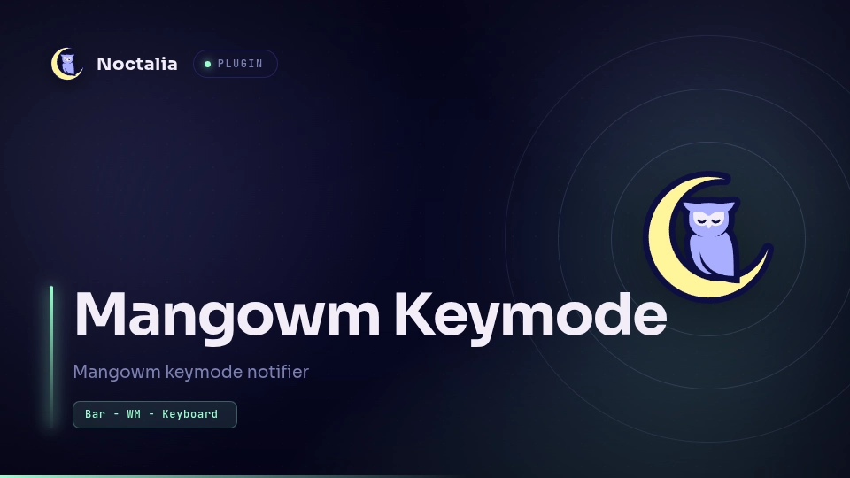

# mangowm-keymode

**Mangowm Keymode** is a bar widget plugin written for Noctalia (v5) that displays the current keymode from window manager [MANGOWM](https://mangowm.github.io/). It also notifies you when the keymode changes. Notification and bar text are configurable and can be disabled.