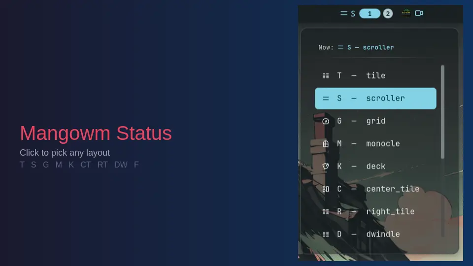

# Mangowm Status

A [Noctalia](https://noctalia.dev) v5 bar widget that displays the current [Mangowm](https://github.com/mangowm/mangowm) tiling layout and keymode — click to open a layout picker, scroll to cycle layouts.



## Plugin

| Field | Value |
| --- | --- |
| ID | `x0d7x/mangowm-status` |
| Entries | Bar widget: `status`; panel: `layout-picker` |

## Screenshots

| Widget (bar) | Layout picker panel |
| --- | --- |
|  |  |

## Features

- **Live layout badge** — shows the active layout glyph and letter code on your bar
- **Keymode indicator** — displays non-default keymodes (resize, move, etc.) beside the layout
- **Click to pick** — left-click opens a scrollable panel of all 14 supported layouts
- **Scroll to cycle** — horizontal scroll cycles through core layouts
- **Live updates** — uses `mmsg watch` streams, no polling
- **14 layouts** — all Mangowm tiling layouts supported

## Install

```sh
noctalia plugin install x0d7x/mangowm-status
```

Or clone manually into `~/.local/share/noctalia/plugins/mangowm-status/`:

```sh
git clone https://github.com/x0d7x/mangowm-status.git \
  ~/.local/share/noctalia/plugins/mangowm-status
```

## Requirements

- Noctalia v5
- [`mmsg`](https://github.com/mangowm/mango) — Mangowm's IPC CLI (install with `cargo install mmsg` or grab a release from the [releases page](https://github.com/mangowm/mango/releases)); must be on `PATH`

## Requirements

- Noctalia v5
- [`mmsg`](https://github.com/mangowm/mango) — Mangowm's IPC CLI (install with `cargo install mmsg` or grab a release from the [releases page](https://github.com/mangowm/mango/releases)); must be on `PATH`

## Usage

### Bar widget

Add the **Mangowm Status** widget from the Add-widget picker in your bar settings, or configure it by hand:

```toml
[widget.mangowm-status]
type = "x0d7x/mangowm-status:status"
```

The widget shows the current layout's icon and letter code. When the active keymode is not `default`, the keymode name appears beside the layout code.


- **Left-click** → opens the **Layout Picker** panel. Click any layout to switch.
- **Horizontal scroll** → cycles through core layouts (T → S → G → …).

### Layout picker panel

Open programmatically with:

```sh
noctalia msg panel-toggle x0d7x/mangowm-status:layout-picker
```

A scrollable list of all 14 layouts. The current layout is highlighted. Click any other layout to switch — the panel closes automatically.


## Settings

| Setting | Type | Default | Description |
| --- | --- | --- | --- |
| Hide on default | `bool` | `false` | Hide the widget when keymode is `default` |
| Show text | `bool` | `true` | Show the keymode name beside the layout glyph |
| Notify on change | `bool` | `true` | Show a notification when the keymode changes |

## IPC

Control the widget from the terminal:

```sh
# Refresh layout data
noctalia msg plugin x0d7x/mangowm-status:status focused refresh

# Get current status (logged as JSON)
noctalia msg plugin x0d7x/mangowm-status:status focused get-status

# Set layout by code
noctalia msg plugin x0d7x/mangowm-status:status focused set-layout S
```

## Layout Codes

| Code | Layout | Icon |
|------|--------|------|
| T | Tile | columns |
| S | Scroller | menu |
| G | Grid | dashboard |
| M | Monocle | window |
| K | Deck | cards |
| CT | Center Tile | layout |
| RT | Right Tile | columns |
| DW | Dwindle | columns |
| F | Fair | layout |
| VS | Vertical Scroller | menu |
| VT | Vertical Tile | columns |
| VG | Vertical Grid | dashboard |
| VK | Vertical Deck | cards |
| VF | Vertical Fair | layout |

## Notes

- This plugin spawns `mmsg` subprocesses to query and change the compositor state. `mmsg` must be installed and on `PATH`.
- Layout changes use `mmsg dispatch setlayout,<name>` (lowercase layout name, not the short code).
- The widget keeps two long-running `mmsg watch` streams (keymode + all-tags) for live updates, with a low-rate (5 s) polling fallback.
- The panel entry fetches tag data on open and does not keep a persistent connection.

## License

MIT
