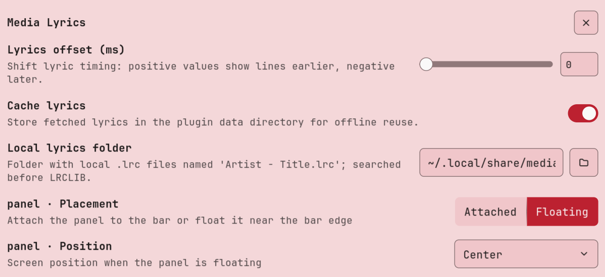

# Media Lyrics

A full-featured media player panel with **time-synced lyrics** for the Noctalia desktop shell. Karaoke-style lyric carousel (14 visible lines), album cover, transport controls, and a progress bar — all in one floating panel. **Pure Luau, zero external dependencies**: no playerctl, no python daemons, no GTK overlays.

| Light theme | Dark theme |
| --- | --- |
|  |  |

| Settings |
| --- |
|  |

## Plugin

| Field | Value |
| --- | --- |
| ID | `tranzem/media-lyrics` |
| Entries | Bar widget: `now-playing`; panel: `panel`; service: `service`; shortcut: `toggle` |

## Requirements

- Noctalia v5 (plugin API 24+)
- `busctl` (systemd, present on every Arch install)
- Outbound HTTPS access to `https://lrclib.net` for synced lyrics

No player-specific software. Any MPRIS-capable player works: Spotify, MPD, Cider, web players, VLC, and anything else that exposes MPRIS over D-Bus.

## Usage

Enable the plugin, then open the panel:

```sh
noctalia msg plugins enable tranzem/media-lyrics
noctalia msg panel-toggle tranzem/media-lyrics:panel
```

Add the `now-playing` widget to your bar to get a compact indicator that opens the panel on click. A `toggle` shortcut (control-center tile) is also available. Bind it to a hotkey in Noctalia's shortcut settings, or from your compositor:

```toml
"Ctrl+Alt+M" = "spawn:noctalia msg panel-toggle tranzem/media-lyrics:panel"
```

The panel shows the active MPRIS player automatically; when nothing is playing it renders an empty state.

## Features

- **Karaoke lyric carousel** — 14 lines visible at once; the active line is bright, neighbours fade by distance (Clavis-style). Works with synced (LRC) and plain lyrics.
- **LRCLIB integration** — exact `/api/get` lookup first, `/api/search` fallback, LRC parsed in pure Luau.
- **Local `.lrc` files** — drop `Artist - Title.lrc` into the local lyrics folder; they take priority over the network.
- **Marquee titles** — long track/artist names hold for 2 s, then scroll slowly instead of wrapping or clipping. Overlap-free (per-slice node recreation).
- **Album cover + progress bar** — interpolated progress between polls, transport controls (prev / play-pause / next), shuffle and repeat state.
- **Settings** — lyric timing offset in ms, on-disk cache, local lyrics folder. Bilingual UI (en/ru).

## Advantages over alternative lyric plugins

- **Zero external dependencies.** No playerctl, python daemons, pip packages, or GTK overlays to install and maintain. Enable → works.
- **No background daemons.** MPRIS polling, lyric fetching, parsing and caching run inside the plugin's own service — no systemd units, no scripts to launch manually.
- **No per-player setup.** No API tokens, no external API to enable inside a specific player, no config files. Any MPRIS player is picked up automatically.
- **Player-agnostic.** Reads MPRIS directly via Noctalia's D-Bus aggregator — works with any player, not tied to a specific app.
- **A real panel, not a 1–3 line bar widget.** Full-height carousel with 14 visible lines keeps whole verses in view, with transport controls and progress built in.
- **Overflow handled properly.** Long titles get a marquee, single-line sanitizer strips embedded newlines, integer button heights prevent glyph overlap.
- **Offline-friendly.** LRCLIB responses are cached; local `.lrc` files work without network at all.

## Settings

| Setting | Type | Default | Description |
| --- | --- | --- | --- |
| `offset_ms` | `int` | `0` | Shift lyric timing: positive shows lines earlier, negative later. |
| `use_cache` | `bool` | `true` | Cache fetched lyrics in the plugin data directory for offline reuse. |
| `local_lyrics_dir` | `folder` | `~/.local/share/media-lyrics` | Folder with local `.lrc` files named `Artist - Title.lrc`; searched before LRCLIB. |

## IPC

```sh
noctalia msg panel-toggle tranzem/media-lyrics:panel
```

## Local development

Add the parent directory as a local Noctalia source:

```sh
noctalia msg plugins source add media-lyrics-dev path /path/to/media-lyrics-parent
noctalia msg plugins enable tranzem/media-lyrics
noctalia msg config-reload
```

## To Do

Upcoming work, roughly in priority order:

- [ ] Album cover inside a capsule shape
- [ ] Additional lyric sources (NetEase, Musixmatch, embedded MPRIS metadata, …)
- [ ] Clickable lyric lines — click a line to seek the track to that moment
- [ ] Seek on progress-bar click
- [ ] Compact mode with a pinnable widget
- [ ] Preconfigured widget actions — default gestures declared in the manifest (middle click → play/pause, scroll → track switching) work out of the box
- [ ] Widget size setting — user-configurable bar-widget size (glyph size, title length, scale) via plugin settings

## Notes

- The service polls MPRIS via `busctl` (150 ms cadence) and publishes a snapshot to `noctalia.state`; the panel animates from those publishes.
- Lyrics are fetched from the public LRCLIB API; nothing is uploaded. Cache and local lyrics live under the plugin data directory and `local_lyrics_dir`.
- Adapted from the Clavis shell media player text layer (karaoke render + LRCLIB provider), ported to pure Luau for Noctalia v5.
