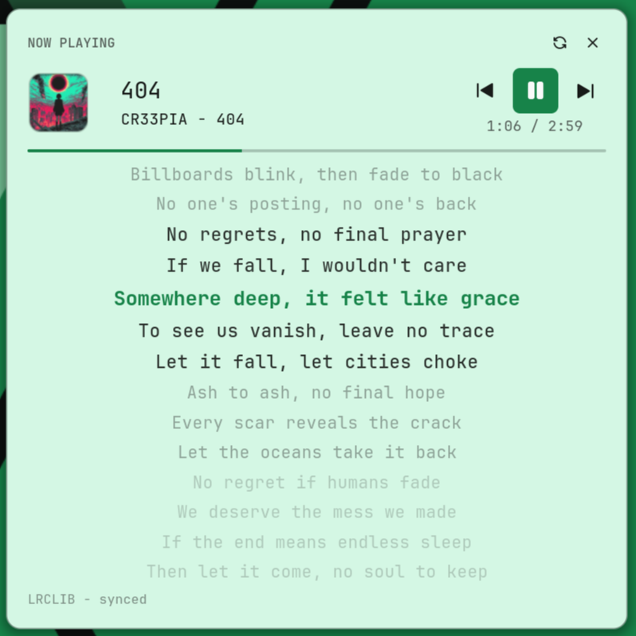
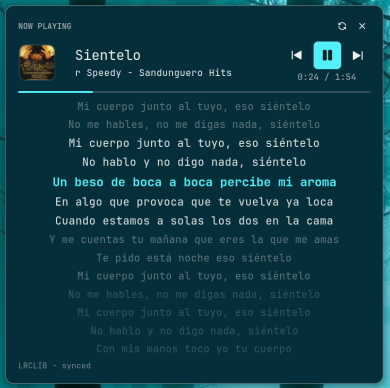

# Media Lyrics

A full-featured media player panel with **time-synced lyrics** for the Noctalia desktop shell. Karaoke-style lyric carousel (10/14/16 visible lines per size preset), album cover, transport controls, and a progress bar — all in one floating panel. **Pure Luau implementation**: no playerctl, no python daemons, no GTK overlays — runtime needs `busctl` (MPRIS) and `curl` (LRCLIB HTTPS).

| Light theme | Dark theme |
| --- | --- |
|  |  |

## Plugin

| Field | Value |
| --- | --- |
| ID | `tranzem/media-lyrics` |
| Entries | Bar widget: `now-playing`; panels: `panel` (medium 520×520), `panel-compact` (440×440), `panel-large` (640×640); service: `service`; shortcut: `toggle` |

## Requirements

- Noctalia v5 (plugin API 24+)
- `busctl` (systemd, present on every Arch install)
- `curl` — used for the LRCLIB HTTPS fetch (spawned as `curl -sSf -m 8 -4 <url>`, argv-only, no shell; LRCLIB resolves IPv4 faster than the built-in HTTP client on some setups)
- Outbound HTTPS access to `https://lrclib.net` for synced lyrics

No player-specific software. Any MPRIS-capable player works: Spotify, MPD, Cider, web players, VLC, and anything else that exposes MPRIS over D-Bus. `sleep` (coreutils) is used for a short refresh delay after transport commands.

## Usage

Enable the plugin, then open the panel:

```sh
noctalia msg plugins enable tranzem/media-lyrics
noctalia msg panel-toggle tranzem/media-lyrics:panel
```

The panel opens at the size preset selected by the `panel_size` setting
(compact 440 / medium 520 / large 640). The `now-playing` bar widget and the
`toggle` control-center tile both open the selected preset; you can also open
a specific preset directly:

```sh
noctalia msg panel-toggle tranzem/media-lyrics:panel-compact
noctalia msg panel-toggle tranzem/media-lyrics:panel-large
```

Add the `now-playing` widget to your bar: a compact chip with the album
cover and **Title - Artist** of the active MPRIS player. Its gestures mirror
the shell's built-in media widget:

- **Left click** — open the lyrics panel.
- **Right click** — play/pause.
- **Middle click** — this widget's display settings.
- **Wheel / mouse back / forward** — previous / next track.
- On a **vertical bar** the chip collapses to the artwork only.

Display options are edited in the widget's own settings popup (middle click):

| Setting | Default | Effect |
| --- | --- | --- |
| `album_art_only` | off | Show only the artwork, no text |
| `hide_album_art` | off | Hide the artwork and its fallback icon |
| `hide_artist` | off | Show only the track title |
| `artist_first` | off | Show `Artist - Title` instead of `Title - Artist` |
| `min_length` | 80 | Minimum widget length (px) — accepted for parity; plugin chips are sized by the host to their content |
| `max_length` | 220 | Text area width (px); long titles truncate or scroll to fit |
| `art_size` | 16 | Artwork size (px) |
| `title_scroll` | none | Scroll long titles: `none`, `always`, or `on hover` |
| `hide_when_no_media` | off | Hide the chip when no MPRIS player is active |

A `toggle` shortcut (control-center tile) is also available. Bind it to a hotkey in Noctalia's shortcut settings, or from your compositor:

```toml
"Ctrl+Alt+M" = "spawn:noctalia msg panel-toggle tranzem/media-lyrics:panel"
```

The panel shows the active MPRIS player automatically; when nothing is playing it renders an empty state.

## Features

- **Karaoke lyric carousel** — 10/14/16 lines visible at once (compact/medium/large presets); the active line is bright, neighbours fade by distance (Clavis-style). Works with synced (LRC) and plain lyrics.
- **Clickable lyric lines** — click a synced line to seek the player to that timestamp.
- **Manual lyric scroll** — Up/Down step a line (the host's chord validator accepts only basic key names; PageUp/PageDown/Home/End are rejected).
- **LRCLIB integration** — exact `/api/get` lookup first, `/api/search` fallback, LRC parsed in pure Luau.
- **Local `.lrc` files** — drop `Artist - Title.lrc` into the local lyrics folder; they take priority over the network.
- **Marquee titles** — long track/artist names hold for 2 s, then scroll slowly instead of wrapping or clipping. Overlap-free (per-slice node recreation).
- **Album cover + progress bar** — interpolated progress between polls, transport controls (prev / play-pause / next), shuffle and repeat state.
- **Settings** — lyric timing offset in ms, on-disk cache, local lyrics folder. Translatable UI: strings go through Noctalia's i18n (`noctalia.tr`, English ships in the plugin; other locales via Noctalia Translate).

## Advantages over alternative lyric plugins

- **Lean runtime.** No playerctl, python daemons, pip packages, or GTK overlays to install and maintain — just `busctl` and `curl`, present on virtually every Linux system. Enable → works.
- **Player-agnostic.** Reads MPRIS directly via Noctalia's D-Bus aggregator — works with any player, not tied to a specific app.
- **A real panel, not a 1–3 line bar widget.** Full-screen-height carousel with 10–16 visible lines (per size preset) keeps whole verses in view.
- **Overflow handled properly.** Long titles get a marquee, single-line sanitizer strips embedded newlines, integer button heights prevent glyph overlap.
- **Offline-friendly.** LRCLIB responses are cached; local `.lrc` files work without network at all.

## Settings

| Setting | Type | Default | Description |
| --- | --- | --- | --- |
| `panel_size` | `select` | `medium` | Panel size preset: `compact` (440×440, 10 lyric lines), `medium` (520×520, 14 lines), `large` (640×640, 16 lines). The bar widget and the control-center tile open this preset. |
| `offset_ms` | `int` | `0` | Shift lyric timing: positive shows lines earlier, negative later. |
| `use_cache` | `bool` | `true` | Cache fetched lyrics in the plugin data directory for offline reuse. |
| `local_lyrics_dir` | `folder` | `~/.local/share/media-lyrics` | Folder with local `.lrc` files named `Artist - Title.lrc`; searched before LRCLIB. |

## IPC

```sh
noctalia msg panel-toggle tranzem/media-lyrics:panel
```

## Local development

Add the parent directory as a local Noctalia source:

```sh
noctalia msg plugins source add media-lyrics-dev path /path/to/media-lyrics-parent
noctalia msg plugins enable tranzem/media-lyrics
noctalia msg config-reload
```

## To Do

Upcoming work, roughly in priority order:

- [ ] Album cover inside a capsule shape
- [ ] Additional lyric sources (NetEase, Musixmatch, embedded MPRIS metadata, …)
- [x] Clickable lyric lines — click a line to seek the track to that moment (DONE in 0.8.5: click + Return/Space)
- [ ] Seek on progress-bar click
- [ ] Compact mode with a pinnable widget
- [x] Preconfigured widget actions — default gestures declared in the manifest (middle click → play/pause, scroll → track switching) work out of the box (DONE in 0.8.1: `[widget.actions] middle = "none"`)
- [x] Widget size setting — panel size presets (DONE in 0.8.7: `panel_size` select — compact 440 / medium 520 / large 640; the bar widget itself keeps its hard-coded look)

## Notes

- The service polls MPRIS via `busctl` (150 ms cadence) and publishes a snapshot to `noctalia.state`; the panel animates from those publishes.
- Lyrics are fetched from the public LRCLIB API with `curl`; nothing is uploaded. Cache and local lyrics live under the plugin data directory and `local_lyrics_dir`.
- Spawned processes (all argv-form, no shell): `busctl` (MPRIS poll), `curl` (LRCLIB fetch, IPv4, 8 s timeout), `sleep` (coreutils, 0.35 s refresh delay after transport commands).
- Adapted from the Clavis shell media player text layer (karaoke render + LRCLIB provider), ported to pure Luau for Noctalia v5.
