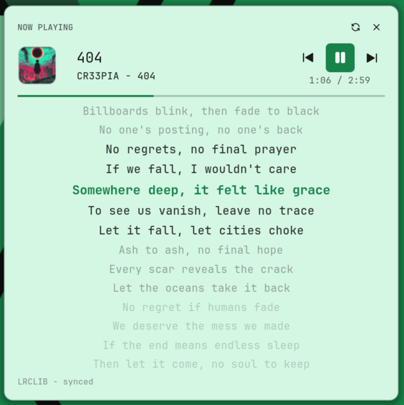
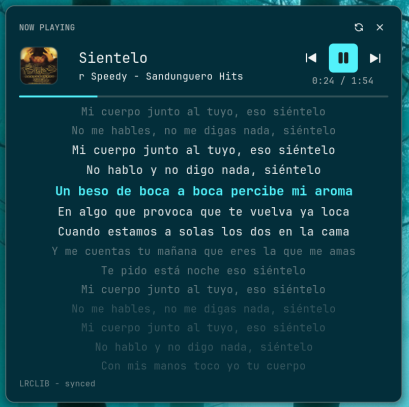

# Media Lyrics

A full-featured media player panel with **time-synced lyrics** for the Noctalia desktop shell. Karaoke-style lyric carousel (9/12/16 visible lines per size preset), album cover, transport controls, and a progress bar — all in one floating panel. **Pure Luau implementation**: no playerctl, no python daemons, no GTK overlays — runtime needs `busctl` (MPRIS) and `curl` (LRCLIB HTTPS + NetEase fallback).

| Light theme | Dark theme |
| --- | --- |
|  |  |

## Plugin

| Field | Value |
| --- | --- |
| ID | `tranzem/media-lyrics` |
| Entries | Bar widget: `now-playing`; panels: `panel` (medium 520×520), `panel-compact` (440×440), `panel-large` (640×640), `panel-mini` (360×120); service: `service`; shortcut: `toggle` |

## Requirements

- Noctalia v5 (plugin API 30+)
- `busctl` (systemd, present on every Arch install)
- `curl` — used for the HTTPS lyric fetches: LRCLIB primary + NetEase Cloud
  Music fallback (spawned as `curl -sSf -m 8 -4 <url>`, argv-only, no shell;
  LRCLIB resolves IPv4 faster than the built-in HTTP client on some setups)
- Outbound HTTPS access to `https://lrclib.net` (primary) and
  `https://music.163.com` (NetEase fallback) for lyrics

No player-specific software. Any MPRIS-capable player works: Spotify, MPD, Cider, web players, VLC, and anything else that exposes MPRIS over D-Bus. `sleep` (coreutils) is used for a short refresh delay after transport commands.

## Usage

Enable the plugin, then open the panel:

```sh
noctalia msg plugins enable tranzem/media-lyrics
noctalia msg panel-toggle tranzem/media-lyrics:panel
```

The panel opens at the size preset selected by the `panel_size` setting
(compact 440 / medium 520 / large 640). The `now-playing` bar widget and the
`toggle` control-center tile both open the selected preset; you can also open
a specific preset directly:

```sh
noctalia msg panel-toggle tranzem/media-lyrics:panel-compact
noctalia msg panel-toggle tranzem/media-lyrics:panel-large
noctalia msg panel-toggle tranzem/media-lyrics:panel-mini
```

`panel-mini` is a compact always-on surface (cover + the current lyric line)
intended for pinning to the desktop; it does not close on outside clicks.

Add the `now-playing` widget to your bar: a compact chip with the album
cover and **Title - Artist** of the active MPRIS player. Its gestures mirror
the shell's built-in media widget:

- **Left click** — open the lyrics panel.
- **Right click** — play/pause.
- **Middle click** — this widget's display settings.
- **Wheel / mouse back / forward** — previous / next track.
- On a **vertical bar** the chip collapses to the artwork only.

Display options are edited in the widget's own settings popup (middle click):

| Setting | Default | Effect |
| --- | --- | --- |
| `album_art_only` | off | Show only the artwork, no text |
| `hide_album_art` | off | Hide the artwork and its fallback icon |
| `hide_artist` | off | Show only the track title |
| `artist_first` | off | Show `Artist - Title` instead of `Title - Artist` |
| `min_length` | 80 | Minimum widget length (px) — accepted for parity; plugin chips are sized by the host to their content |
| `max_length` | 220 | Text area width (px); long titles truncate or scroll to fit |
| `art_size` | 16 | Artwork size (px) |
| `title_scroll` | none | Scroll long titles: `none`, `always`, or `on hover` |
| `hide_when_no_media` | off | Hide the chip when no MPRIS player is active |
| `show_lyric_line` | off | Show `Title · current line` in the chip instead of `Title - Artist` while synced lyrics are ready (long lines scroll with the marquee; falls back to the artist line otherwise) |

A `toggle` shortcut (control-center tile) is also available. Bind it to a hotkey in Noctalia's shortcut settings, or from your compositor:

```toml
"Ctrl+Alt+M" = "spawn:noctalia msg panel-toggle tranzem/media-lyrics:panel"
```

The panel shows the active MPRIS player automatically; when nothing is playing it renders an empty state.

## Features

- **Karaoke lyric carousel** — 9/12/16 lines visible at once (compact/medium/large presets); the active line is bright, neighbours fade by distance (Clavis-style). Works with synced (LRC) and plain lyrics.
- **Centred karaoke** — the active line is pinned to the vertical centre of the lyrics area (symmetric window around the cursor or the playing line): the first line starts centred on load, the anchor holds the centre line through the track, and the last line returns to the centre at the end. A **3-2-1 countdown** fills the space this frees above the first line, shown only in the last three seconds before it starts. Compact/medium/large only — `panel-mini` is untouched.
- **Clickable lyric lines** — click a synced line to seek the player to that timestamp.
- **Manual lyric scroll** — Up/Down step a line (the host's chord validator accepts only basic key names; PageUp/PageDown/Home/End are rejected).
- **LRCLIB integration** — exact `/api/get` lookup first, `/api/search` fallback, LRC parsed in pure Luau.
- **Lyrics variants picker** — the header "list" button (always visible while a track plays) fetches the full LRCLIB search result on demand and lists alternative lyric versions: pick one to switch instantly (the playing lyrics are never interrupted while the list loads), pick **Default** to restore the automatic chain, or switch again at any time — the candidate list stays in memory per track.
- **NetEase Cloud Music fallback** — no-auth second source for LRCLIB misses (public endpoints, browser headers only): synced LRC wins, candidates ranked by title/artist + duration, metadata lines stripped; instrumental placeholders are filtered.
- **Local `.lrc` files** — drop `Artist - Title.lrc` into the local lyrics folder; they take priority over the network.
- **Marquee titles** — long track/artist names hold for 2 s, then scroll slowly instead of wrapping or clipping. Overlap-free (per-slice node recreation).
- **Album cover + seekable progress bar** — click to jump, drag to scrub (a real `ui.slider`), interpolated between polls; transport controls (prev / play-pause / next), shuffle and repeat state.
- **Live lyric line in the chip** — optional `show_lyric_line` widget setting: while synced lyrics are ready the chip shows `Title · current line` instead of the artist (steps with playback, marquee for long lines).
- **Settings** — lyric timing offset in ms, on-disk cache, local lyrics folder. Translatable UI: strings go through Noctalia's i18n (`noctalia.tr`, English ships in the plugin; other locales via Noctalia Translate).

## Advantages over alternative lyric plugins

- **Lean runtime.** No playerctl, python daemons, pip packages, or GTK overlays to install and maintain — just `busctl` and `curl`, present on virtually every Linux system. Enable → works.
- **Player-agnostic.** Reads MPRIS directly via Noctalia's D-Bus aggregator — works with any player, not tied to a specific app.
- **A real panel, not a 1–3 line bar widget.** Full-screen-height carousel with 9–16 visible lines (per size preset) keeps whole verses in view.
- **Overflow handled properly.** Long titles get a marquee, single-line sanitizer strips embedded newlines, integer button heights prevent glyph overlap.
- **Offline-friendly.** LRCLIB responses are cached; local `.lrc` files work without network at all.

## Settings

| Setting | Type | Default | Description |
| --- | --- | --- | --- |
| `panel_size` | `select` | `medium` | Panel size preset: `mini` (360×120 chip panel), `compact` (440×440, 10 lyric lines), `medium` (520×520, 14 lines), `large` (640×640, 16 lines). The bar widget and the control-center tile open this preset. |
| `offset_ms` | `int` | `0` | Shift lyric timing in milliseconds, range **−2000…2000**: positive shows lines earlier, negative later. |
| `use_cache` | `bool` | `true` | Cache fetched lyrics in the plugin data directory for offline reuse. |
| `local_lyrics_dir` | `folder` | `~/.local/share/media-lyrics` | Folder with local `.lrc` files named `Artist - Title.lrc`; searched before LRCLIB. |
| `player_allowlist` | `string` | *(empty)* | Comma-separated identity/bus-name substrings; when set, only matching players are shown (e.g. `spotify, mpd`). |
| `player_blocklist` | `string` | *(empty)* | Comma-separated substrings of players to exclude (e.g. `firefox` to ignore a browser's MPRIS). |

## IPC

```sh
noctalia msg panel-toggle tranzem/media-lyrics:panel
```

## Local development

Add the parent directory as a local Noctalia source:

```sh
noctalia msg plugins source add media-lyrics-dev path /path/to/media-lyrics-parent
noctalia msg plugins enable tranzem/media-lyrics
noctalia msg config-reload
```

## To Do

The authoritative, detailed list lives in
[docs/ROADMAP.md](https://github.com/TraNZeM/media-lyrics/blob/main/docs/ROADMAP.md). Open items right now:

- [ ] **Musixmatch / Spotify lyric sources** — the remaining network sources;
      both need API keys or OAuth tokens, so they can only ship as an opt-in
      "bring your own key" setting. Every no-auth source is already covered
      (NetEase 0.9.1, embedded MPRIS 0.9.2).
- [ ] **Seek on progress-bar click** — **BLOCKED by host**: click handlers do
      not report coordinates, so a click position cannot be mapped to a
      timestamp (only lyric-line clicks and the keyboard cursor can seek).
- [ ] **Album cover in a capsule shape** — **DROPPED** pending a rectangular
      cover: the cover is square, so `radius = COVER/2` yields a circle, not
      a capsule.

Shipped work is recorded in [CHANGELOG.md](CHANGELOG.md) — variants picker
(0.9.4), clickable lines (0.8.5), panel size presets (0.8.7), widget gestures
and display settings (0.8.1 / 0.9.0), karaoke centering (0.9.6).

## Notes

- The service polls MPRIS via `busctl` (150 ms cadence) and publishes a snapshot to `noctalia.state`; the panel animates from those publishes.
- Lyrics are fetched from public services with `curl` — LRCLIB API primary,
  NetEase Cloud Music fallback on misses; nothing is uploaded. Cache and
  local lyrics live under the plugin data directory and `local_lyrics_dir`.
- Spawned processes (all argv-form, no shell): `busctl` (MPRIS poll), `curl` (LRCLIB + NetEase lyric fetches, IPv4, 8 s timeout), `sleep` (coreutils, 0.35 s refresh delay after transport commands).
- Adapted from the Clavis shell media player text layer (karaoke render + LRCLIB provider), ported to pure Luau for Noctalia v5.
