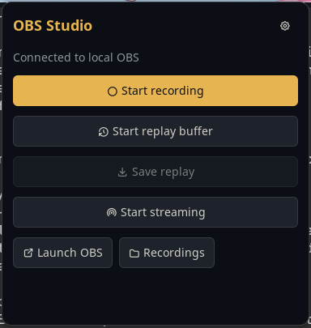

# OBS Control

Control OBS Studio from a themed bar widget, a panel or Niri shortcuts. This is the native Noctalia v5 port of the v4 OBS Control plugin.

## Plugin

| Field | Value |
| --- | --- |
| ID | `ayagmar/obs-control` |
| Entries | Bar widget: `status`; panel: `controls`; service: `controller`; shortcut: `quick-controls` |

## Requirements

Install `python3`, the Python module `websocket-client`, `obs`, `pgrep` and `xdg-open`. On Arch Linux:

```sh
sudo pacman -S obs-studio python-websocket-client procps-ng xdg-utils
```

The executable selected in settings must have `websocket-client` installed. Python 3.10 or newer is supported. `requirements.txt` pins the tested websocket-client version (1.9.2). In OBS, enable **Tools → WebSocket Server Settings → Enable WebSocket server**. Authentication may stay enabled: the helper reads the port and password directly from OBS's local config.

## Usage

Enable the plugin, then add `ayagmar/obs-control:status` to your bar. Left click opens the controls; right click opens plugin settings. Add `ayagmar/obs-control:quick-controls` to the control-center shortcuts for the same panel. The `controller` service polls OBS while the plugin is enabled.

```sh
noctalia msg panel-toggle ayagmar/obs-control:controls
```

The panel controls recording, replay buffer and streaming, saves replays, launches OBS and opens the recording folder. Starting an output launches OBS minimized if it is not running. Saving a replay requires an active replay buffer.



## Settings

| Setting | Default | Behavior |
| --- | --- | --- |
| `python_executable` | `python3` | Interpreter with websocket-client; a virtual environment executable also works. |
| `poll_interval_ms` | `2500` | Polling interval in milliseconds, from 1000 to 30000. |
| `auto_close_managed_obs` | `true` | After stopping an output, close only a process started by the plugin, and only when recording, replay, streaming and virtual camera are all inactive. |
| `open_videos_after_stop` | `true` | Open the parent folder of a completed recording via xdg-open. |
| `show_when_idle` | `true` | Keep the widget visible when no output is active. |
| `show_elapsed_in_bar` | `false` | Add recording duration to the bar label. |

## IPC

```sh
noctalia msg plugin ayagmar/obs-control:controller all toggle-record
noctalia msg plugin ayagmar/obs-control:controller all toggle-replay
noctalia msg plugin ayagmar/obs-control:controller all save-replay
noctalia msg plugin ayagmar/obs-control:controller all toggle-stream
noctalia msg plugin ayagmar/obs-control:controller all launch
noctalia msg plugin ayagmar/obs-control:controller all open-videos
noctalia msg plugin ayagmar/obs-control:controller all status
```

`launch` opens OBS without claiming it for automatic closure. Recording status shows REC, replay shows REPLAY, streaming shows LIVE; errors appear in the panel and action notifications.

## Notes

The Python helper connects only to `127.0.0.1`, using OBS WebSocket protocol v5 and its challenge-response authentication. No remote service is contacted. Passwords are never passed as arguments or included in status output. It reads `$XDG_CONFIG_HOME/obs-studio/plugin_config/obs-websocket/config.json` and `/proc/<pid>/stat`.

Session ownership and an action lock live in `$XDG_RUNTIME_DIR/noctalia-obs-control/`. PID start time is checked before sending SIGTERM, so an unrelated process cannot be closed after PID reuse. Commands are serialized; the plugin never kills an OBS process it did not launch. Disabling the plugin or restarting Noctalia leaves OBS and active outputs running.

The helper spawns `pgrep` for process detection, `obs --minimize-to-tray` when requested, and `xdg-open` for recording folders. No scripts or dependencies are downloaded at runtime. Noctalia handles all widget and panel colors, including palette changes.

Elapsed time is available in the tooltip and optionally the bar label. Launches always minimize to the tray. The recording directory comes from OBS instead of a second plugin path setting.
