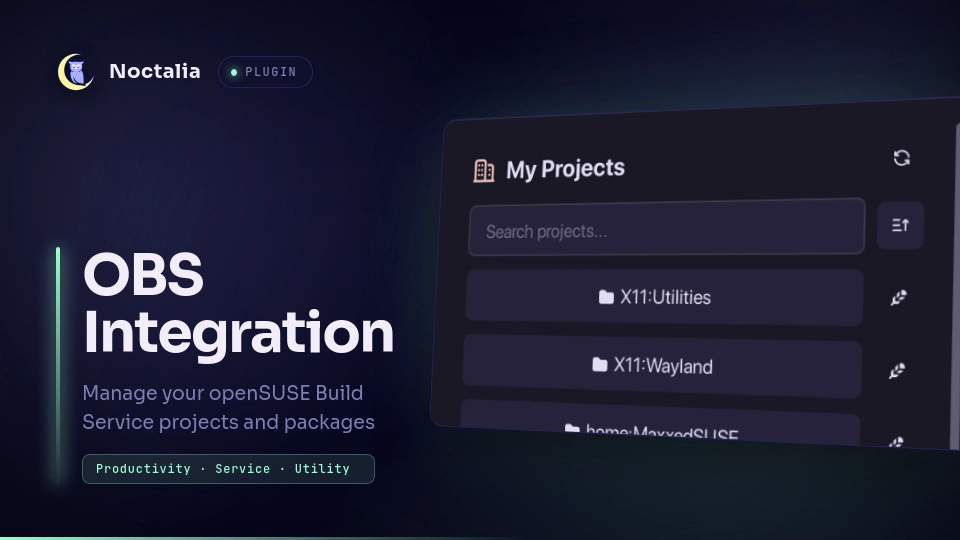

# OBS Integration



Manage openSUSE Build Service projects and packages directly inside Noctalia. 
The bar widget toggles a panel for browsing your projects, checking out packages,
editing metadata and files, and triggering rebuilds on OBS without leaving
the shell.

## Plugin

| Field | Value |
| --- | --- |
| ID | `neyfua/obs-integration` |
| Entries | Bar widget: `obs-integrate`; panel: `panel` |

## Requirements

Install the openSUSE Build Service `osc` CLI and configure your
credentials in `~/.config/osc/oscrc` (for example with `osc apiservice` setup
or by copying a working `oscrc`). The plugin shells out to `osc` for every
operation, so all authentication stays in your normal OBS configuration.

## Usage

### My Projects

The panel opens on **My Projects**: every project you maintain, plus every
project where you are listed as a package maintainer on OBS. Search filters the
list, and the sort button toggles A-Z / Z-A order. The pen icon edits the
project metadata (`osc meta prj -e`).

### Inside a project

Click a project to list its packages. A package's icon turns **primary** when
that package is checked out in your local directory. Click a package to open
its actions:

- **Checkout package** — `osc co` in the configured checkout directory
  (hidden once the package is already checked out).
- **Edit files** — expandable list of editable sources: `_service` and the
  package's `.spec` open in your `$EDITOR`; the `.changes` file runs
  `osc vc`.
- **Files** — lists every non-dotfile in the checkout. Each file has a remove
  button; below the list, **Add/Remove** runs `osc ar` asynchronously in the
  panel. **Commit** runs `osc status` first; if pending changes exist it
  opens a terminal with `osc ci` so you can edit the commit message, otherwise
  the commit runs asynchronously in the panel.
- **Service Local Run** — runs `osc service r` in the checkout, executing the
  package's source-service scripts locally (local side effects: the `_service`
  scripts can modify files in the checkout).
- **Service Manual Run** — runs `osc service mr` in the checkout, running the
  source-service scripts locally in "manual" mode (local side effects, like
  Service Local Run).
- **Service Run All** — runs `osc service ra` in the checkout, running all
  source-service scripts locally. Requires a confirmation click (turns
  **secondary** with a **check** glyph) before it executes.
- **Service Remote Run** — runs `osc service rr` on the OBS server for the
  package on the remote project. No local code executes; the request triggers
  server-side service runs, and a confirmation is not required.
- **Rebuild package** — pick a repository and architecture (or **All**) and trigger `osc rebuild`. Confirmation is required before it runs.
- **Build Status** — Shows real-time build results for the package across all repositories and architectures. Click **Refresh status** to pull latest results.
- **Edit package meta** — `osc meta pkg -e` in a terminal.
- **Remove package** — deletes the checkout from disk only (never touches the
  OBS project); confirm before it runs. If it was the last package in the
  project directory, the directory is removed too.

### Sticky navigation

The panel reopens where you left off — inside the same project or package.

## Settings

| Setting | Type | Default | Description |
| --- | --- | --- | --- |
| `checkout_dir` | `string` | `~/OBS` | Base directory where packages are checked out. Packages land in `<checkout_dir>/<project>/<package>`. |
| `show_label` | `bool` | `false` | Show the "OBS" label next to the bar icon. |

## IPC

```sh
noctalia msg panel-toggle neyfua/obs-integration:panel
```

## Notes

The plugin runs the `osc` CLI with your existing credentials — it stores
nothing itself beyond a small cache of project/package listings and your last
navigated view. Removal is local-only and never modifies the OBS project.
Most operations (rebuilds, service runs, updates, add/remove) run
asynchronously and display their output directly in the panel. The Commit
operation opens a terminal only when `osc status` reports pending changes;
otherwise, it runs asynchronously in the panel. Confirmation prompts precede
destructive and side-effecting operations: Rebuild package, Remove package,
and Service Run All.

Build status data is fetched from `osc results` and cached for the session. The
status display shares the same underlying `osc results` call used for rebuild
architecture selection, so enabling a package view pulls both in one query.
