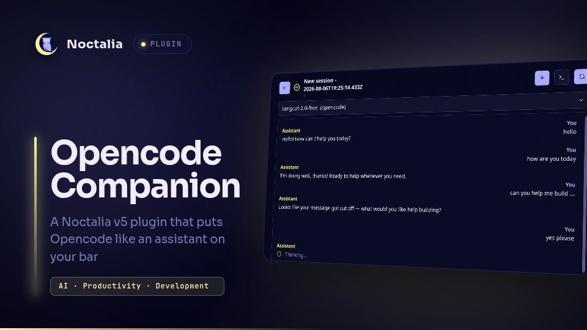

# OpenCode Companion

A Noctalia v5 plugin that puts [OpenCode](https://opencode.ai/) on your bar — a glanceable status dot, a native chat panel, session management, and MCP status — all driven by the OpenCode HTTP API. No embedded terminal, no key emulation.



## Plugin

| Field      | Value                                                                   |
| ---------- | ----------------------------------------------------------------------- |
| ID         | `weinguyen/opencode-companion`                                          |
| Entries    | Bar widget: `widget`; panels: `panel-fill`, `panel`; service: `service` |
| Plugin API | 3                                                                       |

Built and tested against:

- **Noctalia** v5.0.0 (97917d9ca07e)
- **OpenCode** v1.18.13

## Requirements

- **Noctalia v5** (beta or newer) with `plugin_api >= 3` support
- **[OpenCode](https://opencode.ai/)** installed and available on your `PATH` (`opencode --version` to verify)
- A configured OpenCode provider (run `opencode` once to set up auth)

## Install

```sh
# Clone the community-plugins repo (if you haven't already)
git clone https://github.com/... community-plugins

# Symlink into Noctalia plugins directory
ln -s "$PWD/community-plugins/opencode-companion" ~/.local/share/noctalia/plugins/opencode-companion

# Enable the plugin
noctalia msg plugins enable weinguyen/opencode-companion
```

## Usage

### Adding the widget to your bar

1. Open Noctalia Settings → Bar
2. Click **Add Widget**
3. Select **OpenCode Companion** (the code-circle icon)
4. The widget appears on your bar

### Opening the panel

- **Left click** the bar widget → opens/closes the panel
- **Right click** → quick-create a new session
- **Middle click** → open current session in terminal (`opencode attach`)

### Panel workflow

When you first open the panel (after a reboot), the **session chooser** appears. From there you can:

- Create a new session
- Pick an existing session (sorted by most recently updated)
- Filter sessions by workspace (visible in the subtitle)

Once a session is selected, the **chat view** shows:

- Message history (user + assistant)
- Tool call status cards (if enabled)
- Reasoning text (if enabled)
- Streaming responses as they arrive

Type a prompt in the composer and press Enter or click Send.

### IPC

```sh
# Toggle the panel (full-height, right side)
noctalia msg panel-toggle weinguyen/opencode-companion:panel-fill

# Toggle the panel (compact, near click)
noctalia msg panel-toggle weinguyen/opencode-companion:panel

# Force refresh
noctalia msg plugin weinguyen/opencode-companion:service all refresh

# Reconnect to server
noctalia msg plugin weinguyen/opencode-companion:service all reconnect

# Create a new session
noctalia msg plugin weinguyen/opencode-companion:service all create_session
```

## Settings

| Setting             | Type   | Default       | Description                                                     |
| ------------------- | ------ | ------------- | --------------------------------------------------------------- |
| `server_mode`       | string | `"auto"`      | `"auto"` manages a local server; `"external"` connects to a URL |
| `server_host`       | string | `"127.0.0.1"` | Hostname the managed server binds to (loopback only)            |
| `server_port`       | double | `4096`        | Port the managed server listens on                              |
| `server_url`        | string | `""`          | External server URL (used in `"external"` mode)                 |
| `default_workspace` | folder | `""`          | Default working directory for new sessions                      |
| `default_model`     | string | `""`          | Default model in `provider/model` format                        |
| `default_agent`     | string | `"build"`     | Default agent for new sessions                                  |
| `auto_start`        | bool   | `true`        | Auto-start the managed server                                   |
| `show_tool_calls`   | bool   | `true`        | Show tool call status cards                                     |
| `show_reasoning`    | bool   | `false`       | Show reasoning/thinking text                                    |
| `max_messages_load` | double | `50`          | Max messages to load per session                                |
| `debug_logging`     | bool   | `false`       | Print debug messages                                            |

## Session Lifecycle

### Within the same boot

- Selecting a session, closing the panel, and reopening it preserves the active session
- Draft text is preserved when the panel closes
- Unread responses are tracked and shown as a badge on the bar widget
- The SSE connection stays alive while the panel is closed

### After reboot

- The plugin detects reboot via `/proc/sys/kernel/random/boot_id`
- After reboot, the session chooser appears instead of auto-opening the last session
- Old sessions are still available to select
- The active session is persisted to `~/.local/state/noctalia/opencode-companion/opencode_state.json`

### Boot-ID behavior

| Condition                      | Behavior                                |
| ------------------------------ | --------------------------------------- |
| Boot ID matches saved state    | Restore active session on first open    |
| Boot ID differs (reboot)       | Show session chooser; keep session list |
| Saved session no longer exists | Show session chooser                    |

## Security Notes

- **Loopback only**: The managed server binds to `127.0.0.1` by default
- **No credential storage**: The plugin does not store API keys or tokens
- **Shell quoting**: All paths and arguments are shell-escaped before command execution
- **No auto-approve**: Permission requests are never auto-approved
- **No secret logging**: Passwords and tokens are not written to logs

When running in `auto` mode without authentication, any local process can reach the managed server. For multi-user systems, consider:

- Setting `OPENCODE_SERVER_PASSWORD` before starting the server
- Using `external` mode with a password-protected server

## MCP Status

The plugin reads MCP status from OpenCode's `/mcp` endpoint. To check Context7 and Firecrawl:

```sh
curl http://127.0.0.1:4096/mcp | jq
```

Example response:

```json
{
  "context7": { "status": "connected" },
  "firecrawl": { "status": "connected" },
  "github": { "status": "connected" }
}
```

Status values: `connected`, `failed`, `disabled`.

The plugin does **not** add or configure MCP servers — it only reports their status. Configure OpenCode MCP servers through your `opencode.json` or the TUI.

## Troubleshooting

### Widget shows offline

```sh
# Verify opencode is on PATH
which opencode

# Start a server manually to test
opencode serve --hostname 127.0.0.1 --port 4096 &

# Check health
curl http://127.0.0.1:4096/global/health
```

### Server fails to start

```sh
# Check for port conflicts
ss -tlnp | grep 4096

# Try a different port in plugin settings
```

### Panel doesn't open

```sh
# Verify plugin is enabled
noctalia msg plugins list

# Try toggling manually
noctalia msg panel-toggle weinguyen/opencode-companion:panel
```

### SSE events not arriving

OpenCode 1.14.42+ had SSE regressions. Upgrade to 1.18.13+ if events stop flowing. The plugin handles reconnection with exponential backoff.

### Debug logging

Enable `debug_logging` in plugin settings, then check Noctalia logs:

```sh
journalctl --user -u noctalia -f
```

## Logs

Debug output (when enabled) is prefixed with `[opencode-companion]`. Look for:

- Connection state changes
- SSE events received
- IPC messages handled
- HTTP request failures

## Known Limitations

- **No `ui.markdown`**: Responses are rendered as plain `ui.label`. Code blocks lose syntax highlighting.
- **Single-line composer fallback**: If `multiline` input is not fully supported, the composer falls back to single-line.
- **Panel layer**: Panels render at `Layer::Top` — notifications and polkit prompts may cover the panel.
- **No desktop orb**: Initial release includes only the bar widget. A desktop presence orb is planned.
- **Boot-ID edge case**: If the boot ID file is unreadable, session restoration is skipped.
- **SSE reconnection**: After server restart, SSE reconnects with backoff (up to 30s delay).
- **No model/agent switching mid-session**: Model and agent are set at session creation.

## Uninstall

```sh
# Disable the plugin
noctalia msg plugins disable weinguyen/opencode-companion

# Remove the symlink
rm ~/.local/share/noctalia/plugins/opencode-companion

# Optionally remove saved state
rm -rf ~/.local/state/noctalia/opencode-companion
```

## Roadmap

- [ ] Desktop presence orb
- [ ] Model/agent switching from header
- [ ] Session rename/delete from panel
- [ ] MCP status panel
- [ ] Multi-workspace profiles
- [ ] `ui.markdown` support when available
- [ ] Attachment support (images, files)

## License

[MIT](LICENSE)
