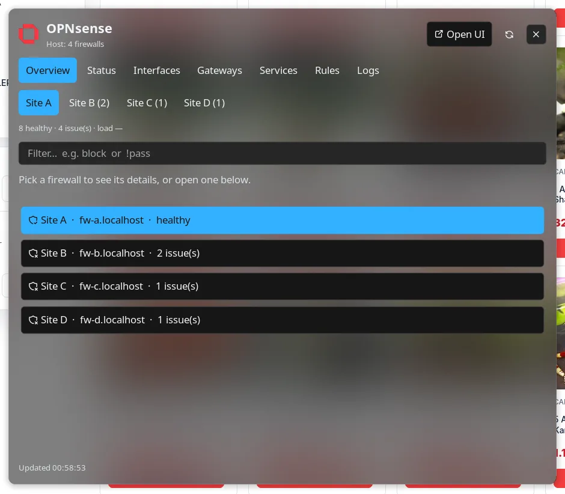
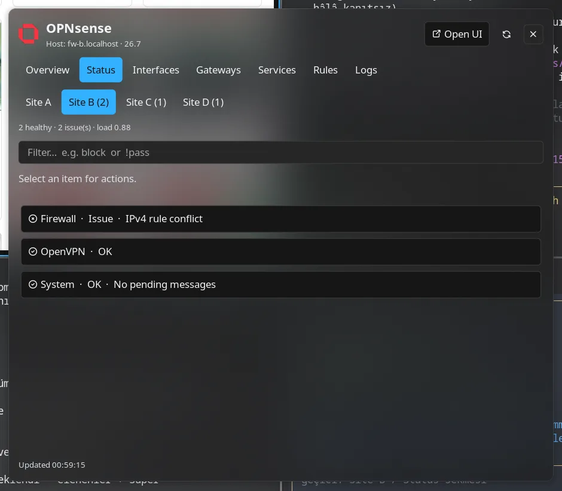
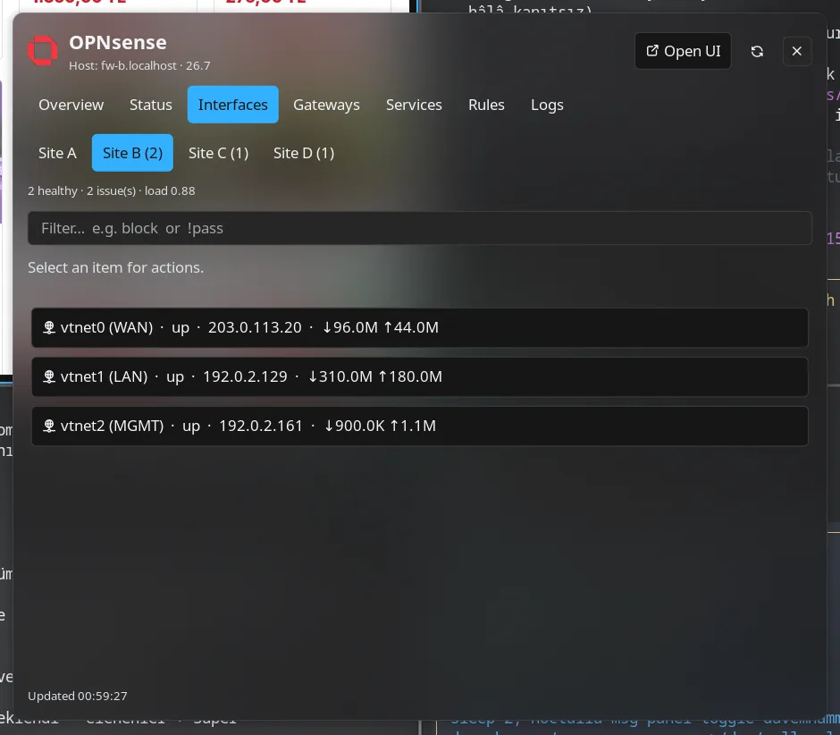

# OPNsense

Monitor one or many OPNsense firewalls — system health, interfaces, gateways, services, firewall rules, and recent firewall logs — from Noctalia.

## Plugin

| Field | Value |
| --- | --- |
| ID | `davemhammer/opnsense` |
| Entries | Bar widget: `status`; panel: `manager`; service: `service`; launcher: `opn` |
| Launcher Prefix | `/opn` |

## Requirements

- Network access to each OPNsense REST API you monitor
- An API key + secret per firewall, with permission to read status (and control services if you use restart/start/stop)
- On `PATH` (declared in `plugin.toml` `dependencies`):
  - `curl` — on-demand firewall log fetch
  - `jq` — slim log JSON for the panel
  - `xdg-open` — open the OPNsense web UI

## Usage

### One firewall

Configure **Base URL**, **API key**, and **API secret** under plugin settings (key/secret are sensitive string fields).

### Several firewalls

Leave the single-firewall settings as they are and put a JSON array in the advanced
**Additional firewalls** setting. When that setting is non-empty it **replaces** the
single-firewall settings, so list every firewall there (including the first one):

```json
[
  { "name": "Site A", "url": "https://fw-a.example.net", "api_key": "KEY", "api_secret": "SECRET" },
  { "name": "Site B", "url": "https://fw-b.example.net", "api_key": "KEY", "api_secret": "SECRET",
    "insecure": true, "web_ui_url": "https://fw-b-admin.example.net:8443" }
]
```

| Field | Required | Meaning |
| --- | --- | --- |
| `name` | no | Label used on the bar, in the panel and by the widget/commands. Defaults to the URL host. |
| `url` | yes | OPNsense origin, without `/api`. |
| `api_key` / `api_secret` | yes | Credentials for that firewall. |
| `insecure` | no | Per-firewall TLS override. Defaults to the **Allow insecure TLS** setting. |
| `web_ui_url` | no | What “Open UI” opens for that firewall. Defaults to `url`. |

Entries without a `url`/`api_key`/`api_secret` are dropped with a log line; a malformed
array leaves the plugin unconfigured and says so in the panel instead of silently
falling back to the single-firewall settings.

Add the **status** bar widget (`davemhammer/opnsense:status`). Click to open the manager panel.

Panel tabs: **Overview**, **Status**, **Interfaces**, **Gateways**, **Services**, **Rules**, **Logs**.
**Overview** lists every firewall with its health and acts as a firewall picker (the firewall
buttons under the tabs do the same). Every other tab shows the selected firewall. Logs load only
when you open the Logs tab (last 100 events, for the selected firewall).



 

Launcher: `/opn` for categories and quick actions, optionally pointed at one firewall —
`/opn site-b gateways` switches the launcher to `Site B` and lists its gateways. Firewall rows
appear at the top of the empty query and in the fuzzy results.

### Bar widget

With several firewalls the widget shows the **combined** state: unreachable firewalls and
subsystem/gateway issues are added up, and the tooltip lists every firewall on its own line.
To pin one bar widget to a single firewall, set the widget's **Show one firewall** setting to
that firewall's `name` (they can be used side by side with a combined widget).

```sh
noctalia msg panel-toggle davemhammer/opnsense:manager
```

## Settings

| Setting | Type | Default | Description |
| --- | --- | --- | --- |
| `base_url` | `string` | `https://192.168.1.1` | OPNsense base URL (no trailing `/api`). Used when no firewalls are listed in `instances`. |
| `api_key` | `string` | _(empty)_ | API key (basic auth username) for that single firewall. |
| `api_secret` | `string` | _(empty)_ | API secret (basic auth password) for that single firewall. |
| `instances` | `string` | _(empty)_ | Advanced: JSON array of the firewalls to monitor (see **Several firewalls**). Non-empty replaces the three settings above. |
| `allow_insecure_tls` | `bool` | `true` | Skip TLS certificate verification (default **on** for common LAN self-signed certs; set **false** when you have a trusted cert). |
| `refresh_interval` | `int` | `20` | Core status poll interval in seconds. |
| `notify_on_issue` | `bool` | `true` | Notify when a new subsystem/gateway issue appears. |
| `web_ui_url` | `string` | _(empty)_ | Override URL for “Open Web UI”; empty uses `base_url`. |
| `instance` | `string` (widget) | _(empty)_ | Firewall this widget instance reports on (`name` from `instances`). Empty = combined state of every firewall. |
| `show_label` | `bool` (widget) | `true` | Show OK / issue label on the bar. |
| `ok_color` | `select` (widget) | `tertiary` | Bar color when status is OK. |
| `warn_color` | `select` (widget) | `error` | Bar color when issues are present. |

## IPC

```sh
noctalia msg panel-toggle davemhammer/opnsense:manager
noctalia msg plugin davemhammer/opnsense:service all refresh
noctalia msg plugin davemhammer/opnsense:service all logs
```

## Notes

- Uses `noctalia.http` for status/rules/services (Basic Auth). Log fetch uses `curl` + `jq` with `?limit=100` so large log dumps do not stall Luau. Web UI opens via `xdg-open`.
- API credentials are stored in Noctalia settings (not in this repo). Prefer a restricted API key.
- `allow_insecure_tls` applies to both `noctalia.http` and the log `curl` request. Default is **true** (verification skipped); turn it **off** when the firewall presents a certificate you trust.
- Service control mutates the firewall only when you request start/stop/restart, and only on the firewall the panel/launcher is pointed at.
- `plugin davemhammer/opnsense:service all logs` without a firewall name fetches logs from every configured firewall; the panel always fetches for the selected one.
- Firewalls are polled **one at a time**: Noctalia’s HTTP queue rejects bursts (`http queue full`), so a sweep of N firewalls takes about N × one firewall’s poll. Requests within one firewall still go out together, exactly as before.
