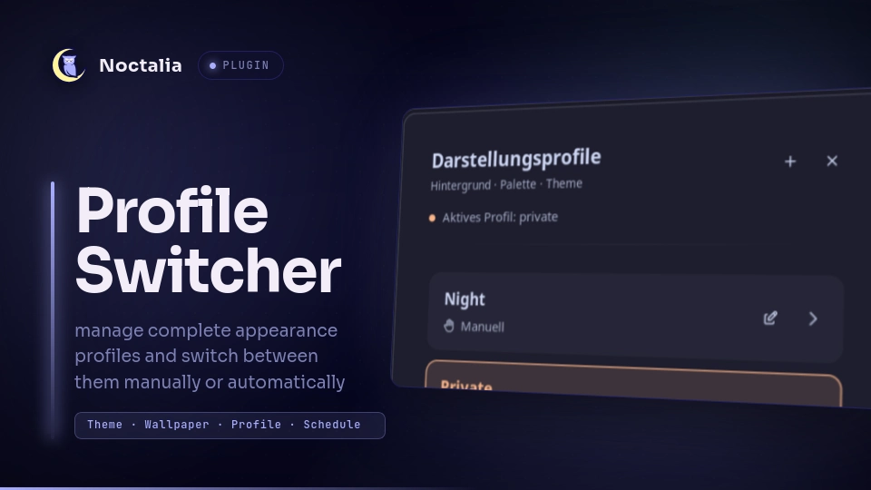

# Noctalia Profile Switcher



A profile switcher plugin for [Noctalia](https://noctalia.dev/) that lets you manage complete appearance profiles and switch between them manually or automatically based on a schedule.

A profile can define:

- Theme mode
- Color palette
- Wallpaper directory
- Default wallpaper
- Per-monitor wallpapers
- Automatic schedule
- Manual-only activation

Profiles are stored as simple TOML files and can be created and edited directly from Noctalia.

## Plugin

Plugin ID: `m4sc/profile-switcher`

### Widget

- `profile`

### Panels

- `panel`
- `editor`

### Shortcut

- `profiles`

### Service

- `service`

## Features

### Appearance Profiles

Each profile can configure:

- **Theme mode**
  - Dark
  - Light
  - Auto

- **Palette source**
  - Builtin
  - Wallpaper
  - Community
  - Custom

- **Wallpapers**
  - Wallpaper directory
  - Default wallpaper
  - Per-monitor overrides
  - Integrated wallpaper browser
  - Wallpaper preview
  - Paginated thumbnail gallery

- **Scheduling**
  - Automatic profile activation
  - Configurable start/end time
  - Configurable weekdays
  - Manual-only profiles

### Manual and Automatic Profiles

Profiles can either participate in automatic scheduling or remain completely manual.

```toml
[schedule]
enabled = false
from = "08:00"
until = "17:00"
days = [1, 2, 3, 4, 5]
```

With:

```toml
enabled = false
```

the profile is ignored by the scheduler but can still be activated manually.

With:

```toml
enabled = true
```

the profile is automatically activated according to its configured schedule.

Existing profiles without an `enabled` property are treated as automatic for backwards compatibility.

## Profile Example

Profiles are stored in:

```text
~/.config/noctalia/profiles/
```

Example:

```toml
name = "Private"
icon = "home"
theme_mode = "dark"

[palette]
source = "community"
name = "Catppuccin Mocha Peach"

[wallpapers]
directory = "/home/user/Pictures/Wallpapers/Private"
default = "/home/user/Pictures/Wallpapers/Private/default.png"

[wallpapers.monitors]
"DP-1" = "/home/user/Pictures/Wallpapers/Private/main.png"
"DP-3" = "/home/user/Pictures/Wallpapers/Private/secondary.png"

[schedule]
enabled = false
from = "16:30"
until = "08:30"
days = [1, 2, 3, 4, 5]
```

The filename is used as the profile ID:

```text
private.toml
```

becomes:

```text
private
```

## Profile Editor

The integrated editor allows profiles to be configured without manually editing TOML files.

It supports:

- Creating new profiles
- Editing existing profiles
- Selecting theme mode
- Selecting palette source
- Loading community palettes
- Loading custom palettes
- Configuring wallpaper directories
- Browsing wallpapers
- Wallpaper previews
- Per-monitor wallpaper overrides
- Schedule configuration
- Manual/automatic schedule mode
- Save
- Save & Apply

New profiles default to **Manual** scheduling.

## Wallpaper Browser

The editor contains an integrated wallpaper browser.

Images from the configured wallpaper directory are displayed as thumbnails.

Supported formats include:

```text
png
jpg
jpeg
webp
bmp
gif
```

The gallery displays up to **12 wallpapers per page** to avoid creating a large number of image components at once.

Wallpaper targets can be configured individually:

```text
Default
DP-1
DP-3
...
```

Monitor overrides are stored under:

```toml
[wallpapers.monitors]
```

## Palette Sources

### Builtin

Uses one of Noctalia's builtin palettes.

Examples:

```text
Ayu
Catppuccin
Dracula
Eldritch
Gruvbox
Kanagawa
Noctalia
Nord
Rosé Pine
Tokyo-Night
```

### Wallpaper

Generates the palette from the selected wallpaper using one of the supported schemes.

Examples:

```text
m3-tonal-spot
m3-content
m3-fruit-salad
m3-rainbow
m3-monochrome
vibrant
faithful
soft
dysfunctional
muted
```

### Community

Community palettes are loaded dynamically from the Noctalia palette API.

### Custom

Custom palettes are loaded from:

```text
~/.config/noctalia/palettes/
```

## Translations

The plugin uses Noctalia's native plugin translation system.

Translation bundles are stored in:

```text
translations/
├── en.json
└── de.json
```

English is the fallback language. German is included as an additional translation.

Plugin UI strings use `noctalia.tr()` and automatically follow Noctalia's configured language.

## Installation

Clone the plugin into the Noctalia plugin directory:

```bash
mkdir -p ~/.local/share/noctalia/plugins

git clone <repository-url> \
  ~/.local/share/noctalia/plugins/profile-switcher
```

The resulting directory should look similar to:

```text
~/.local/share/noctalia/plugins/profile-switcher/
├── plugin.toml
├── README.md
├── LICENSE
├── thumbnail.webp
├── service.luau
├── scheduler.luau
├── profiles.luau
├── apply.luau
├── panel.luau
├── editor.luau
├── widget.luau
├── shortcut.luau
├── toml.luau
└── translations/
    ├── en.json
    └── de.json
```

Enable the plugin in Noctalia and restart Noctalia if necessary.

## Usage

Open the profile selector through Noctalia or via IPC:

```bash
noctalia msg panel-toggle m4sc/profile-switcher:panel
```

The editor can also be opened directly:

```bash
noctalia msg panel-toggle m4sc/profile-switcher:editor
```

### Activate a Profile

Profiles can be activated directly through IPC:

```bash
noctalia msg plugin \
  m4sc/profile-switcher:service \
  all activate private
```

Replace `private` with the profile ID.

### List Profiles

```bash
noctalia msg plugin \
  m4sc/profile-switcher:service \
  all list
```

### Show Active Profile

```bash
noctalia msg plugin \
  m4sc/profile-switcher:service \
  all status
```

### Re-evaluate the Schedule

```bash
noctalia msg plugin \
  m4sc/profile-switcher:service \
  all reconcile
```

## Keybinding Example

The selector can be opened from your compositor.

For example, with Umbriel:

```toml
"Mod+P" = "spawn:noctalia msg panel-toggle m4sc/profile-switcher:panel"
```

## Scheduling

The plugin periodically evaluates profile schedules.

### Automatic Profile

Example work profile:

```toml
[schedule]
enabled = true
from = "08:00"
until = "17:00"
days = [1, 2, 3, 4, 5]
```

Example private profile:

```toml
[schedule]
enabled = true
from = "17:00"
until = "08:00"
days = [1, 2, 3, 4, 5]
```

Schedules crossing midnight are supported by the scheduler.

### Manual Profile

A manual profile can keep its schedule configuration while disabling automatic activation:

```toml
[schedule]
enabled = false
from = "17:00"
until = "08:00"
days = [1, 2, 3, 4, 5]
```

This makes it easy to temporarily disable automation without deleting the configured times.

Manual profiles can always be activated from the profile selector or through IPC.

## Project Structure

```text
profile-switcher/
├── plugin.toml
│   Plugin manifest and Noctalia entries
│
├── README.md
│   Plugin documentation
│
├── LICENSE
│   MIT license
│
├── thumbnail.webp
│   Plugin preview image
│
├── service.luau
│   Background service, IPC and schedule handling
│
├── scheduler.luau
│   Schedule evaluation
│
├── profiles.luau
│   Profile loading and TOML serialization
│
├── apply.luau
│   Applies profile settings to Noctalia
│
├── panel.luau
│   Profile selector
│
├── editor.luau
│   Profile editor and wallpaper browser
│
├── widget.luau
│   Noctalia widget integration
│
├── shortcut.luau
│   Noctalia shortcut integration
│
├── toml.luau
│   TOML parsing
│
└── translations/
    ├── en.json
    └── de.json
```

## Notes

The plugin currently identifies monitors by their connector name, for example:

```text
DP-1
DP-3
eDP-1
```

If the same profile is used across multiple machines, configure the required monitor overrides in the profile.

A missing monitor override does not prevent the profile from using its default wallpaper.

## Requirements

- Noctalia with plugin API support
- Noctalia Plugin API 30
- Luau plugin runtime

## License

This project is licensed under the [MIT License](LICENSE).
