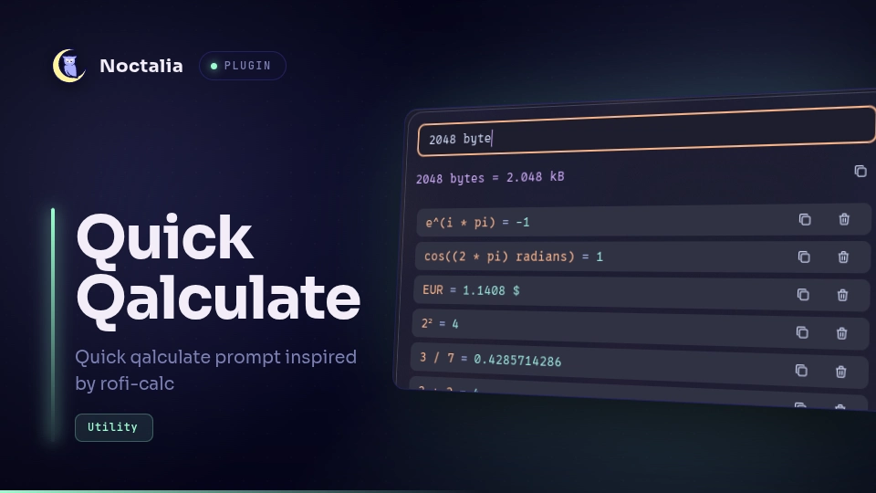

# Quick Qalculate

Quick calculator panel powered by [libqalculate](https://github.com/qalculate/libqalculate), inspired by rofi-calc.



## Plugin

| Field | Value |
| --- | --- |
| ID | `shadr/quick-qalculate` |
| Entries | panel: `panel` |

## Requirements

- `qalc` binary from [libqalculate](https://github.com/qalculate/libqalculate)

## Usage

Open the panel with the IPC command:

```sh
noctalia msg panel-toggle shadr/quick-qalculate:panel
```

Once the panel is open:

- **Enter** — evaluate and save current expression to the history
- **Esc** — close panel

Bind a key in your compositor to open the plugin panel:

```
# Niri
binds {
    Mod+A { spawn "noctalia" "msg" "panel-toggle" "shadr/quick-qalculate:panel"; }
}

# Hyprland
bind = Mod+A, exec, noctalia msg panel-toggle shadr/quick-qalculate:panel
```

## Settings

| Setting | Type | Default | Description |
| --- | --- | --- | --- |
| `unicode` | `bool` | `true` | Use Unicode characters in output when possible. |

## Notes

- The history file is written to the `$HOME/.config/quick-qalculate`
- `qalc` is spawned as a subprocess for each evaluation.
- Copying results to clipboard is currently unsupported in Noctalia v5.
