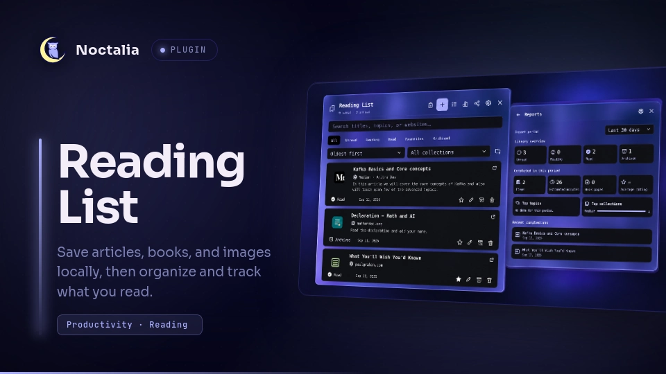

# Reading List



Save articles, books, and images from the Noctalia bar, then organize and track
them without sending your library to a third-party service. Reading List stores
each item locally as an Obsidian-friendly Markdown note.

## Plugin

| Field | Value |
| --- | --- |
| ID | `ahmedhossamdev/reading-list` |
| Entries | Bar widget: `bar`; panel: `panel`; service: `service` |

## Requirements

- Noctalia Shell v5 with plugin API 26 or newer.
- `xdg-open` on `PATH` to open saved links and Markdown notes.
- `python3` on `PATH` for the image and import file pickers.
- PyGObject (`gi`) and an active `xdg-desktop-portal` file chooser backend for
  the desktop file picker.

## Usage

1. Enable **Reading List** in Settings → Plugins.
2. Add its `bar` widget to a bar section.
3. Click the bookmarks icon to open the panel.
4. Copy a web URL and press the clipboard button to save it immediately, or
   press **+** to add an article, book, or image manually.

Open or close the panel directly:

```sh
noctalia msg panel-toggle ahmedhossamdev/reading-list:panel
```

### Add and edit items

- URLs can fetch their title, website, author, description, favicon, and Open
  Graph preview automatically.
- Use **More details** in the editor to add a cover, reading progress, book
  pages, estimated reading time, rating, review, or private notes.
- Covers and image entries can be selected with the desktop file picker. If
  the attached panel closes while the picker is open, the draft is preserved
  and the editor reopens after a file is selected.
- Click an item's title to open its website. Use the edit button to change its
  details or open the corresponding Markdown note.

### Organize and track reading

- The status button cycles through **Unread → Reading → Read → Unread**.
  Archiving is handled separately by the archive button.
- Search titles, topics, authors, descriptions, and websites, or filter by
  status, favorites, and collection.
- Create reusable collections from the library or editor, then select them
  from a list instead of entering collection names manually.
- Sort by newest, oldest, title, rating, progress, or queue order. In
  **Queue order**, use the arrow buttons to move items up or down.
- Select multiple items to change their status, add them to a collection, or
  delete them together.

### Reports, sharing, and backups

- Reports show library status, completed items, estimated reading time, book
  pages, average rating, top topics and collections, and recent completions.
  Reports can cover the last 7 days, last 30 days, or all time.
- Share the current filter or selected items by copying Markdown or exporting
  Markdown, HTML, or JSON. Private notes are excluded unless explicitly
  included.
- Import a Reading List JSON export, an exported Markdown list, an HTML
  bookmarks file, or a plain-text URL list.

## Settings

| Setting | Type | Default | Description |
| --- | --- | --- | --- |
| `save_path` | `string` | `~/Documents/Reading List` | Folder containing the Markdown library, collections, exports, and cached images. It can point inside an Obsidian vault. |
| `show_unread_count` | `bool` | `true` | Shows the number of unread items beside the bar icon. |
| `fetch_metadata` | `bool` | `true` | Fetches website details automatically after a URL is added. |
| `download_previews` | `bool` | `true` | Caches Open Graph preview images locally. Favicons are still cached when metadata fetching is enabled. |
| `sync_external_changes` | `bool` | `true` | Reloads the library every 30 seconds so external Markdown edits appear in Noctalia. |

## Notes

- The default library layout is:

  ```text
  Reading List/
  ├── Collections.md
  ├── Exports/
  ├── Items/
  │   └── 17890600000001234.md
  └── .assets/
      ├── 17890600000001234-favicon.ico
      └── 17890600000001234-cover.webp
  ```

- Every item is a standalone Markdown note with YAML frontmatter. Notes written
  below the frontmatter remain editable from both Noctalia and Obsidian.
- Adding or refreshing a URL makes a direct request to that website. The plugin
  does not use a third-party favicon service.
- Downloaded favicons and previews are stored in `.assets`. A manually selected
  image outside the library is referenced but never modified or deleted.
- The plugin writes only inside the configured library folder, apart from files
  the user explicitly selects. It runs `xdg-open` only when the user chooses to
  open a saved HTTP(S) link or Markdown note.
- Reports use each item's saved `finished_at` timestamp. Older read items that
  do not have this timestamp appear in the library totals but not in historical
  completion reports.
- Duplicate URLs are rejected, and common tracking parameters such as `utm_*`,
  `fbclid`, and `gclid` are removed before saving.
- Run `./reading-list/tests/run.sh` from the repository root to check Markdown
  persistence, queue ordering, import/export, collection deletion, report UI,
  and other panel interactions without touching the real reading-list folder.
