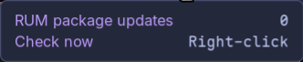
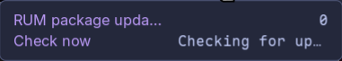

# RUM Updates

A Noctalia bar widget for monitoring and managing RakuOS overlay package updates with [`rum`](https://gitlab.com/rakuos/packages/rakuos/rakuos-rum).

The plugin checks for updates in the background, displays the available count in your bar, provides package details on hover, and can open either RakuOS Software Center or the `rum` system upgrade command in a terminal.

## Plugin

| Field | Value |
| --- | --- |
| ID | `etrigan63/rum-updates` |
| Entries | Bar widget: `rum_updates`; service: `update_poller` |
| Version | `0.1.6` |
| Noctalia plugin API | `3` |
| License | MIT |

## Screenshots

### Bar widget

The widget displays a configurable glyph and the number of overlay package updates reported by `rum`.


### Manual check

The tooltip ends with a **Check now** row that shows how to start a check on demand and reports progress while it runs.





### Configuration

The plugin settings control polling and notifications. Each bar widget has its own visibility, glyph, click action, and terminal settings.


## Features

- Checks for RakuOS overlay package updates with `rum check-upgrade --json`.
- Updates the bar automatically at a configurable interval.
- Starts an immediate update check when the widget is right-clicked, with progress shown in the tooltip.
- Shows the current count as `1 Update`, `0 Updates`, or `RUM error`.
- Provides package names, installed and available versions, and repository names in the tooltip.
- Uses the `package` glyph by default and supports any configurable Noctalia glyph.
- Runs `sudo rum system-upgrade` in a terminal on click by default, or opens RakuOS Software Center instead.
- Uses Noctalia's detected terminal by default, with support for a custom terminal executable.
- Optionally sends a notification when the number of available updates increases.
- Validates and sorts `rum` JSON output before displaying it.
- Never starts a privileged upgrade automatically; `sudo` is run only after an explicit widget click.

## Requirements

- RakuOS with [`rum`](https://gitlab.com/rakuos/packages/rakuos/rakuos-rum) 0.1.0 or later.
- A Noctalia release that supports plugin API 3.
- `rakuos-software` is optional and only needed for the **Open RakuOS Software Center** click action.
- `sh` and `sudo` are used only when launching the optional terminal updater.
- A terminal emulator is optional and only needed for the **Run rum system upgrade** click action.

## Installation

### From the plugin directory

1. Open **Settings → Plugins** in Noctalia.
2. Find **RUM Updates** in the plugin directory.
3. Install and enable the plugin.
4. Open **Settings → Bar** and add **RUM Updates** to a bar.

### From GitHub

Add the repository as a plugin source, then enable the plugin:

```bash
noctalia msg plugins source add rum-updates git https://github.com/etrigan63/rum-updates
noctalia msg plugins enable etrigan63/rum-updates
```

After enabling the source, add **RUM Updates** to a bar in **Settings → Bar**.

## Usage

The update service starts as soon as the plugin is enabled and performs an initial check. It then repeats the check at the configured interval.

Hover over the widget to see:

- The number of available overlay package updates.
- Each package name and architecture.
- The installed and available versions.
- The repository associated with each update.
- The **Check now** row, which shows how to check for updates on demand.

Right-click the widget to start an immediate update check instead of waiting for the configured interval. While a check is running, **Check now** changes to **Checking for updates…** and further clicks are ignored. Right-click is always reserved for this check and does not change the configured **Click action**. The widget must be visible, so disable **Hide when empty** if you want to trigger checks on demand while no updates are available.

Click the widget to run the configured action. **Run rum system upgrade** is the default:

| Click action | Behavior |
| --- | --- |
| **Run rum system upgrade** (default) | Opens a terminal containing `sudo rum system-upgrade`. |
| **Open RakuOS Software Center** | Opens `rakuos-software` if it is available. |

The updater action does not run an upgrade immediately. Review the command in the terminal and enter your password only when you are ready to proceed.

## IPC

The update service accepts IPC events for manual refreshes and diagnostics:

```sh
noctalia msg plugin etrigan63/rum-updates:update_poller all refresh
noctalia msg plugin etrigan63/rum-updates:update_poller all status
```

`refresh` starts an immediate update check. `status` writes the current update count and error state to the Noctalia log. The widget's right-click action sends the same `refresh` event, so manual and scripted checks share one code path.

## Settings

### Plugin settings

These settings apply to the shared update service.

| Setting | Default | Description |
| --- | ---: | --- |
| **Refresh seconds** | `300` | How often to run `rum check-upgrade --json`, from 60 to 86,400 seconds. |
| **Notify** | Disabled | Show a notification when the available update count increases. |

### Widget settings

These settings apply to each **RUM Updates** bar widget instance.

| Setting | Default | Description |
| --- | --- | --- |
| **Hide when empty** | Enabled | Hide the widget while no overlay package updates are available. Disable this to keep the glyph and zero count visible. |
| **Glyph** | `package` | Select the icon displayed before the update count. |
| **Click action** | Run rum system upgrade | Choose between running the system updater and opening Software Center. |
| **Terminal application** | Empty | Set one terminal executable path or name. Leave empty to use Noctalia's detected terminal. |

Examples for **Terminal application** include:

```text
ghostty
kgx
/usr/bin/ghostty
/usr/bin/kitty
```

Enter only the executable. Do not add the command you want to run or terminal arguments to this field.

## How it works

1. The background service runs `rum check-upgrade --json`.
2. The command has a 60-second timeout, and overlapping checks are prevented.
3. The plugin validates every returned update before updating the shared state.
4. Available updates are sorted by package name, architecture, and repository.
5. The bar widget and its tooltip react immediately when the state changes.
6. If a check fails, the widget displays `RUM error`; its tooltip contains the available diagnostic message.

The widget reports the overlay package updates returned by `rum check-upgrade`. RakuOS base-image and Flatpak updates remain part of the normal full system upgrade flow and are not represented by this count.

## Notifications

When **Notify** is enabled, Noctalia shows a notification only when the number of discovered updates increases. The plugin does not notify for the initial check, unchanged counts, decreases, errors, or updates that disappear.

## Troubleshooting

### The widget is not visible

The **Hide when empty** setting is enabled by default. Disable it from the widget settings to keep **0 Updates** visible, or wait until an update is available. A hidden widget cannot be right-clicked, so manual checks require the widget to stay visible.

### The widget shows `RUM error`

Run the following command in a terminal:

```bash
rum check-upgrade --json
```

Confirm that `rum` is installed and available in `PATH`. If the command succeeds outside Noctalia but the widget still reports an error, check the current Noctalia log for the `RUM Updates` diagnostic entry.

### The updater terminal does not open

- Confirm that the selected terminal executable is installed.
- Use an absolute path if it is not available in Noctalia's `PATH`.
- Enter only the executable path or name in **Terminal application**.
- Leave the field empty to test Noctalia's automatic terminal detection.

### RakuOS Software Center does not open

The Software Center action requires the optional `rakuos-software` application. It is not the default, so a missing Software Center does not affect the default click action; select **Open RakuOS Software Center** to use it.

### The count does not change immediately

The service checks in the background. Right-click the widget to start a check immediately, or wait for the configured refresh interval. If the manual check does not appear to work, run:

```sh
noctalia msg plugin etrigan63/rum-updates:update_poller all refresh
```

## Notes

### Security and privileges

- Update checks run as the current user and do not use `sudo`.
- No upgrade is started automatically.
- The privileged command is launched only when **Run rum system upgrade** is selected and the widget is clicked.
- The plugin does not implement independent telemetry. Network access during update checks is performed by `rum` and its configured repositories.

## Development

Clone and lint the plugin:

```bash
git clone https://github.com/etrigan63/rum-updates.git
cd rum-updates
noctalia plugins lint ./rum-updates
```

For local development, add the repository root as a **path** plugin source in Noctalia. After changing plugin files, reload or disable and re-enable the plugin so the service and widget are recreated.

Repository layout:

```text
rum-updates/
├── catalog.toml
└── rum-updates/
    ├── docs/screenshots/
    ├── plugin.toml
    ├── poller.luau
    ├── thumbnail.webp
    ├── translations/en.json
    └── widget.luau
```

## License

RUM Updates is licensed under the MIT License.
