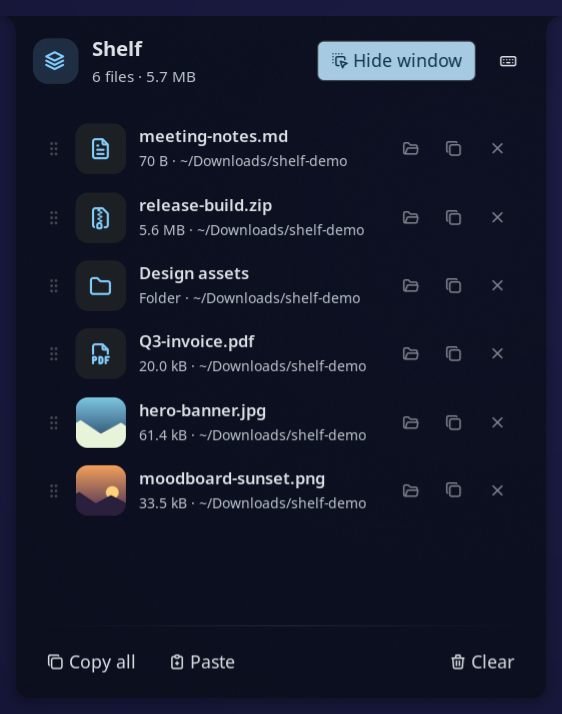
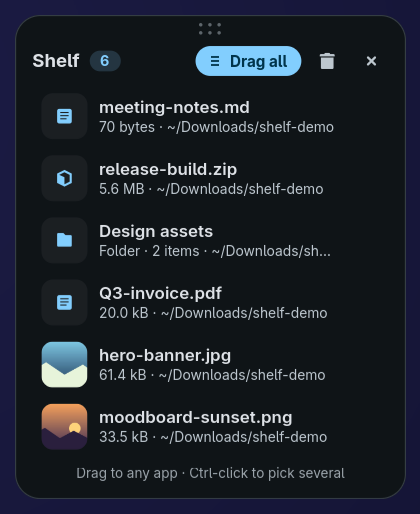
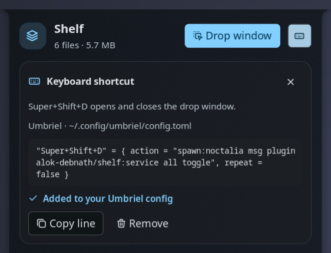

# Shelf

A drop shelf for your desktop. Drag files onto it from any app, keep them there while you work, then drag them out
into a browser upload, a chat, an email, or a folder. Shelf keeps references only: files stay where they are, and
removing something from the shelf never touches the file on disk.




## Plugin

| Field | Value |
| --- | --- |
| ID | `alok-debnath/shelf` |
| Entries | Bar widget: `shelf`; panel: `panel`; service: `service` |

## Requirements

Noctalia plugins cannot take part in Wayland drag and drop yet, so Shelf ships a small GTK 4 window
(`helper/shelf-window.py`) that handles dragging files in and out. It needs:

- `python3`
- `python3-gobject` (PyGObject; `python-gobject` on Arch)
- `gtk4`
- `xdg-utils`, for opening files and folders from the panel

Optional: install `gtk4-layer-shell` and the drop window opens at your mouse cursor (or a screen edge you pick), above
your windows, and you can drag it anywhere by its header. Without it the window opens as a normal floating window and
your compositor decides where it goes.

```sh
# Fedora
sudo dnf install python3-gobject gtk4 gtk4-layer-shell
# Arch
sudo pacman -S python-gobject gtk4 gtk4-layer-shell
```

## Usage

1. Enable the plugin, then add the **Shelf** widget (`alok-debnath/shelf:shelf`) to a bar in
   **Settings → Bar**.
2. Right-click the widget to open the **drop window**. Drag files onto it. Drag the dots at the top of the window (or its
   title) to move it; it opens there next time.
3. Drag files back out of the drop window into any app. Drag a single row, **Ctrl-click** to pick several, or use
   **Drag all**.
4. Left-click the widget to open the **panel**, where you can:
   - click a row to open the file
   - use the row buttons to show the file in its folder, copy it, or remove it from the shelf
   - drag the grip on the left of a row to reorder the shelf
   - **Paste** files you copied in a file manager, or plain file paths, from the clipboard
   - **Copy all** to paste every file into a file manager
   - **Clear** the shelf

Drop window keys: `Esc` closes, `Delete` removes the selected rows, `Ctrl+A` selects all, `Ctrl+C` copies the
selected files (or all of them), `Ctrl+V` pastes copied files, and double-click or `Enter` opens a file.

### Keyboard shortcut

Wayland compositors own the keyboard, so a plugin cannot grab a global key by itself; the compositor runs a command
when you press the key. Shelf makes that one step:

1. Pick the keys in **Settings → Plugins → Shelf → Keyboard shortcut** (default `Super+Shift+D`).
2. Open the Shelf panel and press the keyboard button (or run `noctalia msg plugin alok-debnath/shelf:service all
   shortcut`). Shelf detects your compositor and shows the exact line for its config.
3. Press **Add for me** to have Shelf add the line (it backs the file up as `<config>.shelf-backup`), or **Copy line**
   and paste it yourself.



**Add for me** supports Hyprland (`hyprland.conf` or `hyprland.lua`), niri, Sway, Scroll, Umbriel, labwc, and Mango.
It refuses when the keys are already bound, and shows the line that uses them. On KDE Plasma and GNOME, add a custom
shortcut in System Settings for the command the panel shows. On any other compositor, bind your keys to:

```sh
noctalia msg plugin alok-debnath/shelf:service all toggle
```

Toggle the panel:

```sh
noctalia msg panel-toggle alok-debnath/shelf:panel
```

## Settings

Plugin settings live under **Settings → Plugins → Shelf**. Widget settings live with the bar widget.

| Setting | Type | Default | Description |
| --- | --- | --- | --- |
| `window_position` | `select` | `last` | Where the drop window opens: where you last moved it (at the cursor until you first move it), centred on the mouse cursor, or docked to a screen edge or corner. Needs `gtk4-layer-shell`. |
| `shortcut` | `string` | `Super+Shift+D` | Keys for the drop window. Add them to your compositor from the panel's keyboard button. |
| `remove_after_drag` | `bool` | `false` | Take files off the shelf once they are dropped into another app. |
| `close_after_drag` | `bool` | `false` | Close the drop window once files are dropped into another app. |
| `python` | `file` | empty | Interpreter for the drop window. Empty uses `/usr/bin/python3` when it exists, otherwise `python3` from `PATH`. |
| `glyph` (widget) | `glyph` | `stack-2` | Bar icon. |
| `show_count` (widget) | `bool` | `true` | Show the number of files next to the icon. |
| `hide_when_empty` (widget) | `bool` | `false` | Hide the widget while the shelf is empty. |

## IPC

Bind these to keys in your compositor. For example, Hyprland:
`bind = SUPER, S, exec, noctalia msg plugin alok-debnath/shelf:service all toggle`.

```sh
noctalia msg plugin alok-debnath/shelf:service all toggle        # open or close the drop window
noctalia msg plugin alok-debnath/shelf:service all open          # open (or raise) the drop window
noctalia msg plugin alok-debnath/shelf:service all close         # close the drop window
noctalia msg plugin alok-debnath/shelf:service all add /path     # put a file on the shelf
noctalia msg plugin alok-debnath/shelf:service all clear         # empty the shelf
noctalia msg plugin alok-debnath/shelf:service all panel         # toggle the panel
noctalia msg plugin alok-debnath/shelf:service all shortcut      # open the panel at the keyboard shortcut section
```

## Notes

- **Files written**: when you press **Add for me** or **Remove** in the panel's shortcut section, your compositor's
  config file (after saving a copy as `<config>.shelf-backup`). Otherwise the shelf list at `<plugin data dir>/shelf.json`, usually
  `~/.local/state/noctalia/plugins/data/alok-debnath/shelf/shelf.json`, and the drop window's last position next to
  it in `window.json`. Shelf never copies, moves, or deletes your files.
- **Processes spawned**: the drop window (`python3 helper/shelf-window.py`), a one-time `python3 -c` check that GTK 4
  is importable, `xdg-open` to open files and folders, `hyprctl` to find the cursor (Hyprland only), and `gdbus` to
  show and hide the drop window and to ask the file manager to highlight a file
  (`org.freedesktop.FileManager1.ShowItems`), falling back to opening the folder.
- **Network**: none.
- The drop window only reads the shelf file. It reports actions (add, remove, clear) as JSON lines on stdout, and the
  plugin service applies them. `gdbus` ships with GLib, which GTK 4 already depends on.
- The drop window stays running after you close it, so it opens again instantly. It quits after ten minutes closed, or
  when the plugin stops.
- To find the cursor on compositors other than Hyprland, the drop window briefly maps an invisible layer surface and
  reads where the pointer is. If the compositor does not report it, the window opens in the middle of the screen.
- Thumbnails in the drop window come from the freedesktop thumbnail cache when your file manager made one, or from
  the image itself.
- Tested on umbriel; earlier versions were also tested on Hyprland. The drop window is plain GTK 4, so it works on
  any Wayland compositor. Placement and moving need a compositor with layer-shell support.
