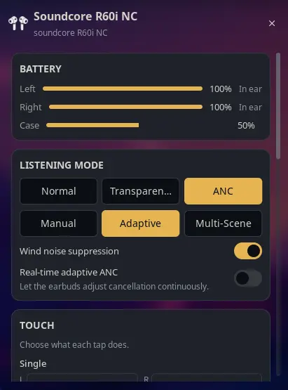

# Soundcore Buds for Noctalia

Soundcore battery, listening mode and ANC strength in the Noctalia bar, powered by [OpenSCQ30](https://github.com/Oppzippy/OpenSCQ30). Tested against **Soundcore R60i NC (D1202C)**; other OpenSCQ30 models work via capability detection.

Ported from the architecture of the [AirPods community plugin](https://github.com/noctalia-dev/community-plugins/tree/main/airpods) (`harveywuk/airpods`, MIT, itself a port of [thisisgm/omarchy-pods](https://github.com/thisisgm/omarchy-pods)), with device logic adapted from [omarchy-better-omapods](https://github.com/Dakota-DITS/omarchy-better-omapods) (`bridge.py` / `Model.js`).

## Screenshots



## Plugin

| Field   | Value                          |
| ------- | ------------------------------ |
| ID      | `sankity/soundcore-buds`       |
| Entries | Bar widget: `soundcore`; panel: `panel`; service: `service` |

## Requirements

- [OpenSCQ30](https://github.com/Oppzippy/OpenSCQ30) installed with `openscq30` on `PATH` (or set `openscq30_path` in Settings → Plugins).
- `bluetoothctl` (bluez), `busctl` (systemd) and `bash` on `PATH` (used for discovery; `busctl` also pauses/resumes MPRIS players during Find).
- Find helper only: `pactl`, plus `paplay` (or `pw-play`) and `python3` to synthesize and play the locating tone.
- Earbuds paired via the usual Bluetooth flow **and** registered with OpenSCQ30:
  `openscq30 paired-devices list` must show your device. If not:
  `openscq30 paired-devices add --mac-address <MAC> --model <MODEL_ID>`
  (find `<MODEL_ID>` via `openscq30 list-models`).

## Usage

Add the **Soundcore Buds** widget to a bar from Settings → Bar. The icon stays hidden until Soundcore buds are connected (see `hide_when_disconnected`).

- **Left click** opens the panel.
- **Right click** cycles the listening mode without opening anything.
- Sections are grouped cards; tapping an active listening mode collapses it.
  Noise Cancellation expands Adaptive / Manual / Multi-Scene sub-modes, each
  with its own extra controls (ANC slider, scenario). Touch controls are
  grouped per gesture with left/right dropdowns side by side.

The panel is also available directly:

```sh
noctalia msg panel-toggle sankity/soundcore-buds:panel
```

## Settings

| Setting                  | Type | Default | Description                                        |
| ------------------------ | ---- | ------- | -------------------------------------------------- |
| `openscq30_path`         | file | empty   | Path to `openscq30`. Leave empty to find it on `PATH`. |
| `poll_interval`          | int  | `4`     | Service poll interval in seconds (2–15). Bluetooth is slow, keep it at 3 or above. |
| `hide_when_disconnected` | bool | `true`  | Hide the bar widget when nothing is connected (widget setting). |
| `icon`                   | select | `Auto` | Bar icon: `Auto` follows the device, `Earbuds` is the in-ear silhouette, `Over-ear` is the headphone cups (widget setting). |

## Touch

The panel shows a TOUCH section when the connected device exposes touch
controls (8 on the R60i NC: single/double/triple/hold per bud). Each row is a
dropdown with the actions the device actually offers, plus a touch-tone toggle
and a reset-to-defaults row where supported. Changes apply immediately and
snap back if `openscq30` rejects them.

## Sound & device settings

When the connected device exposes them, the panel also shows:

- **SOUND**: transparency sub-mode (under Transparency),
  noise scenario (under ANC), wind suppression,
  real-time adaptive ANC.
- **DEVICE**: dual connections, auto power off, low battery prompt, high
  volume limiter (toggle + dB slider + check interval).
- **INFO**: firmware versions, adaptive ANC level, serial, linked hosts.

Only settings the connected device actually supports are drawn (capability
detection via `list-settings`), so other models get a subset automatically.

## Panel keyboard shortcuts

While the panel is focused: `o` Normal, `t` Transparency, `a` Adaptive,
`n` Noise Cancellation, `f` find (left bud, or stop a running tone),
`r` refresh. `Esc` always closes the panel.

## Troubleshooting: "control busy" / widget dimmed but buds connected

`openscq30` talks to the buds over an **exclusive** BLE control channel while
audio uses A2DP. If the official Soundcore app on your phone is open (even in
the background), it holds that channel and the laptop gets `connect timed
out`. The plugin then keeps showing last-known data dimmed with an "earbuds
busy" hint instead of vanishing, and recovers automatically once you close the
phone app. If it happens often, disable the phone app's background activity or
forget the buds on the phone.

## Troubleshooting: tap actions do nothing on Linux

Media tap actions (Next / Play-Pause / Volume) are sent by the buds as kernel
media keys on a virtual input device (`soundcore <model> (AVRCP)` — e.g.
`soundcore R60i NC (AVRCP)`; check `dmesg | grep -i avrcp`), **not** through this plugin. Your compositor must
translate those keys into player commands:

- **Umbriel**: install `playerctl` and bind the keys (examples ship commented
  in the default config):
  ```toml
  [keybinds]
  "XF86AudioPlay" = "spawn:playerctl play-pause"
  "XF86AudioNext" = "spawn:playerctl next"
  "XF86AudioPrev" = "spawn:playerctl previous"
  ```
- **KDE Plasma**: works out of the box via global media-key handling.
- If taps work on your phone but not the laptop, also make sure the phone's
  Bluetooth is off — R60i NC supports dual connections and taps may route to
  the other device.

## Find

The panel has a FIND section with Left / Right rows. The first tap arms the
side ("tap again — LOUD"), the second tap plays a locating tone on that side:
MPRIS playback pauses, the sink is boosted to 200% (plus 180% on the tone
stream) and the volume limiter is temporarily bypassed
(`limitHighVolume=false`, `limitDb=100`), then sink volume/mute, the limiter,
and playback are restored — only players that were `Playing` are resumed —
when the tone stops (20 seconds) or you tap Stop. Switching sides keeps
playback paused until the last tone ends. Closing the panel also stops a
running tone. **Take the buds off your ears first — the tone is loud on
purpose.** Requires `pactl` and `paplay` (or `pw-play`) plus `python3` (see Requirements).

## IPC

```sh
noctalia msg plugin sankity/soundcore-buds:service all cycle-noise
noctalia msg plugin sankity/soundcore-buds:service all refresh
noctalia msg plugin sankity/soundcore-buds:service all find-left
noctalia msg plugin sankity/soundcore-buds:service all find-right
noctalia msg plugin sankity/soundcore-buds:service all stop-find
```

Bind the mode cycle in Hyprland, for example:

```
# ~/.config/hypr/hyprland.conf
bind = SUPER, N, exec, noctalia msg plugin sankity/soundcore-buds:service all cycle-noise
```

## Notes

- The service polls `openscq30` every few seconds; Bluetooth is slow, so keep `poll_interval` at 3 or above.
- Controls are optimistic: the panel reflects a click immediately and snaps back only if `openscq30` rejects it or does not confirm within a few seconds.
- The panel reads the device's capability list, so it only draws the modes and the ANC-strength slider the connected device actually supports.
- Charging buds are shown as "Charging"; buds resting unplugged in the case
  are shown as "In case" (tracked via `twsStatus`/`hostDevice`), otherwise
  connected buds are shown as "In ear".
- Touch controls are set with `setting --set <id>=<value>`; an empty value
  deselects (shows as Off).
- Coexistence: `openscq30` holds an exclusive control channel — close the
  phone app if the panel reports busy. The Find tone only ever plays on the
  Bluetooth buds sink (never speakers) and restores volume/mute, the volume
  limiter, and paused players afterwards; if its process is force-killed
  (`kill -9`), lower the sink volume back manually.

## Compatibility

| Category | Battery | Listening modes | Extras |
|---|---|---|---|
| TWS earbuds (tested: R60i NC) | Per-bud + case | Modes + sub-modes + ANC slider + touch + find | Full support |
| Over-ear headphones (Q30-class) | Single headset row | Modes + scenario sub-modes | No touch/case rows (device has none) |
| Speakers | Not supported | Not supported | Out of scope |

Support is capability-driven: every control has a fixed, translated UI and
appears only when the connected device reports that capability, otherwise it
stays hidden. Nothing appears without a designed UI. If the buds are connected
over Bluetooth but unknown to openscq30, the service registers them itself
(`paired-devices add`). Intentionally unsupported: equalizer (protects the
phone-side HearID curve), spatial audio, LDAC, speaker-only settings.
Only the R60i NC is tested with real hardware; other models are covered by
fixtures in `tests/` — please report issues with your model ID
(`openscq30 list-models`) and the failing behavior.

## Development notes

- Hot-reload applies to `.luau` files only. After changing `plugin.toml` or
  adding new `tr()` keys in `translations/`, disable and re-enable the plugin
  once, otherwise new settings read as undeclared and new strings render as
  raw keys.
- Run `bash tests/run.sh` before committing.

## License

MIT. Device control is [OpenSCQ30](https://github.com/Oppzippy/OpenSCQ30) by Oppzippy (GPL-3.0), which is not bundled with this plugin. Soundcore is a trademark of Anker Innovations, which does not sponsor this plugin.
