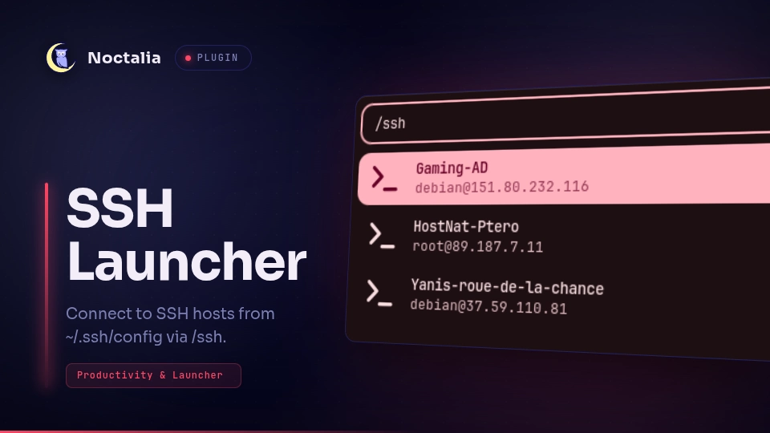

# SSH Launcher

SSH Launcher lists hosts from your OpenSSH config and opens an SSH session in a
terminal from the Noctalia launcher.

## Plugin

| Field | Value |
| --- | --- |
| ID | `cleboost/ssh-launcher` |
| Entry | Launcher provider: `launcher` |
| Launcher Prefix | `/ssh` |

## Requirements

Install [OpenSSH](https://www.openssh.com/) and ensure `ssh` is available on
`PATH`.

## Usage

Open the Noctalia launcher and type `/ssh` to list hosts from your SSH config.
Continue typing to filter by host alias, hostname, or user, then select one to
open a terminal running `ssh <host>`.

## Settings

| Setting | Type | Default | Description |
| --- | --- | --- | --- |
| `config_path` | `file` | `~/.ssh/config` | Path to your SSH config file. |
| `max_results` | `int` | `30` | Maximum number of hosts shown. |
| `extra_args` | `string` | `""` | Extra arguments appended to every `ssh` command. |
| `terminal` | `string` | `""` | Custom terminal command. Empty uses Noctalia's terminal discovery. |

## Notes

Hosts are read from simple `Host` entries in your SSH config. Wildcard patterns
such as `Host *` or `Host *.example.com` are ignored. `Include` directives are
not expanded in this version. The host list is cached for the launcher session.
