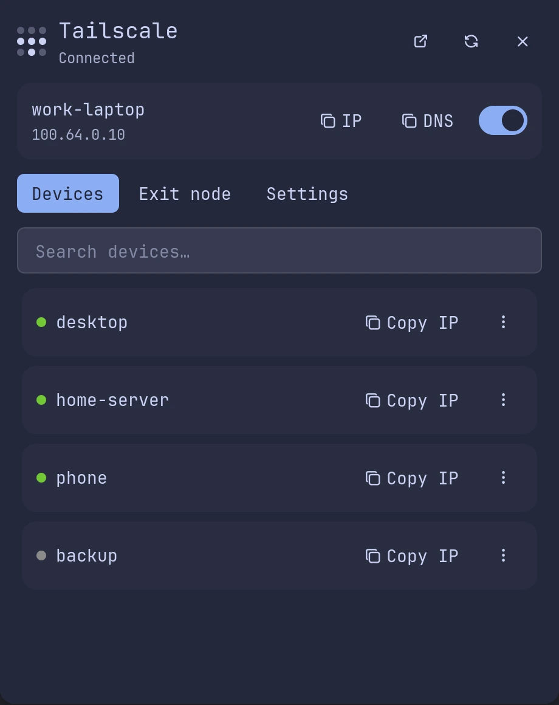
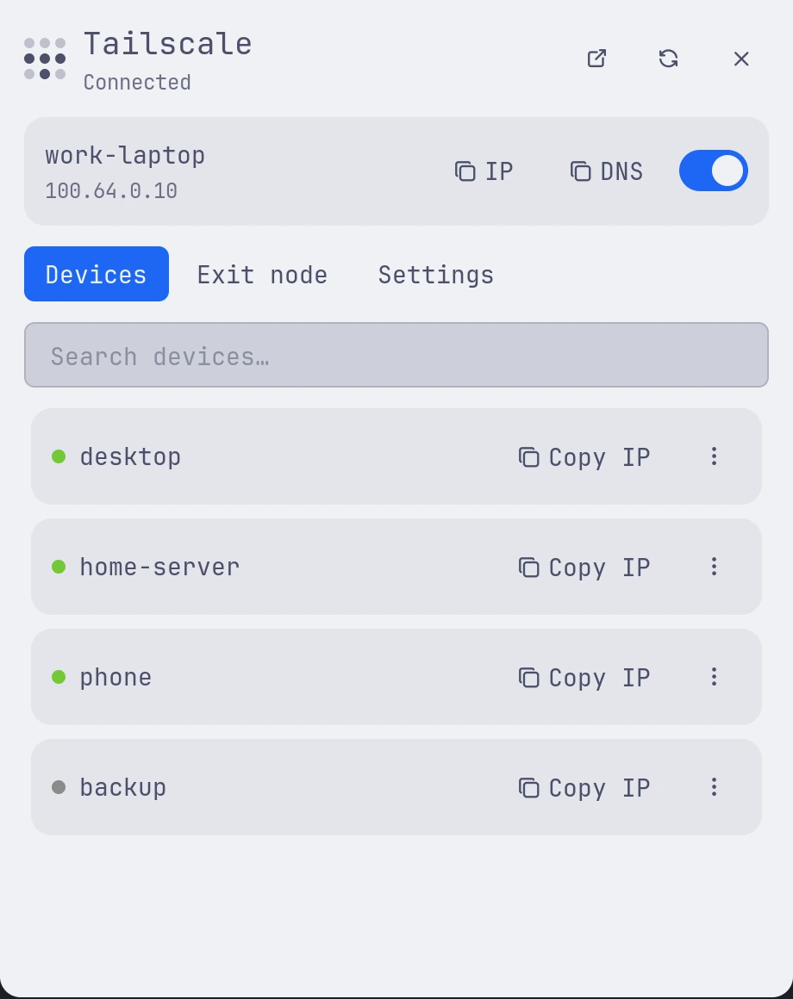
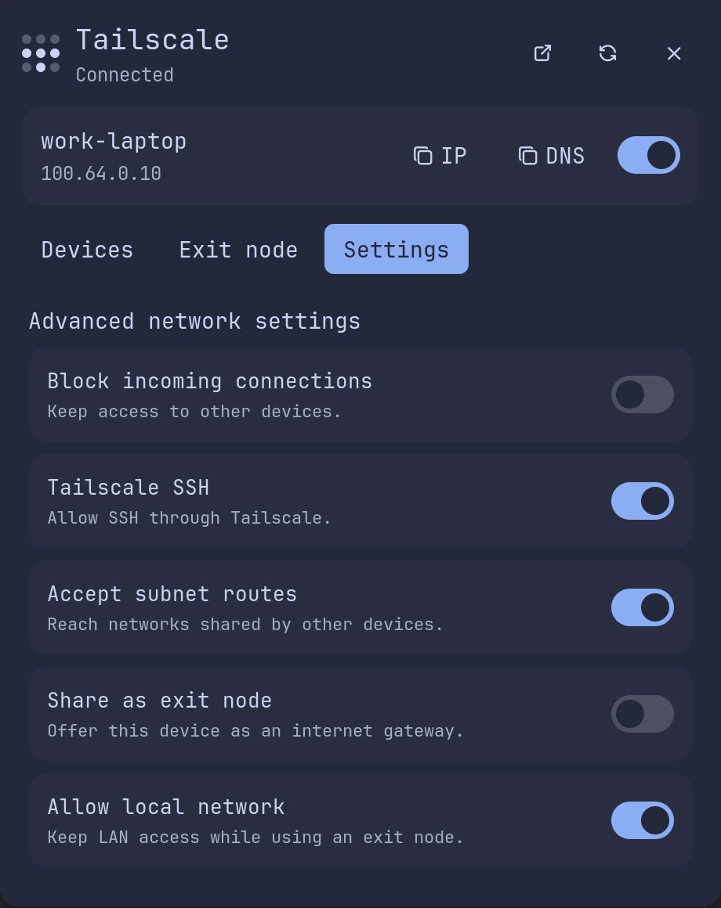
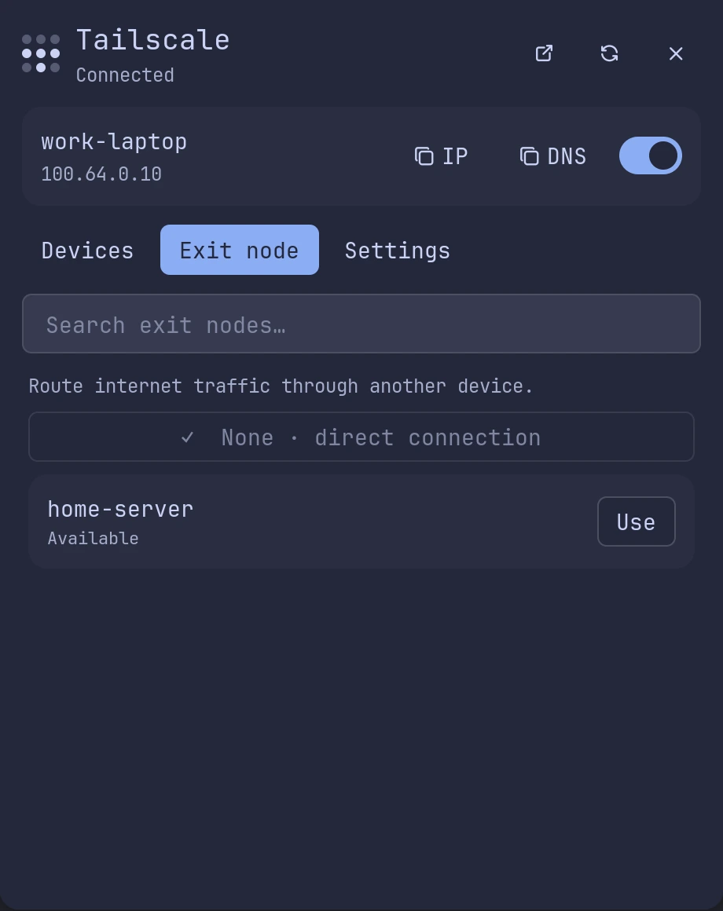

# Tailscale Simple

A compact, attached Tailscale panel for everyday use: a connection switch, one-click IP copying,
online-first devices, expandable device actions, exit-node selection, and advanced settings switches.
The monochrome bar icon follows light and dark themes, with faded dots instead of outlined circles.

This is an independently maintained UI-focused fork of
[davemhammer/tailscale](https://github.com/noctalia-dev/community-plugins/tree/main/tailscale),
not an official Tailscale application. The original backend and launcher are credited to Dave Hammer
and the upstream contributors; the simplified interface is maintained by [alivault](https://github.com/alivault).

## Plugin

| Field | Value |
| --- | --- |
| ID | `alivault/tailscale-simple` |
| Entries | Bar widget: `status`; panel: `manager`; service: `service`; launcher provider: `ts` |
| Launcher Prefix | `/tss` |

## Requirements

- `tailscale` on `PATH`, with a running `tailscaled` and an authenticated account.
- `jq` to reduce status JSON and select non-secret preference fields before Luau parses them.
- `xdg-open` to open the admin console in your default browser.
- A terminal configured in Noctalia for interactive Ping and SSH actions.

Your user must have permission to control the daemon (a Tailscale operator user or equivalent).
The plugin does not prompt for sudo or configure operator permissions. Noctalia must support plugin API 30.

## Usage

Enable **Tailscale Simple** and add `alivault/tailscale-simple:status` to your bar.
Click anywhere on its capsule to open the attached panel; right-click refreshes status.
The `service` entry starts automatically when enabled and polls status without changing the connection.

```sh
noctalia msg panel-toggle alivault/tailscale-simple:manager
```

- Use the switch beside your device name to connect or disconnect. The inline **IP** and **DNS** buttons
  retain copy icons and tooltips, and copy your device's address or DNS name.
- **Devices:** search by name, DNS name, or IP. Green dots mean online; gray dots mean offline.
  The vertical ellipsis expands the IP address and Ping, SSH, and Copy DNS actions.
- **Exit node:** choose an available node or select **None · direct connection** to stop using an exit node.
- **Settings:** toggle incoming-connection blocking, Tailscale SSH, subnet routes, advertising this device
  as an exit node, and local-network access while using an exit node.
- The header icons open the admin console, refresh status, and close the panel. Action results use notifications.
- The panel is 580 logical pixels tall, fitting the settings without unnecessary empty space at the default scale.

Type `/tss` in the Noctalia launcher for categories. Examples: `/tss peers laptop`, `/tss exit`,
`/tss panel`, `/tss status`, `/tss refresh`, and `/tss admin`.
Activating a peer opens its actions; activating an exit node selects it.
Activating `/tss up` or `/tss down` changes the connection. The distinct `/tss` prefix avoids colliding
with the original plugin's `/ts` prefix.

## Settings

Enable **Automatically receive Taildrop files** in the plugin settings to save incoming files
to your XDG Downloads folder (fallback: `~/Downloads`), or set a custom receive folder.
The plugin checks on its refresh interval while Tailscale is connected and Noctalia is running.
Saved files trigger a desktop notification; name conflicts are renamed, never overwritten.
Existing inbox files are also collected when enabled. Repeated identical errors are suppressed
until a successful check. Disabling reception does not cancel a batch already in progress.
No separate service or `notify-send` is required. Do not run another auto-receiver alongside it.

| Setting | Type | Default | Description |
| --- | --- | --- | --- |
| `refresh_interval` | int | `10` | Poll interval in seconds, from 3 to 120. |
| `notify_on_peer_change` | bool | `true` | Notify when a known peer goes online or offline. |
| `taildrop_auto_receive` | bool | `false` | Automatically collect Taildrop files while the plugin runs. |
| `taildrop_directory` | string | empty | Receive folder; empty uses XDG Downloads. Absolute paths and `~/` are supported. |
| `taildrop_notify` | bool | `true` | Notify after files are saved. |
| `tailscale_bin` | string | `tailscale` | Tailscale executable name or path. |
| `admin_url` | string | empty | Browser URL override; defaults to `https://login.tailscale.com/admin/machines`. |
| `ssh_user` | string | empty | Optional username for `tailscale ssh`. |
| `show_counts` | bool, widget | `false` | Show online/total peer counts beside the bar icon. |

## IPC

```sh
noctalia msg plugin alivault/tailscale-simple:service all refresh
# The following commands CHANGE the VPN connection:
noctalia msg plugin alivault/tailscale-simple:service all up
noctalia msg plugin alivault/tailscale-simple:service all down
noctalia msg plugin alivault/tailscale-simple:service all toggle
```

## Notes

- Read-only polling executes `tailscale status --json | jq …`, `tailscale debug prefs | jq …`,
  and `tailscale exit-node list`. Unused Mullvad exits are filtered out of the peer JSON to avoid
  exceeding the script CPU budget; exit nodes remain available separately. The peer list is capped at 200.
- Explicit user actions execute `tailscale up`, `tailscale down`, or `tailscale set` with the selected flags.
  Those commands modify daemon-managed preferences and may affect connectivity. Exit-node advertising
  may additionally need approval in the Tailscale admin console.
- Ping and SSH spawn the configured terminal running `tailscale ping -c 3` or `tailscale ssh`.
  If the host lacks terminal support, the inherited fallback launches the command directly.
- Admin opens `xdg-open` with the default or configured URL. Shell command arguments are quoted.
- No plugin HTTP client, telemetry, remote code download, or plugin-managed credential files.
  Network access is through the Tailscale daemon/CLI and the browser; SSH and Ping contact the selected peer.
- Copy actions write to the system clipboard. Device data is held in plugin runtime state and may be
  displayed in notifications. Tailscale, the terminal, browser, and Noctalia manage their own state/logs.
- Optional Taildrop reception creates the receive directory and runs `tailscale file get --verbose --conflict=rename`,
  moving files out of the daemon inbox onto disk. Files are not opened or executed. Its code does not need your account name, IPs, or device IDs.
- Screenshots below use fictitious demo devices, not a real tailnet.






## Attribution and license

Forked from `davemhammer/tailscale` 1.0.6 in the Noctalia community repository (upstream plugin revision
`919ed6bfb3f11140ead813645b9c61067fa66307`). Backend and launcher behavior are largely inherited;
the panel, theme-aware dots, layout, and defaults have been redesigned. See `LICENSE` for MIT terms.
Tailscale is a trademark of Tailscale Inc.; this plugin is not affiliated with or endorsed by Tailscale Inc.
