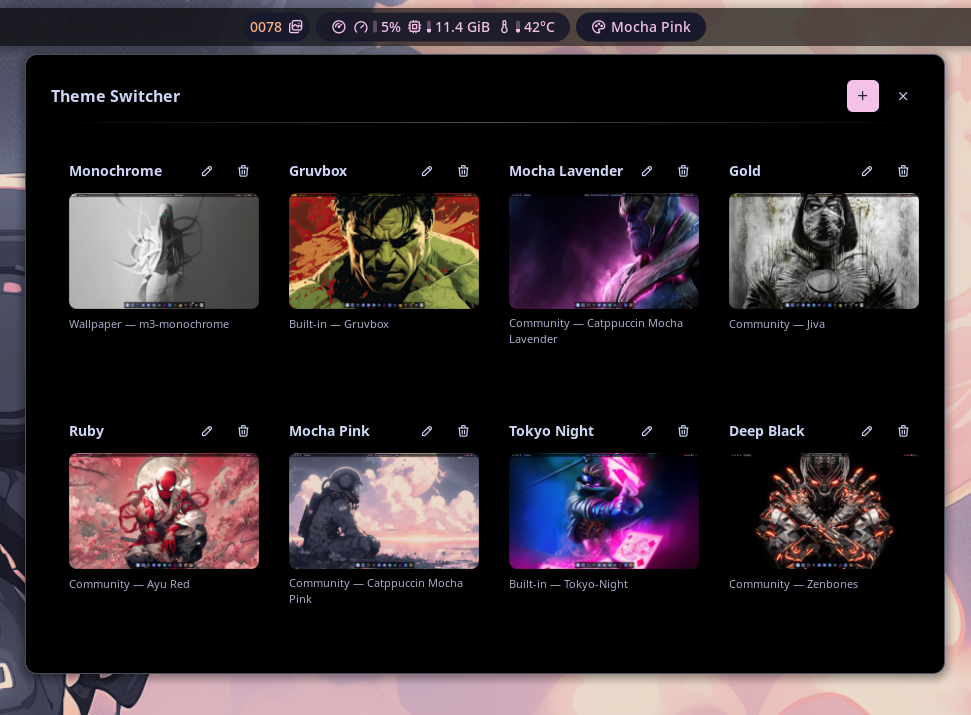
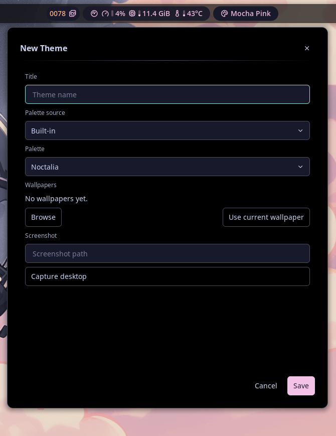
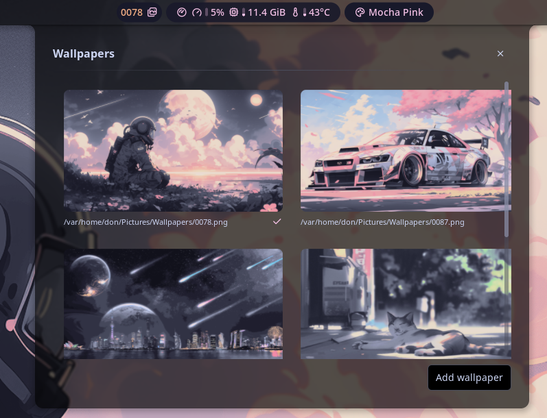

# Theme Switcher

Browse saved themes in a carousel and apply palette, wallpaper, and templates to the shell in one click. Each theme bundles a palette source (built-in, wallpaper, community, or custom), the wallpaper that goes with it, a preview screenshot, and a title.

## Plugin

| Field | Value |
| --- | --- |
| ID | `theblackdon/theme-switcher` |
| Entries | Shortcut: `open`; shortcut: `wallpaper`; shortcut: `random`; bar widget: `theme-switcher`; panel: `carousel`; panel: `editor`; panel: `wallpapers`; service: `wallpaper-ipc` |

## Usage

1. Enable the plugin in Settings → Plugins.
2. Add a `Theme Switcher` bar widget, a control center shortcut, or run:

   ```sh
   noctalia msg panel-toggle theblackdon/theme-switcher:carousel
   ```

3. In the carousel, click a theme card to apply it immediately (palette source + selection, wallpaper, and templates). Use the pencil button on a card to edit it, the plus button to add a new one.
4. The editor lets you pick a palette source (built-in, wallpaper, community, or custom), the matching palette or generator scheme, one or more wallpapers, a screenshot path (including a "Capture desktop" helper), and a title. Open the editor directly with:

   ```sh
   noctalia msg panel-toggle theblackdon/theme-switcher:editor
   ```

5. The `wallpaper` shortcut opens the wallpapers panel, which lets you browse and switch the wallpapers of the currently applied theme without re-applying the palette. Open it with:

   ```sh
   noctalia msg panel-toggle theblackdon/theme-switcher:wallpapers
   ```

6. The `random` shortcut applies a random wallpaper from the currently applied theme with a single click.

## Keyboard bindings

Wallpaper switching is reachable over IPC via the always-running `wallpaper-ipc`
service, so you can bind these to keys as KWin/KineticWE custom shortcuts
(Command/URL action):

```sh
noctalia-kwe msg plugin theblackdon/theme-switcher:wallpaper-ipc all random
noctalia-kwe msg plugin theblackdon/theme-switcher:wallpaper-ipc all next
noctalia-kwe msg panel-toggle theblackdon/theme-switcher:carousel
noctalia-kwe msg panel-toggle theblackdon/theme-switcher:wallpapers
noctalia-kwe msg panel-toggle theblackdon/theme-switcher:editor
```

> Use `:wallpaper-ipc` for `random`/`next`. Dispatching to the `:wallpapers`
> **panel** only works while that panel is open; a service is always ready.

Use `noctalia` instead of `noctalia-kwe` if that is the binary name on your system.

## How a theme is applied

Applying a theme sets the active wallpaper first, then runs `noctalia msg color-scheme-set <source> <palette>` to switch the palette, and finally `noctalia msg templates-apply` to re-render the configured templates. A theme can hold several wallpapers; the active one is selected in the walls panel.

## Screenshots

| Carousel | Editor | Wallpapers |
| --- | --- | --- |
|  |  |  |

## Notes

- Community palettes are listed from the Noctalia palette catalog over HTTP, with an offline fallback to the plugin's cached copy and the shell's community-palette cache.
- Custom palettes are read from `~/.config/noctalia/palettes/*.json`.
- Themes are stored in the plugin's data directory (`themes.json`).
