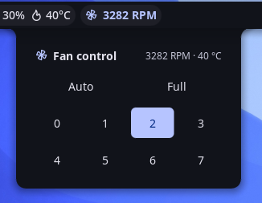

# ThinkPad Fan & Thermal Control

A fan monitor and manual speed control for **Noctalia v5**, for ThinkPads using
the `thinkpad_acpi` kernel module. The bar widget shows the current fan RPM and
turns a warning color when the fans are forced off or set to a manual level.
Clicking it opens a panel to pick a fan level — no root needed at runtime.

> Ported from the Noctalia v4 (Quickshell/QML) plugin of the same name to the v5
> Luau plugin runtime.



## Plugin

Manifest id `piero-93/thinkpad-fan`. Three entries share one state snapshot (no
Lua memory is shared between them):

- `service` — headless: polls `/proc/acpi/ibm/fan` and the thermal zone, and
  performs the fan-level writes.
- `widget` — the bar widget: fan glyph + `NNNN RPM`, tinted by status. Click it
  to open the panel.
- `panel` — the control surface: a grid of fan levels (Auto, Full, 0–7). Toggle
  it from a keybind with:

  ```sh
  noctalia msg panel-toggle piero-93/thinkpad-fan:panel
  ```

## Features

- **Live RPM** in the bar, with a tooltip showing speed, level, and temperature.
- **Status coloring** — the widget turns red when the fans are forced off
  (level 0) and uses the accent color for any manual override.
- **Manual level control** — Auto, Full (disengaged), or fixed levels 0–7.
- **Temperature readout** from a configurable thermal zone.

## Requirements

- A ThinkPad exposing `/proc/acpi/ibm/fan` through the `thinkpad_acpi` kernel
  module, loaded with `fan_control=1` (see Setup).
- The service reads and writes those files through a shell, so `sh` and `cat`
  must be on `PATH`. Both ship with every distro (coreutils and the system
  shell); there is nothing to install.
- The bundled setup script additionally uses `sudo`, `bash`, `dirname`,
  `getent`, `groupadd`, `usermod`, `chgrp`, `chmod`, `rm`, and `udevadm` — all
  part of coreutils, shadow-utils, and systemd/udev.

## Setup (required for manual control)

Manual fan control needs two things, handled once by the included script:

1. the `thinkpad_acpi` module loaded with `fan_control=1`, and
2. write access to `/proc/acpi/ibm/fan` for your user.

Run it from the installed plugin directory:

```sh
cd ~/.local/share/noctalia/plugins/thinkpad-fan/scripts
sudo ./setup-fan-permissions.sh
```

The script is idempotent, and it makes these changes to your system:

| Change | Detail |
|--------|--------|
| Creates a group | `fan_ctl`, and adds you to it with `usermod -aG` |
| Installs a udev rule | `/etc/udev/rules.d/99-noctalia-thinkpad-fan.rules` — `chgrp fan_ctl` + `chmod 0664` on `/proc/acpi/ibm/fan` at every module bind |
| Installs a modprobe option | `/etc/modprobe.d/99-noctalia-thinkpad-fan.conf` — `options thinkpad_acpi fan_control=1` |

Write access is granted to the `fan_ctl` group only — the file is **not** made
world-writable, so other local processes cannot drive your fans.

Then **log out and back in** so the group membership applies, and reboot (or
reload `thinkpad_acpi`) if the script had to enable `fan_control=1`. Without
this setup the RPM/temperature readout still works, but changing the level will
fail (the panel shows a notification).

> ⚠️ Forcing the fans off (level 0) or to a fixed low level can let the machine
> overheat. Use manual levels with care; **Auto** returns control to firmware.

**Migrating from the v4 plugin.** Its setup script installed
`/etc/udev/rules.d/99-thinkpad-fan.rules`, which made `/proc/acpi/ibm/fan`
world-writable on every boot — that would undo the group-scoped access above, so
this script removes it, and only when its contents still match that exact rule.
Nothing else is deleted: a pre-existing `/etc/modprobe.d/thinkpad_acpi.conf` (or
any other `thinkpad_acpi` config) is left alone, since setting `fan_control=1`
twice is harmless.

### NixOS

`/etc/udev/rules.d` is generated from system config on NixOS, so the script exits
instead of writing to it. Add the equivalent declaratively:

```nix
users.groups.fan_ctl = { };
users.users.<you>.extraGroups = [ "fan_ctl" ];
boot.extraModprobeConfig = ''
  options thinkpad_acpi fan_control=1
'';
services.udev.extraRules = ''
  ACTION=="add|bind", SUBSYSTEM=="platform", DRIVER=="thinkpad_acpi", RUN+="${pkgs.coreutils}/bin/chgrp fan_ctl /proc/acpi/ibm/fan", RUN+="${pkgs.coreutils}/bin/chmod 0664 /proc/acpi/ibm/fan"
'';
```

## Usage

Install the plugin from Noctalia's plugin manager, then add the **ThinkPad Fan &
Thermal Control** widget from the bar's Add-widget picker.

**Contributors only** — to run it from a checkout instead, register that
checkout as a development source:

```sh
noctalia msg plugins source add dev path /path/to/community-plugins
noctalia msg plugins enable piero-93/thinkpad-fan
```

`.luau` edits hot-reload; `plugin.toml` changes apply on the next config reload.

## Settings

| Setting | Type | Default | Description |
|---------|------|---------|-------------|
| Colorize by status | bool | `true` | Tint the widget when forced off / manual |
| Left-click opens the control panel | bool | `true` | Open the panel on left-click |
| Thermal zone | string | `thermal_zone0` | sysfs thermal zone for the temperature |

## What it does to your system

For review transparency (this plugin is trusted, unsandboxed Luau):

- **Reads** `/proc/acpi/ibm/fan` and `/sys/class/thermal/<zone>/temp` every
  2.5 s. The read goes through `noctalia.runAsync`, which executes via
  `/bin/sh -c`, so each poll spawns a shell and a `cat`. Both paths are
  shell-quoted, and the configurable thermal zone is reduced to a single path
  segment before use.
- **Writes** `level <value>` to `/proc/acpi/ibm/fan` — through the same shell —
  only when you pick a level in the panel. The value is checked against a
  whitelist (`auto`, `disengaged`, `0`–`7`) before it reaches the command.
- **No network access**, and no commands beyond the shell, `cat`, and the
  redirect described above.
- The **setup script** is never invoked by the plugin; you run it yourself with
  `sudo`. Its system changes are listed in Setup above.

## License

GPL-3.0
