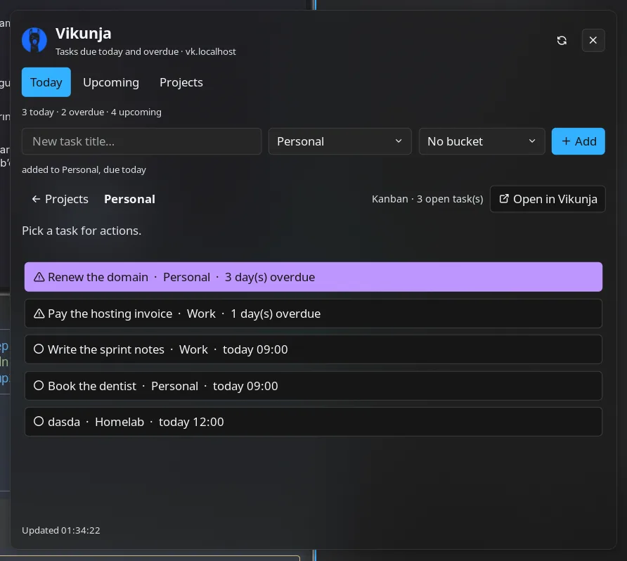
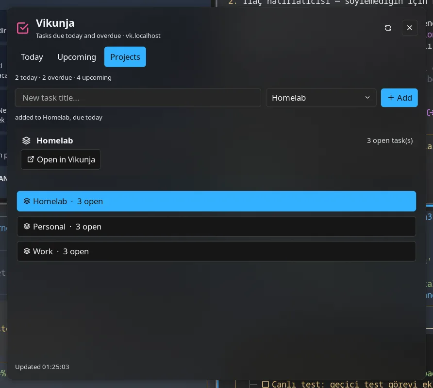
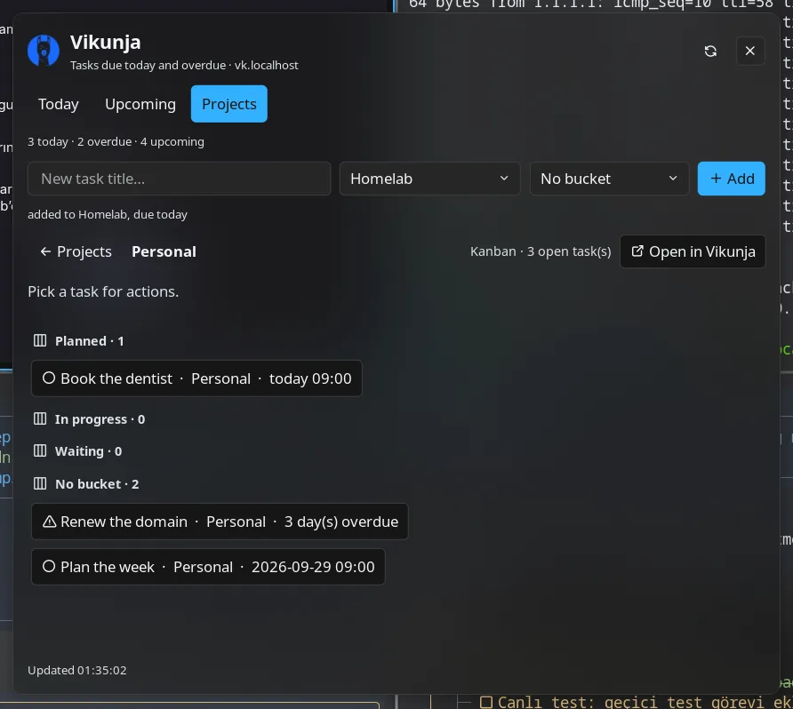

# Vikunja

Today's and overdue Vikunja tasks on the bar, a panel to add, complete and postpone them, and a
`/vk` launcher provider for quick capture.

## Plugin

| Field | Value |
| --- | --- |
| ID | `omertahaoztop/vikunja` |
| Entries | Bar widget: `status`; panel: `manager`; service: `service`; launcher: `vk` |
| Launcher Prefix | `/vk` |

## Requirements

- Network access to a Vikunja instance (developed and tested against **v2.6.0**; the plugin uses the
  `/api/v1/tasks` filter API, which older releases spell differently)
- An API token from **Settings → API Tokens** in Vikunja. Reading needs `projects:read` and
  `tasks:read`; add/complete/postpone additionally need `tasks:create` and `tasks:update`.
- `xdg-open` on `PATH` (opens a task or project in Vikunja; declared in `plugin.toml`)

## Usage

Configure **Base URL** (origin only, no `/api`) and **API token** under plugin settings.

Add the **status** bar widget (`omertahaoztop/vikunja:status`). It counts the tasks due **today** plus
the ones already **overdue**, turns red while anything is overdue, and lists the next tasks in its
tooltip. Click opens the manager panel, right-click refreshes.

Panel tabs:

- **Today** — overdue first, then what is due today. Pick a row for **Complete**, **+1 day**,
  **+3 days**, **Open in Vikunja** and **Copy title**.
- **Upcoming** — everything inside the **Upcoming window** (`soon_days`).
- **Projects** — every project with its open-task count (counted on demand, one sweep of the open
  tasks). Pick a project (or **Show tasks**) to browse **that project's** open tasks: kanban
  projects are grouped by their own bucket names, everything without a bucket lands under
  **No bucket**, and tasks without a due date are included — so a “Plans” or “Book list” project is
  just as browsable as the due-date driven views. **Open in Vikunja**, **← Projects** and every row
  action work there too; a task's own **Project tasks** button jumps straight to its project.
  Rows can be **dragged onto another bucket** to move the task, and the toolbar offers the same move
  as buttons (**Move to** …) for keyboard or precise use.

The add row at the top creates a task in the selected project (the **Default project** when none is
selected) due today at the due hour; Enter and the **Add** button do the same. When that project has
a kanban view, a second dropdown appears next to it, so the new task can be filed straight into the
bucket you want (default: no bucket).

Launcher:

- `/vk <text>` — the first row adds `<text>` (due today, default project), the following rows are
  matching open tasks; activating one opens it in Vikunja.
- `/vk done <text>` — completes the best match.
- `/vk projects` — projects with their open counts.

```sh
noctalia msg panel-toggle omertahaoztop/vikunja:manager
```







## Settings

| Setting | Type | Default | Description |
| --- | --- | --- | --- |
| `base_url` | `string` | `https://vikunja.example.com` | Vikunja origin, no trailing `/api`. |
| `api_token` | `string` | _(empty)_ | API token used as `Authorization: Bearer …`. |
| `default_project` | `string` | _(empty)_ | Project name or numeric id that quick add and `/vk add` use; empty takes the first project Vikunja returns. |
| `soon_days` | `int` | `7` | Days ahead covered by the Upcoming tab and the widget's lookahead (1–60). |
| `timezone` | `string` | `Europe/Istanbul` | Time zone used for “today”, day boundaries and the due dates sent to Vikunja. |
| `refresh_interval` | `int` | `60` | Poll interval in seconds (15–3600). |
| `notify_on_due` | `bool` | `true` | Notify once when a task becomes overdue. |
| `show_label` | `bool` (widget) | `true` | Show the count next to the glyph. |
| `ok_color` | `select` (widget) | `tertiary` | Bar colour while nothing is due. |
| `warn_color` | `select` (widget) | `error` | Bar colour while something is overdue. |

## IPC

```sh
noctalia msg panel-toggle omertahaoztop/vikunja:manager
noctalia msg plugin omertahaoztop/vikunja:service all refresh
noctalia msg plugin omertahaoztop/vikunja:service all projects
noctalia msg plugin omertahaoztop/vikunja:service all open_project 1
noctalia msg plugin omertahaoztop/vikunja:service all close_project
```

`open_project <id>` loads a project (`projects` first, to have the list), `close_project` returns to it.

## Notes

- **Network calls.** Each poll is one filtered `GET /api/v1/tasks` (lookahead window, 50 per page,
  paginated) plus one `GET /api/v1/projects`. Counting per project adds one paginated sweep over the
  open tasks (`done = false`); opening a project adds `GET /projects/{id}/views`, its buckets when
  the chosen view is kanban, and a paginated `GET /projects/{id}/views/{view}/tasks`. Nothing else is
  fetched, and browsing a project never changes it.
- **Mutations.** Only what you ask for: `PUT /projects/{id}/tasks` (add, with `bucket_id` when a
  bucket is chosen), `POST /tasks/{id}` (complete, postpone), `PUT /tasks/{id}/comments` (a
  `+Nd (Noctalia)` note when postponing) and
  `POST /projects/{id}/views/{view}/buckets/{bucket}/tasks` (moving between kanban buckets). The
  plugin never deletes anything and never touches a task it did not list.
- **Due dates.** Add and postpone write the due hour (09:00) of the target day in the configured time
  zone, converted to UTC the way Vikunja stores it, so a task stays a “today” task in your own day.
- **Filter.** The lookahead query is `done = false && due_date < now/d+(soon_days+1)d` with
  `filter_timezone` set, which is why dateless open tasks never inflate the counter.
- **Token.** Stored like any other plugin setting in Noctalia's configuration; a token scoped to the
  four permissions above is enough.
