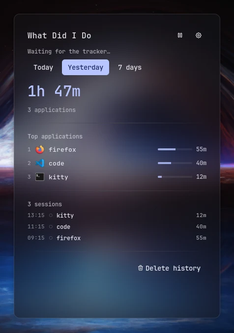
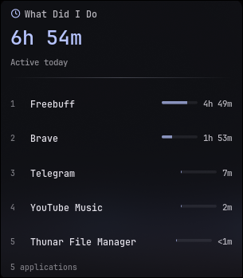
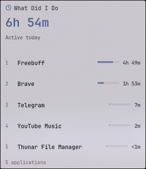
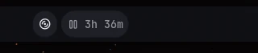

# What Did I Do

A local-first desktop activity tracker for Noctalia. It watches which
application has focus, records usage as sessions on your disk, and answers one
simple question: *what did I do on my computer today?* Everything stays on your
device — no network access, no telemetry, no analytics, ever.

## Features

- **Local activity tracking** — polls the focused application and records it as sessions on your disk
- **Today / Yesterday / 7 days** — three views over your history in the dashboard
- **Bar widget** — today's total at a glance in the Noctalia bar
- **Desktop widget** — a real, standalone Noctalia desktop widget with the day's summary
- **Dashboard panel** — totals, top applications and the recent session list
- **Launcher provider** — type `/activity` for summaries and actions
- **Pause / resume** — from the panel, the launcher or a control-center shortcut
- **Local history** — versioned JSON storage with retention and crash recovery
- **Human-readable app names** — `Freebuff`, `Brave`, `Telegram` instead of raw identifiers
- **App ID tooltip** — the technical identifier stays available on hover
- **Privacy-first** — nothing ever leaves the device; window titles are off by default
- **Internationalization** — all labels localize through Noctalia's translation system

## Screenshots / Videos

Captured from the running plugin on Hyprland (sample data):



The dashboard shows Today / Yesterday / 7 days, per-application share bars and
the recent session list.

The standalone desktop widget — today's active time, the top applications and
the application count, directly on the desktop, separate from the bar widget —
in the shell's dark and light themes:







The bar widget shows today's total, e.g. `◷ 3h 42m`.

## Plugin

| Field | Value |
| --- | --- |
| ID | `alitura1/what-did-i-do` |
| Entries | Service: `service`; bar widget: `bar`; desktop widget: `summary`; panel: `dashboard`; launcher provider: `activity`; shortcut: `toggle` |
| Launcher Prefix | `/activity` |

## Requirements

Activity **tracking** currently targets **Hyprland**. For tracking, install on `PATH`:

- `hyprctl` — focused-window polling (part of Hyprland itself)
- `hypridle` — idle detection (the plugin runs its own private, actionless instance; your own `hypridle` config is untouched)
- `dbus-monitor` — screen lock and suspend/resume events via `org.freedesktop.login1`

The plugin does not require Hyprland to be useful. On any compositor it
loads normally: the dashboard, bar widget, desktop widget, launcher,
settings and the entire stored history stay accessible. When the running
compositor does not provide a way to read the focused application, the
plugin says so honestly ("Activity tracking is unavailable for this
compositor") instead of pretending to track, and records nothing.

`hypridle` and `dbus-monitor` are optional on Hyprland: without them the
plugin still tracks the focused application but undercounts time instead of
inventing activity for idle or locked periods. `dbus-monitor` speaks the
desktop-session-standard `org.freedesktop.login1` API and is not
compositor-specific.

Other compositors are not supported yet; the provider layer is isolated in
`providers/` (selection in `providers/capability.luau`) so future backends
can be added without touching the tracker.

## Usage

- Add the **bar widget** (`bar`) to the bar — click it to open the dashboard.
- Add the **desktop widget** (`summary`) from the desktop-widget editor for an always-visible summary on the desktop.
- Open the dashboard panel directly with:

```sh
noctalia msg panel-toggle alitura1/what-did-i-do:dashboard
```

- Type `/activity` in the launcher for summaries and actions.
- Add the **control-center shortcut** (`toggle`) from Settings → Control Center
  shortcuts to pause or resume tracking from anywhere.

Continuous use of one application is merged into a single session; switching
away and back creates separate sessions. Idle time, screen lock, suspend, a
backward clock jump, and paused tracking are never counted — when in doubt the
tracker undercounts rather than fabricates usage.

The Noctalia shell itself (and its panels, launcher and layer overlays) is
excluded at the tracking layer — shell time never creates a session, so it can
never appear in history, aggregation or storage. Exclusion uses exact
application identifiers (no fuzzy name matching), see `lib/exclusion.luau`.

## Bar Widget

The bar widget (`bar`) renders today's tracked time, e.g. `◷ 3h 42m`, and
keeps ticking while a session is open. The tooltip adds the application count
and the current application; while tracking is paused it shows a pause glyph
and a "Tracking paused" tooltip. Clicking it toggles the dashboard panel. On a
vertical bar it stacks instead of relying on a horizontal row, and it mirrors
naturally on RTL surfaces.

`Show bar widget` hides it without removing it from the bar layout; the
per-widget `glyph`, `show_text` and `show_glyph` settings control the icon and
whether the time text is shown.

## Desktop Widget

The desktop widget (`summary`) is a **real Noctalia desktop widget** — the same
kind of surface as the shell's own desktop widgets — and is distinct from the
bar widget. It shows today's active time (ticking live), the top applications
of the day with share bars, the application count, and the tracking state.

Add it from Noctalia's desktop-widget editor:

```sh
noctalia msg desktop-widgets-edit
```

Pick **What Did I Do** (`summary`) and place it on your desktop. It consumes
the same shared service state as every other entry — it never polls the
compositor and never runs a second tracker. Clicking it toggles the dashboard
panel.

## Dashboard

The dashboard panel (`dashboard`) is the detailed view:

- **Today / Yesterday / 7 days** tabs. Today and Yesterday show the total
  active time, the application count, the top applications with per-app share
  bars, and the day's session list. The 7-day view adds a per-day breakdown
  and the daily average.
- **Recent sessions** — the session list below the top applications is a
  scrollable region showing the day's sessions, most recent first. Every
  session stays reachable by scrolling; the list is not truncated. The session
  in progress is marked and counts its elapsed time live.
- **Delete History** is a fixed footer action pinned below the scrollable
  session region — it never scrolls away and never overlaps a session row. It
  opens an explicit confirmation before anything is deleted.
- The header has a pause/resume toggle and a shortcut to Noctalia settings.

If no application is currently focused, the panel shows **"No application
focused"** while your historical activity for the day still displays — that is
a normal steady state, not "no activity".

## Launcher

Type `/activity` in the launcher (the provider is not part of global search,
so the prefix is the entry point):

- **Summary rows**: Today (total · applications today), the current session,
  Yesterday and 7 days. Activating Today / Yesterday / 7 days drills into that
  period's per-application list (with the technical App ID as each row's badge).
- **Open dashboard** toggles the dashboard panel.
- **Pause tracking / Resume tracking** toggles recording.
- **Delete all history** requires activating a second, explicit confirm row —
  a stray Enter cannot wipe your history.

## Application Names

History stores the stable technical identifier for each application (the
Hyprland window class, e.g. `@codebuff/freebuff-desktop` or
`org.telegram.desktop`). The UI shows a human-readable label resolved from it:

- trusted application metadata first,
- then the local `.desktop` database (one cached scan, no network),
- then a safe normalization of the identifier — and the identifier itself as
  the final fallback, so a label is never empty.

So the panel, desktop widget and launcher show `Freebuff`, `Brave`,
`Telegram`, while the technical ID is preserved internally. Hovering an
application row exposes it without cluttering the main list, e.g.:

> Freebuff
> App ID: @codebuff/freebuff-desktop

Application IDs are never translated and never mirrored for RTL.

## Privacy

- All data stays local: sessions are written to Noctalia's per-plugin data
  directory on your disk, and nowhere else.
- No network requests, no telemetry, no analytics, no cloud sync.
- Window titles are **disabled by default** (`track_window_titles = false`) —
  titles can contain private information (documents, chats, URLs). When
  enabled, they are stored locally alongside sessions and never leave the
  device.
- The Noctalia shell itself is never tracked.
- No user data ever becomes part of a command line; `hyprctl` runs in
  argument-array form with no shell parsing.
- **Delete History** (panel footer, launcher, or the `delete` IPC event)
  erases every stored session immediately.

## Localization

All user-facing strings resolve through Noctalia's translation system:

- `translations/en.json` is the canonical source; every `label_key` and
  `description_key` in the manifest resolves to a key in it.
- A Turkish translation ships as `translations/tr.json`, maintained by the
  author. Format strings share a placeholder contract with `en.json`
  (`{h}`, `{m}`, `{s}`), guarded by unit tests so a translation can never leak
  a literal `{…}` placeholder.
- Per repository policy, editing existing translations happens on
  [Noctalia Translate](https://i18n.noctalia.dev) — additional languages come
  from there, not from this repository.

The layout is RTL-safe: no hardcoded left/right, no directional arrows; rows
flow with the surface's writing direction and mirror when the shell language
is RTL (verified with an RTL shell language, see
`screenshots/arabic-rtl.webp`).

## Settings

| Setting | Type | Default | Description |
| --- | --- | --- | --- |
| `tracking_enabled` | `bool` | `true` | Master switch for recording activity. History is kept when disabled. |
| `track_window_titles` | `bool` | `false` | Store window titles locally with each session. Titles can contain private information (documents, chats, URLs), so this is off by default. |
| `history_retention_days` | `int` | `30` | Sessions older than this many days are removed automatically (1–3650). |
| `poll_interval` | `int` | `2` | Seconds between focused-window samples (1–60). |
| `idle_after_seconds` | `int` | `120` | Idle time after which the private `hypridle` listener reports the user as idle (10–600). |
| `persist_every_seconds` | `int` | `30` | How often open sessions are flushed to disk (5–600). |
| `show_bar_widget` | `bool` | `true` | Hide the bar widget without removing it from the bar layout. |
| Bar widget `glyph` | `glyph` | `clock-hour-4` | Icon shown next to the tracked time in the bar. |
| Bar widget `show_text` | `bool` | `true` | Show today's total in the bar. Turn off for an icon-only widget. |
| Bar widget `show_glyph` | `bool` | `true` | Show the icon next to the tracked time. |

## IPC

```sh
noctalia msg plugin alitura1/what-did-i-do:service all pause
noctalia msg plugin alitura1/what-did-i-do:service all resume
noctalia msg plugin alitura1/what-did-i-do:service all toggle
noctalia msg plugin alitura1/what-did-i-do:service all delete
noctalia msg plugin alitura1/what-did-i-do:service all refresh
```

`delete` erases all stored sessions immediately (it is the same action the
panel and launcher expose behind confirmation).

## Storage

Sessions are written as versioned JSON (schema version 1) to
`noctalia.pluginDataDir()/activity/history.json` — a per-plugin data directory
that survives plugin updates and honors `NOCTALIA_STATE_HOME`. Nothing is
stored in your Noctalia config.

- Writes are temp-file + atomic rename: a crash mid-write can lose only the
  very last flush, never the stored history.
- The open (in-progress) session is persisted too; after a crash or shell
  restart it is recovered and closed at load time, so no wall-clock time is
  invented for the gap.
- A malformed history file is preserved once as
  `history.corrupt-<timestamp>.json` (at most three such backups are kept) and
  tracking continues with an empty dataset.
- A file with an unknown schema version is preserved untouched as
  `history.unknown-<version>.json` and the plugin starts empty, so an upgrade
  never destroys data.

## Troubleshooting

- **Time seems too low** — that is the undercount policy: idle time (after
  `idle_after_seconds`), screen lock and suspend are never counted. If
  `hypridle` or `dbus-monitor` is missing, the corresponding detection is
  disabled and the log says so; the plugin still tracks, but undercounts.
- **Panel shows "Waiting for the tracker…"** — the service entry has not
  published its state yet. Make sure the plugin (and its `service` entry) is
  enabled, then check Noctalia's log for lines prefixed `what-did-i-do:`.
- **Nothing is tracked at all** — tracking needs a compositor provider. On
  Hyprland, `hyprctl` must be on `PATH`; on any other compositor the plugin
  shows "Activity tracking is unavailable for this compositor" and records
  nothing. Your history remains accessible either way.
- **History was replaced by an empty dataset** — the previous history file
  was malformed or carried an unknown schema version. The original file was
  preserved in the data directory as `history.corrupt-*.json` or
  `history.unknown-*.json` (see Storage); inspect it before deleting it.
- **Your own `hypridle` / `dbus-monitor` are untouched** — the plugin runs a
  private, actionless `hypridle` instance and its own read-only
  `dbus-monitor` streams, identified by a unique config file name / argv0, and
  only ever sweeps stale instances of its own.

## Testing

Pure logic (session merging, idle/lock/suspend handling, aggregation, JSON
codec, storage recovery, shell exclusion, application-name resolution and the
panel's render/layout contract) is covered by:

```sh
lua tests/run_tests.lua
```

Run it from the plugin directory.
