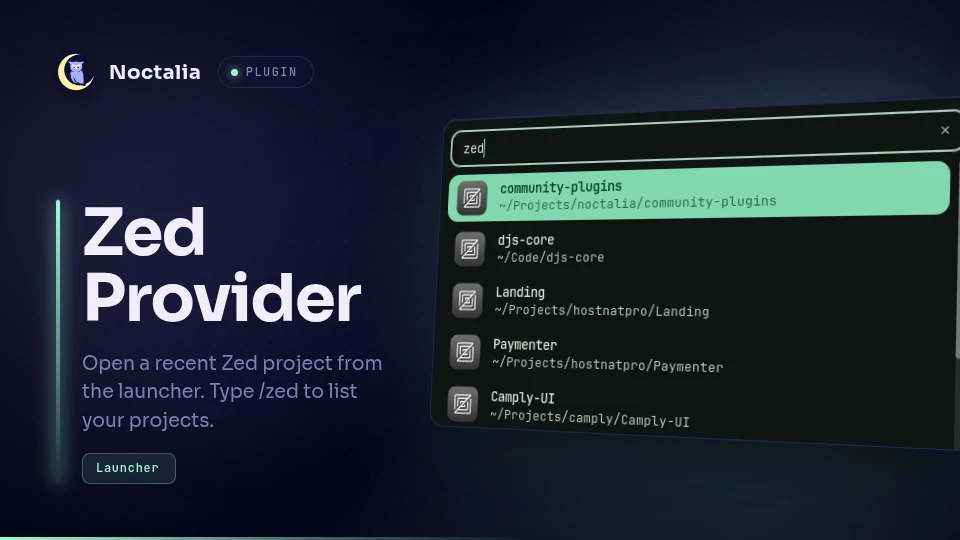

# Zed Provider

Zed Provider integrates recent Zed workspaces with the Noctalia launcher so you
can reopen a project quickly without leaving the shell.

## Plugin

| Field | Value |
| --- | --- |
| ID | `cleboost/zed-provider` |
| Entry | Launcher provider: `provider` |
| Launcher Prefix | `/zed` |

## Requirements

Install [Zed](https://zed.dev) and ensure `zed` is available on `PATH` as
`zeditor`. The `sqlite3` command must also be available to read Zed's workspace
database. `nohup` command is required to launch Zed.

## Usage

Open the Noctalia launcher and type `/zed` to list recent Zed workspaces,
including SSH remotes. Continue typing to filter projects by name, then select
one to open it with `zeditor`.

## Settings

- `db_path` — path to Zed's `db.sqlite` workspace database.
- `max_results` — maximum number of projects shown in the launcher.
- `new_window` — to open projects in a new window.

## Notes

Projects are read from Zed's workspace database, typically at
`~/.local/share/zed/db/0-stable/db.sqlite`. SSH remote workspaces are included
and opened with `zeditor ssh://[user@]host[:port]/path`; other remote kinds
(if any) are skipped. The list is cached for the launcher session and
refreshed when you clear the query.
